# Advance Java

## Question Bank Solution

### Question 1(a): Define lambda expressions and explain their significance in Java programming. (3 marks)

**Ans 1(a):**

Lambda expressions in Java are anonymous functions that provide a concise way to express instances of single-method interfaces (functional interfaces). They were introduced in Java 8 to enable functional programming features.

Key points about lambda expressions:

1. **Syntax**:
   - Basic structure: `(parameters) -> expression` or `(parameters) -> { statements; }`
   - Example: `(int a, int b) -> a + b`

2. **Characteristics**:
   - No name (anonymous)
   - No return type declaration
   - No access modifiers

3. **Significance in Java programming**:

   - **Concise code**: Lambda expressions reduce the verbosity of anonymous inner classes, making code more readable and maintainable.

   - **Functional programming support**: They enable functional programming concepts in Java, allowing functions to be treated as first-class citizens.

   - **Enhanced collection processing**: Lambda expressions work seamlessly with the Streams API, enabling efficient and expressive data processing.

   - **Improved API design**: Libraries can now define more flexible and powerful APIs using functional interfaces.

   - **Parallel processing**: Lambda expressions facilitate writing concurrent code, especially when used with parallel streams.

Example demonstrating lambda expression usage:

```java
// Without lambda
Runnable runnable = new Runnable() {
    @Override
    public void run() {
        System.out.println("Hello World!");
    }
};

// With lambda
Runnable lambdaRunnable = () -> System.out.println("Hello World!");
```

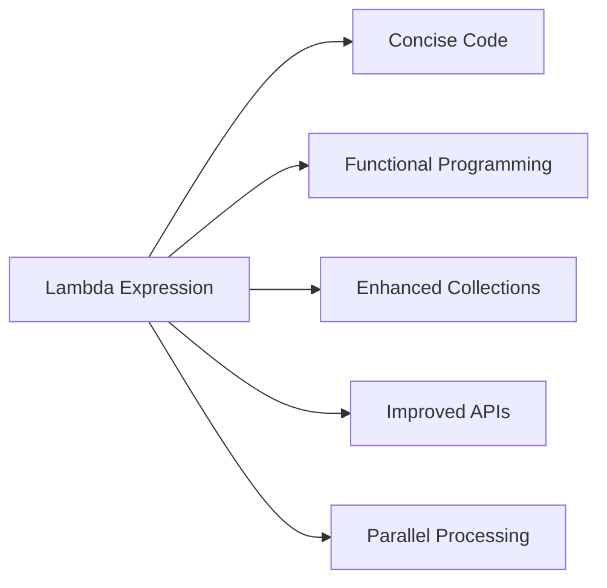

Lambda expressions significantly enhance Java's capabilities, making it more expressive and aligned with modern programming paradigms.

### પ્રશ્ન 1(અ): લેમ્બ્ડા એક્સપ્રેશન્સની વ્યાખ્યા આપો અને જાવા પ્રોગ્રામિંગમાં તેમનું મહત્વ સમજાવો. (3 ગુણ)

**જવાબ 1(અ):**

જાવામાં lambda expressions એ anonymous functions છે જે single-method interfaces (functional interfaces) ના instances ને સંક્ષિપ્ત રીતે વ્યક્ત કરવાની રીત પ્રદાન કરે છે. તેઓને Java 8 માં functional programming સુવિધાઓને સક્ષમ કરવા માટે રજૂ કરવામાં આવ્યા હતા.

Lambda expressions વિશે મુખ્ય મુદ્દાઓ:

1. **સિન્ટેક્સ**:
   - મૂળભૂત રચના: `(parameters) -> expression` અથવા `(parameters) -> { statements; }`
   - ઉદાહરણ: `(int a, int b) -> a + b`

2. **લાક્ષણિકતાઓ**:
   - કોઈ નામ નથી (anonymous)
   - કોઈ return type ઘોષણા નથી
   - કોઈ access modifiers નથી

3. **જાવા પ્રોગ્રામિંગમાં મહત્વ**:

   - **સંક્ષિપ્ત કોડ**: Lambda expressions anonymous inner classes ની વર્બોસિટી ઘટાડે છે, જેથી કોડ વધુ વાંચી શકાય અને જાળવી શકાય તેવો બને છે.

   - **Functional programming સપોર્ટ**: તેઓ જાવામાં functional programming concepts ને સક્ષમ કરે છે, જેથી functions ને પ્રથમ-વર્ગના નાગરિકો તરીકે ગણવામાં આવે છે.

   - **વધુ સારી collection પ્રોસેસિંગ**: Lambda expressions Streams API સાથે સરળતાથી કામ કરે છે, જે કાર્યક્ષમ અને અભિવ્યક્તિપૂર્ણ ડેટા પ્રોસેસિંગને સક્ષમ કરે છે.

   - **સુધારેલ API ડિઝાઇન**: લાઇબ્રેરીઓ હવે functional interfaces નો ઉપયોગ કરીને વધુ લવચીક અને શક્તિશાળી APIs વ્યાખ્યાયિત કરી શકે છે.

   - **સમાંતર પ્રક્રિયા**: Lambda expressions concurrent કોડ લખવાની સુવિધા આપે છે, ખાસ કરીને parallel streams સાથે વપરાય ત્યારે.

Lambda expression ના ઉપયોગને દર્શાવતું ઉદાહરણ:

```java
// Lambda વગર
Runnable runnable = new Runnable() {
    @Override
    public void run() {
        System.out.println("Hello World!");
    }
};

// Lambda સાથે
Runnable lambdaRunnable = () -> System.out.println("Hello World!");
```

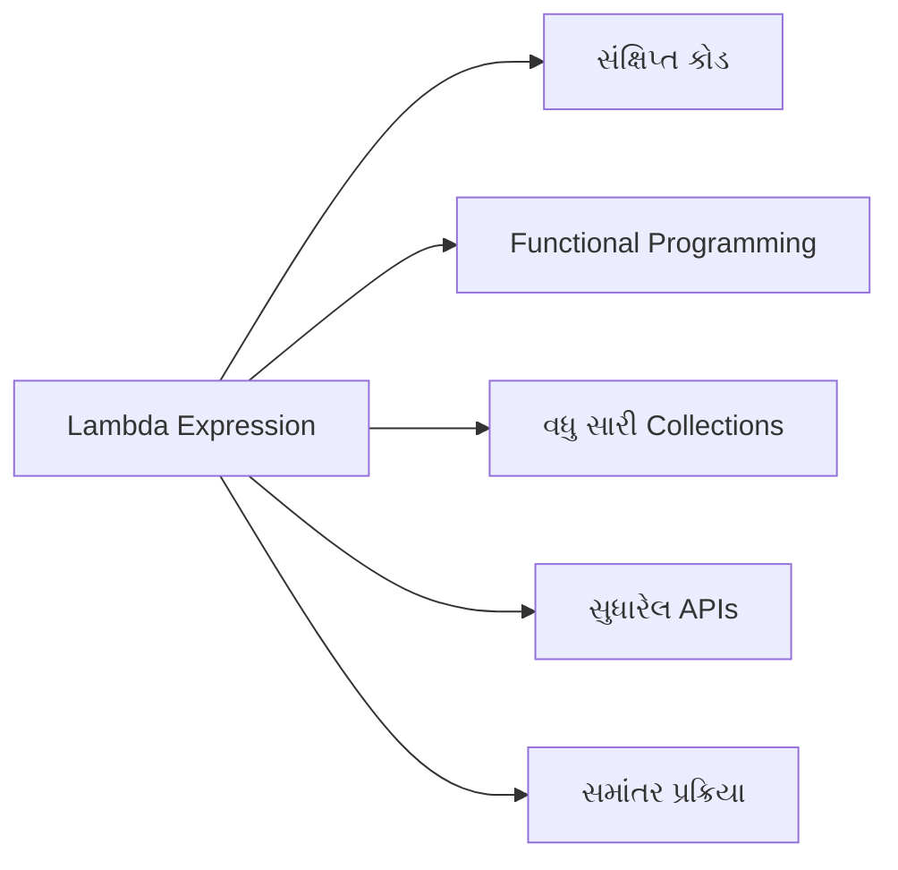

Lambda expressions જાવાની ક્ષમતાઓને નોંધપાત્ર રીતે વધારે છે, તેને વધુ અભિવ્યક્તિપૂર્ણ બનાવે છે અને આધુનિક પ્રોગ્રામિંગ પેરાડાઇમ્સ સાથે સંરેખિત કરે છે.

### Question 1(b): Explain the concept of generics in Java with an example. (4 marks)

**Ans 1(b):**

Generics in Java provide a way to create classes, interfaces, and methods that operate on objects of various types while providing compile-time type safety. They allow you to abstract over types, making code more flexible and reusable.

Key aspects of generics:

1. **Type Safety**: Generics enforce compile-time type checking, reducing runtime errors.

2. **Code Reusability**: A single generic class can work with different types, reducing code duplication.

3. **Type Erasure**: Generic type information is removed at runtime, maintaining backward compatibility.

4. **Wildcards**: Allow for more flexible use of generic types (e.g., `?`, `? extends`, `? super`).

Example of a generic class:

```java
public class Box<T> {
    private T content;

    public void set(T content) {
        this.content = content;
    }

    public T get() {
        return content;
    }
}

// Usage
Box<Integer> intBox = new Box<>();
intBox.set(10);
int value = intBox.get(); // No casting needed

Box<String> stringBox = new Box<>();
stringBox.set("Hello Generics");
String text = stringBox.get();
```

In this example:

- `Box<T>` is a generic class where `T` is a type parameter.
- We can create `Box` objects for different types (e.g., `Integer`, `String`).
- The compiler ensures type safety, preventing type mismatches.

Benefits of using generics:

1. **Type-safe collections**: Eliminates the need for explicit casting.

   ```java
   List<String> list = new ArrayList<>();
   list.add("Java");
   String s = list.get(0); // No cast needed
   ```

2. **Generic methods**: Allow creation of type-safe methods.

   ```java
   public static <E> void printArray(E[] array) {
       for (E element : array) {
           System.out.print(element + " ");
       }
   }
   ```

3. **Bounded type parameters**: Restrict the types that can be used with a generic class or method.

   ```java
   public class NumberBox<T extends Number> {
       // ...
   }
   ```

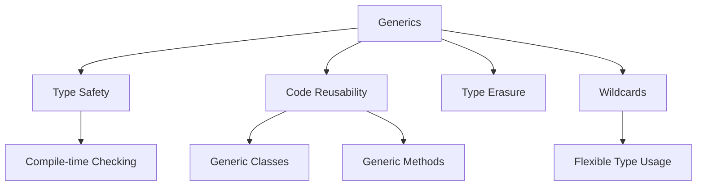

Generics significantly enhance Java's type system, leading to more robust and flexible code while maintaining strong type safety.

### પ્રશ્ન 1(બ): જાવામાં જેનેરિક્સની વિભાવના ઉદાહરણ સાથે સમજાવો. (4 ગુણ)

**જવાબ 1(બ):**

જાવામાં generics વિવિધ પ્રકારના objects પર કાર્ય કરતા વર્ગો, ઇન્ટરફેસેસ અને પદ્ધતિઓ બનાવવાની રીત પ્રદાન કરે છે, જે કમ્પાઇલ-ટાઇમ પ્રકાર સુરક્ષા પ્રદાન કરે છે. તેઓ પ્રકારો પર અમૂર્ત થવાની મંજૂરી આપે છે, જેથી કોડ વધુ લવચીક અને પુન:ઉપયોગી બને છે.

Generics ના મુખ્ય પાસાઓ:

1. **પ્રકાર સુરક્ષા**: Generics કમ્પાઇલ-ટાઇમ પ્રકાર તપાસણીને લાગુ કરે છે, જે રનટાઇમ ભૂલોને ઘટાડે છે.

2. **કોડ પુનઃઉપયોગિતા**: એક જ generic class વિવિધ પ્રકારો સાથે કામ કરી શકે છે, જે કોડ ડુપ્લિકેશનને ઘટાડે છે.

3. **પ્રકાર કાઢી નાખવું**: Generic પ્રકારની માહિતી રનટાઇમ પર દૂર કરવામાં આવે છે, જે પાછલી સુસંગતતા જાળવે છે.

4. **Wildcards**: Generic પ્રકારોના વધુ લવચીક ઉપયોગની મંજૂરી આપે છે (દા.ત., `?`, `? extends`, `? super`).

Generic class નું ઉદાહરણ:

```java
public class Box<T> {
    private T content;

    public void set(T content) {
        this.content = content;
    }

    public T get() {
        return content;
    }
}

// ઉપયોગ
Box<Integer> intBox = new Box<>();
intBox.set(10);
int value = intBox.get(); // કાસ્ટિંગની જરૂર નથી

Box<String> stringBox = new Box<>();
stringBox.set("Hello Generics");
String text = stringBox.get();
```

આ ઉદાહરણમાં:

- `Box<T>` એ generic class છે જ્યાં `T` એક પ્રકાર પરિમાણ છે.
- આપણે વિવિધ પ્રકારો માટે `Box` objects બનાવી શકીએ છીએ (દા.ત., `Integer`, `String`).
- કમ્પાઇલર પ્રકાર સુરક્ષા સુનિશ્ચિત કરે છે, પ્રકાર બેમેળને રોકે છે.

Generics ના ઉપયોગના ફાયદાઓ:

1. **પ્રકાર-સુરક્ષિત સંગ્રહો**: સ્પષ્ટ casting ની જરૂરિયાતને દૂર કરે છે.

   ```java
   List<String> list = new ArrayList<>();
   list.add("Java");
   String s = list.get(0); // કાસ્ટની જરૂર નથી
   ```

2. **Generic પદ્ધતિઓ**: પ્રકાર-સુરક્ષિત પદ્ધતિઓ બનાવવાની મંજૂરી આપે છે.

   ```java
   public static <E> void printArray(E[] array) {
       for (E element : array) {
           System.out.print(element + " ");
       }
   }
   ```

3. **બાઉન્ડેડ પ્રકાર પરિમાણો**: Generic class અથવા પદ્ધતિ સાથે ઉપયોગ કરી શકાય તેવા પ્રકારોને મર્યાદિત કરે છે.

   ```java
   public class NumberBox<T extends Number> {
       // ...
   }
   ```

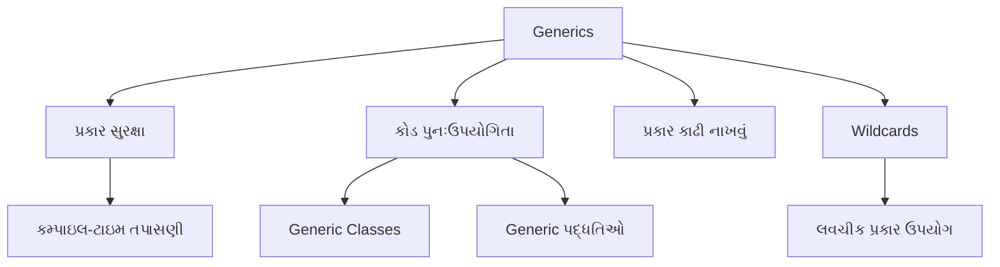

Generics જાવાની પ્રકાર પ્રણાલીને નોંધપાત્ર રીતે વધારે છે, જે મજબૂત પ્રકાર સુરક્ષા જાળવી રાખતા વધુ મજબૂત અને લવચીક કોડ તરફ દોરી જાય છે.

### Question 1(c): Describe the Streams API in Java and explain how it facilitates parallel processing. (7 marks)

**Ans 1(c):**

The Streams API, introduced in Java 8, provides a modern approach to process collections of objects. It offers a functional programming model for data manipulation, allowing for more concise and expressive code.

Key features of the Streams API:

1. **Declarative Programming**: Streams allow you to describe what you want to do, rather than how to do it.

2. **Lazy Evaluation**: Stream operations are lazily evaluated, improving performance for large datasets.

3. **Pipeline Processing**: Multiple operations can be chained together to form a processing pipeline.

4. **Functional Interfaces**: Streams work seamlessly with lambda expressions and method references.

5. **Parallel Execution**: Streams can easily switch between sequential and parallel processing.

Basic structure of a Stream operation:

```java
collection.stream()
    .intermediateOperation1()
    .intermediateOperation2()
    .terminalOperation();
```

Common Stream operations:

1. **Intermediate Operations**:
   - `filter()`: Filters elements based on a predicate.
   - `map()`: Transforms elements using a function.
   - `flatMap()`: Flattens nested structures.
   - `sorted()`: Sorts elements.
   - `distinct()`: Removes duplicates.

2. **Terminal Operations**:
   - `forEach()`: Performs an action for each element.
   - `collect()`: Gathers elements into a collection.
   - `reduce()`: Reduces elements to a single value.
   - `count()`: Returns the number of elements.
   - `anyMatch()`, `allMatch()`, `noneMatch()`: Checks elements against a predicate.

Example of Stream usage:

```java
List<String> names = Arrays.asList("Alice", "Bob", "Charlie", "David");
long count = names.stream()
                  .filter(name -> name.length() > 4)
                  .count();
System.out.println("Names longer than 4 characters: " + count);
```

Parallel Processing with Streams:

The Streams API facilitates parallel processing through the use of parallel streams. This allows operations to be executed concurrently on multiple threads, potentially improving performance for large datasets.

How Streams facilitate parallel processing:

1. **Easy Parallelization**: Convert a sequential stream to parallel with `parallelStream()` or `parallel()`.

   ```java
   long count = names.parallelStream()
                     .filter(name -> name.length() > 4)
                     .count();
   ```

2. **Automatic Thread Management**: The API handles thread creation and management, simplifying concurrent programming.

3. **Fork/Join Framework**: Parallel streams utilize the fork/join framework for efficient work distribution.

4. **Stateless Operations**: Many stream operations are stateless, making them suitable for parallel execution.

5. **Reduction Operations**: The API provides efficient parallel reduction operations like `reduce()` and `collect()`.

6. **Configurable Thread Pool**: The common fork/join pool can be configured for optimal performance.

Benefits of parallel streams:

- **Improved Performance**: Can significantly speed up operations on large datasets.
- **Efficient Resource Utilization**: Makes better use of multi-core processors.
- **Simplified Concurrent Programming**: Abstracts away the complexities of thread management.

Considerations for parallel streams:

- **Data Size**: Parallel processing may not be beneficial for small datasets due to overhead.
- **Thread Safety**: Ensure that operations used with parallel streams are thread-safe.
- **Ordering**: Some operations may not preserve the encounter order in parallel streams.

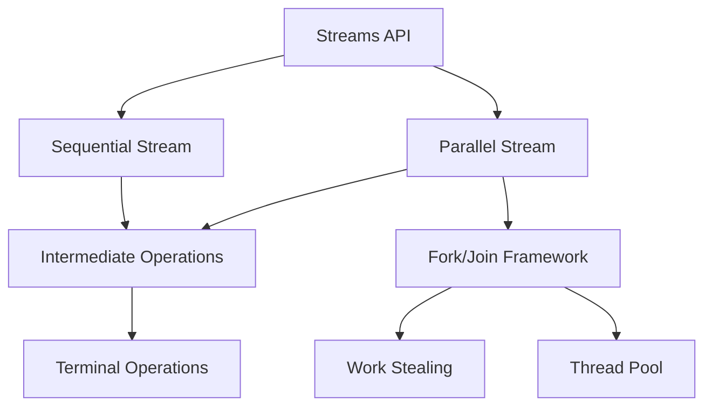

The Streams API, particularly with its support for parallel processing, represents a powerful tool in Java for efficient and expressive data processing, especially when dealing with large datasets or computationally intensive operations.

### પ્રશ્ન 1(ક): જાવામાં સ્ટ્રીમ્સ API નું વર્ણન કરો અને તે સમાંતર પ્રક્રિયાને કેવી રીતે સરળ બનાવે છે તે સમજાવો. (7 ગુણ)

**જવાબ 1(ક):**

Java 8 માં રજૂ કરાયેલ Streams API, objects ના સંગ્રહોને પ્રક્રિયા કરવા માટે એક આધુનિક અભિગમ પ્રદાન કરે છે. તે ડેટા મેનિપ્યુલેશન માટે functional programming મોડેલ આપે છે, જે વધુ સંક્ષિપ્ત અને અભિવ્યક્તિપૂર્ણ કોડની મંજૂરી આપે છે.

Streams API ની મુખ્ય વિશેષતાઓ:

1. **ડિક્લેરેટિવ પ્રોગ્રામિંગ**: Streams તમને શું કરવું છે તે વર્ણવવાની મંજૂરી આપે છે, કેવી રીતે કરવું તેના બદલે.

2. **આળસુ મૂલ્યાંકન**: Stream ઓપરેશન્સ આળસુથી મૂલ્યાંકન કરવામાં આવે છે, જે મોટા ડેટાસેટ્સ માટે કાર્યક્ષમતા સુધારે છે.

3. **પાઇપલાઇન પ્રોસેસિંગ**: પ્રોસેસિંગ પાઇપલાઇન બનાવવા માટે એકાધિક ઓપરેશન્સને સાંકળી શકાય છે.

4. **ફંક્શનલ ઇન્ટરફેસેસ**: Streams lambda expressions અને method references સાથે સરળતાથી કામ કરે છે.

5. **સમાંતર અમલીકરણ**: Streams સરળતાથી અનુક્રમિક અને સમાંતર પ્રક્રિયા વચ્ચે સ્વિચ કરી શકે છે.

Stream ઓપરેશનની મૂળભૂત રચના:

```java
collection.stream()
    .intermediateOperation1()
    .intermediateOperation2()
    .terminalOperation();
```

સામાન્ય Stream ઓપરેશન્સ:

1. **મધ્યવર્તી ઓપરેશન્સ**:
   - `filter()`: પ્રેડિકેટના આધારે તત્વોને ફિલ્ટર કરે છે.
   - `map()`: ફંક્શનનો ઉપયોગ કરીને તત્વોને રૂપાંતરિત કરે છે.
   - `flatMap()`: નેસ્ટેડ સ્ટ્રક્ચર્સને ફ્લેટ કરે છે.
   - `sorted()`: તત્વોને સોર્ટ કરે છે.
   - `distinct()`: ડુપ્લિકેટ્સ દૂર કરે છે.

2. **ટર્મિનલ ઓપરેશન્સ**:
   - `forEach()`: દરેક તત્વ માટે ક્રિયા કરે છે.
   - `collect()`: તત્વોને સંગ્રહમાં એકત્રિત કરે છે.
   - `reduce()`: તત્વોને એક મૂલ્યમાં ઘટાડે છે.
   - `count()`: તત્વોની સંખ્યા પરત કરે છે.
   - `anyMatch()`, `allMatch()`, `noneMatch()`: પ્રેડિકેટ સામે તત્વોની તપાસ કરે છે.

Stream ઉપયોગનું ઉદાહરણ:

```java
List<String> names = Arrays.asList("Alice", "Bob", "Charlie", "David");
long count = names.stream()
                  .filter(name -> name.length() > 4)
                  .count();
System.out.println("4 અક્ષરો કરતાં લાંબા નામો: " + count);
```

Streams સાથે સમાંતર પ્રક્રિયા:

Streams API સમાંતર streams ના ઉપયોગ દ્વારા સમાંતર પ્રક્રિયાને સરળ બનાવે છે. આ ઓપરેશન્સને એક સાથે ઘણા threads પર અમલ કરવાની મંજૂરી આપે છે, જે મોટા ડેટાસેટ્સ માટે કાર્યક્ષમતા સુધારી શકે છે.

Streams સમાંતર પ્રક્રિયાને કેવી રીતે સરળ બનાવે છે:

1. **સરળ સમાંતરીકરણ**: `parallelStream()` અથવા `parallel()` સાથે અનુક્રમિક stream ને સમાંતર માં રૂપાંતરિત કરો.

   ```java
   long count = names.parallelStream()
                     .filter(name -> name.length() > 4)
                     .count();
   ```

2. **સ્વચાલિત Thread મેનેજમેન્ટ**: API thread નિર્માણ અને મેનેજમેન્ટને સંભાળે છે, જે concurrent programming ને સરળ બનાવે છે.

3. **Fork/Join ફ્રેમવર્ક**: સમાંતર streams કાર્યક્ષમ કાર્ય વિતરણ માટે fork/join ફ્રેમવર્કનો ઉપયોગ કરે છે.

4. **સ્ટેટલેસ ઓપરેશન્સ**: ઘણા stream ઓપરેશન્સ સ્ટેટલેસ છે, જે તેમને સમાંતર અમલીકરણ માટે યોગ્ય બનાવે છે.

5. **ઘટાડા ઓપરેશન્સ**: API `reduce()` અને `collect()` જેવા કાર્યક્ષમ સમાંતર ઘટાડા ઓપરેશન્સ પ્રદાન કરે છે.

6. **કોન્ફિગર કરી શકાય તેવું Thread પૂલ**: સામાન્ય fork/join પૂલને શ્રેષ્ઠ કાર્યક્ષમતા માટે કોન્ફિગર કરી શકાય છે.

સમાંતર streams ના ફાયદા:

- **સુધારેલી કાર્યક્ષમતા**: મોટા ડેટાસેટ્સ પર ઓપરેશન્સને નોંધપાત્ર રીતે ઝડપી બનાવી શકે છે.
- **કાર્યક્ષમ સંસાધન ઉપયોગ**: મલ્ટી-કોર પ્રોસેસર્સનો વધુ સારો ઉપયોગ કરે છે.
- **સરળીકૃત Concurrent પ્રોગ્રામિંગ**: Thread મેનેજમેન્ટની જટિલતાઓને દૂર કરે છે.

સમાંતર streams માટે ધ્યાનમાં લેવાની બાબતો:

- **ડેટા કદ**: નાના ડેટાસેટ્સ માટે ઓવરહેડને કારણે સમાંતર પ્રક્રિયા ફાયદાકારક ન હોઈ શકે.
- **Thread સુરક્ષા**: ખાતરી કરો કે સમાંતર streams સાથે ઉપયોગમાં લેવાતા ઓપરેશન્સ thread-safe છે.
- **ક્રમ**: કેટલાક ઓપરેશન્સ સમાંતર streams માં એન્કાઉન્ટર ઓર્ડરને જાળવી ન શકે.

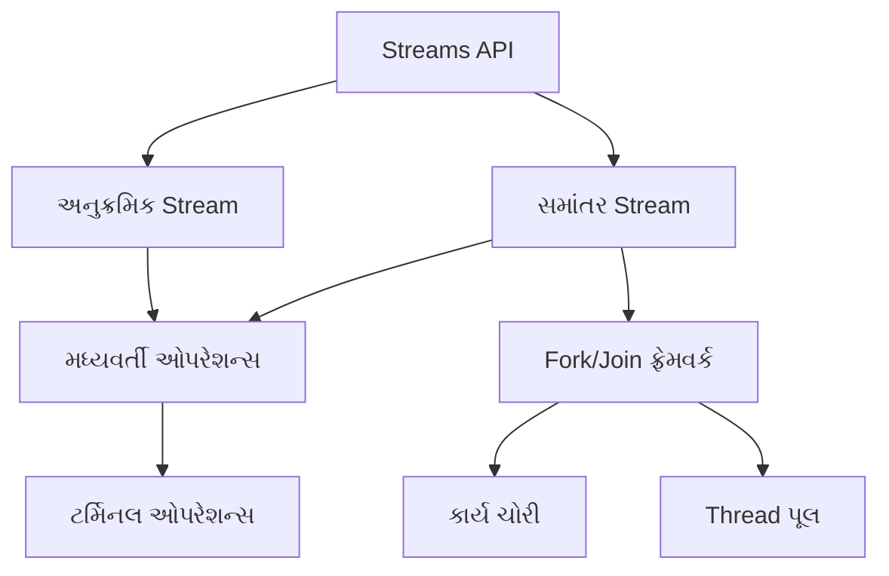

Streams API, ખાસ કરીને તેના સમાંતર પ્રક્રિયા માટેના સમર્થન સાથે, મોટા ડેટાસેટ્સ અથવા કમ્પ્યુટેશનલી સઘન ઓપરેશન્સ સાથે કામ કરતી વખતે કાર્યક્ષમ અને અભિવ્યક્તિપૂર્ણ ડેટા પ્રોસેસિંગ માટે Java માં એક શક્તિશાળી સાધન રજૂ કરે છે.

### Question 1(c) OR: Explain the concept of reflection in Java and discuss its applications. (7 marks)

**Ans 1(c):**

Reflection in Java is a powerful feature that allows programs to examine, introspect, and modify their own structure and behavior at runtime. It provides the ability to inspect classes, interfaces, fields, and methods without knowing their names at compile time.

Key aspects of reflection:

1. **Runtime Introspection**: Examine class structures during program execution.
2. **Dynamic Invocation**: Call methods and access fields dynamically.
3. **Type Inspection**: Determine the class of an object at runtime.
4. **Object Creation**: Instantiate objects of classes known only at runtime.

Core classes in Java's reflection API:

- `java.lang.Class`: Represents classes and interfaces in a running Java application.
- `java.lang.reflect.Method`: Represents a method in a class.
- `java.lang.reflect.Field`: Represents a field in a class.
- `java.lang.reflect.Constructor`: Represents a constructor in a class.

Basic example of reflection:

```java
Class<?> clazz = String.class;
Method[] methods = clazz.getDeclaredMethods();
for (Method method : methods) {
    System.out.println("Method name: " + method.getName());
}
```

Applications of Reflection:

1. **IDE and Development Tools**:
   - Code completion and suggestion features.
   - Debuggers for inspecting object states.

2. **Frameworks and Libraries**:
   - Dependency injection frameworks (e.g., Spring).
   - Object-Relational Mapping (ORM) tools (e.g., Hibernate).
   - Serialization and deserialization libraries.

3. **Unit Testing**:
   - Accessing private methods and fields for comprehensive testing.
   - Mocking frameworks for creating test doubles.

4. **Plugins and Extension Mechanisms**:
   - Dynamically loading and instantiating classes at runtime.
   - Implementing plugin architectures in applications.

5. **Annotations Processing**:
   - Reading and processing custom annotations at runtime.

6. **Class Browsers and Visual Development Environments**:
   - Exploring and manipulating class structures dynamically.

7. **Remote Method Invocation (RMI)**:
   - Invoking methods on remote objects.

Advanced reflection techniques:

1. **Accessing Private Members**:

   ```java
   Field field = someClass.getDeclaredField("privateField");
   field.setAccessible(true);
   Object value = field.get(someObject);
   ```

2. **Dynamic Proxy**:

   ```java
   Interface proxy = (Interface) Proxy.newProxyInstance(
       classLoader, 
       new Class<?>[] { Interface.class },
       new InvocationHandler() {
           public Object invoke(Object proxy, Method method, Object[] args) {
               // Custom logic here
           }
       }
   );
   ```

3. **Creating Instances**:

   ```java
   Class<?> clazz = Class.forName("com.example.MyClass");
   Object instance = clazz.newInstance();
   ```

Advantages of Reflection:

- Flexibility in coding
- Enables creation of versatile libraries
- Supports dynamic loading of classes

Disadvantages:

- Performance overhead
- Security restrictions in some environments
- Loss of compile-time type checking

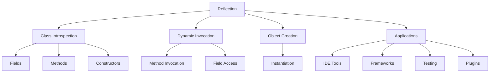

Reflection is a powerful tool in Java that enables writing flexible and dynamic code. While it should be used judiciously due to its performance implications, it forms the backbone of many advanced Java features and frameworks, making it an essential concept for Java developers to understand and utilize effectively.

### પ્રશ્ન 1(ક) OR: જાવામાં રિફ્લેક્શનની વિભાવના સમજાવો અને તેના ઉપયોગો વિશે ચર્ચા કરો. (7 ગુણ)

**જવાબ 1(ક):**

જાવામાં રિફ્લેક્શન એક શક્તિશાળી સુવિધા છે જે પ્રોગ્રામ્સને રનટાઇમ પર તેમની પોતાની રચના અને વર્તણૂકની તપાસ, આંતરિક નિરીક્ષણ અને સુધારણા કરવાની મંજૂરી આપે છે. તે કમ્પાઇલ સમયે તેમના નામ જાણ્યા વિના વર્ગો, ઇન્ટરફેસ, ફીલ્ડ્સ અને પદ્ધતિઓની તપાસ કરવાની ક્ષમતા પ્રદાન કરે છે.

રિફ્લેક્શનના મુખ્ય પાસાઓ:

1. **રનટાઇમ આંતરિક નિરીક્ષણ**: પ્રોગ્રામ અમલીકરણ દરમિયાન વર્ગ રચનાઓની તપાસ કરો.
2. **ડાયનેમિક ઇન્વોકેશન**: પદ્ધતિઓને ડાયનેમિક રીતે કૉલ કરો અને ફીલ્ડ્સને ઍક્સેસ કરો.
3. **પ્રકાર નિરીક્ષણ**: રનટાઇમ પર ઑબ્જેક્ટનો વર્ગ નિર્ધારિત કરો.
4. **ઑબ્જેક્ટ નિર્માણ**: માત્ર રનટાઇમ પર જાણીતા વર્ગોના ઑબ્જેક્ટ્સને ઇન્સ્ટન્શિએટ કરો.

જાવાના રિફ્લેક્શન API માં મુખ્ય વર્ગો:

- `java.lang.Class`: ચાલુ જાવા એપ્લિકેશનમાં વર્ગો અને ઇન્ટરફેસનું પ્રતિનિધિત્વ કરે છે.
- `java.lang.reflect.Method`: વર્ગમાં પદ્ધતિનું પ્રતિનિધિત્વ કરે છે.
- `java.lang.reflect.Field`: વર્ગમાં ફીલ્ડનું પ્રતિનિધિત્વ કરે છે.
- `java.lang.reflect.Constructor`: વર્ગમાં કન્સ્ટ્રક્ટરનું પ્રતિનિધિત્વ કરે છે.

રિફ્લેક્શનનું મૂળભૂત ઉદાહરણ:

```java
Class<?> clazz = String.class;
Method[] methods = clazz.getDeclaredMethods();
for (Method method : methods) {
    System.out.println("પદ્ધતિનું નામ: " + method.getName());
}
```

રિફ્લેક્શનના ઉપયોગો:

1. **IDE અને ડેવલપમેન્ટ ટૂલ્સ**:
   - કોડ પૂર્ણતા અને સૂચન સુવિધાઓ.
   - ઑબ્જેક્ટ સ્થિતિઓની તપાસ માટે ડીબગર્સ.

2. **ફ્રેમવર્ક્સ અને લાઇબ્રેરીઓ**:
   - ડિપેન્ડન્સી ઇન્જેક્શન ફ્રેમવર્ક્સ (દા.ત., Spring).
   - ઑબ્જેક્ટ-રિલેશનલ મેપિંગ (ORM) ટૂલ્સ (દા.ત., Hibernate).
   - સિરિયલાઇઝેશન અને ડિસિરિયલાઇઝેશન લાઇબ્રેરીઓ.

3. **યુનિટ ટેસ્ટિંગ**:
   - વ્યાપક પરીક્ષણ માટે ખાનગી પદ્ધતિઓ અને ફીલ્ડ્સને ઍક્સેસ કરવી.
   - ટેસ્ટ ડબલ્સ બનાવવા માટે મોકિંગ ફ્રેમવર્ક્સ.

4. **પ્લગઇન્સ અને એક્સ્ટેન્શન મેકેનિઝમ્સ**:
   - રનટાઇમ પર ડાયનેમિક રીતે વર્ગો લોડ કરવા અને ઇન્સ્ટન્શિએટ કરવા.
   - એપ્લિકેશન્સમાં પ્લગઇન આર્કિટેક્ચર્સ અમલમાં મૂકવા.

5. **એનોટેશન્સ પ્રોસેસિંગ**:
   - રનટાઇમ પર કસ્ટમ એનોટેશન્સ વાંચવા અને પ્રોસેસ કરવા.

6. **ક્લાસ બ્રાઉઝર્સ અને વિઝ્યુઅલ ડેવલપમેન્ટ એન્વાયરન્મેન્ટ્સ**:
   - વર્ગ રચનાઓને ડાયનેમિક રીતે એક્સપ્લોર અને મેનિપ્યુલેટ કરવી.

7. **રિમોટ મેથડ ઇન્વોકેશન (RMI)**:
   - દૂરસ્થ ઑબ્જેક્ટ્સ પર પદ્ધતિઓને ઇન્વોક કરવી.

અદ્યતન રિફ્લેક્શન તકનીકો:

1. **ખાનગી સભ્યોને ઍક્સેસ કરવા**:

   ```java
   Field field = someClass.getDeclaredField("privateField");
   field.setAccessible(true);
   Object value = field.get(someObject);
   ```

2. **ડાયનેમિક પ્રોક્સી**:

   ```java
   Interface proxy = (Interface) Proxy.newProxyInstance(
       classLoader, 
       new Class<?>[] { Interface.class },
       new InvocationHandler() {
           public Object invoke(Object proxy, Method method, Object[] args) {
               // કસ્ટમ લોજિક અહીં
           }
       }
   );
   ```

3. **ઇન્સ્ટન્સ બનાવવા**:

   ```java
   Class<?> clazz = Class.forName("com.example.MyClass");
   Object instance = clazz.newInstance();
   ```

રિફ્લેક્શનના ફાયદા:

- કોડિંગમાં લવચીકતા
- બહુમુખી લાઇબ્રેરીઓના નિર્માણને સક્ષમ કરે છે
- વર્ગોના ડાયનેમિક લોડિંગને સમર્થન આપે છે

ગેરફાયદા:

- કાર્યક્ષમતા ઓવરહેડ
- કેટલાક વાતાવરણમાં સુરક્ષા પ્રતિબંધો
- કમ્પાઇલ-ટાઇમ પ્રકાર તપાસની ખોટ

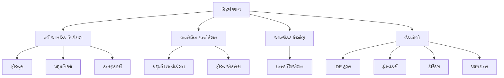

રિફ્લેક્શન જાવામાં એક શક્તિશાળી સાધન છે જે લવચીક અને ડાયનેમિક કોડ લખવા માટે સક્ષમ કરે છે. જ્યારે તેની કાર્યક્ષમતાની અસરોને કારણે તેનો ઉપયોગ કાળજીપૂર્વક કરવો જોઈએ, તે ઘણી અદ્યતન જાવા સુવિધાઓ અને ફ્રેમવર્ક્સનું આધારસ્તંભ બનાવે છે, જે તેને જાવા ડેવલપર્સ માટે સમજવા અને અસરકારક રીતે ઉપયોગ કરવા માટે આવશ્યક વિભાવના બનાવે છે.

રિફ્લેક્શનનો ઉપયોગ કરતી વખતે ધ્યાનમાં રાખવાની બાબતો:

1. **કાર્યક્ષમતા**: રિફ્લેક્શન સામાન્ય રીતે સીધા કોડ કરતાં ધીમું હોય છે, તેથી ક્રિટિકલ પાથ્સમાં તેનો ઉપયોગ મર્યાદિત કરવો જોઈએ.

2. **સુરક્ષા**: ખાનગી સભ્યોને ઍક્સેસ કરવા માટે રિફ્લેક્શનનો ઉપયોગ કરતી વખતે સાવચેત રહો, કારણ કે તે એન્કેપ્સ્યુલેશનને તોડી શકે છે.

3. **મેઇન્ટેનેબિલિટી**: રિફ્લેક્શન કોડ વધુ જટિલ અને સમજવામાં મુશ્કેલ હોઈ શકે છે, તેથી તેનો ઉપયોગ યોગ્ય રીતે દસ્તાવેજીકરણ કરવો જોઈએ.

4. **પ્રકાર સુરક્ષા**: રિફ્લેક્શન કમ્પાઇલ-ટાઇમ પ્રકાર તપાસને બાયપાસ કરે છે, જે રનટાઇમ ભૂલોનું જોખમ વધારે છે.

રિફ્લેક્શનનો યોગ્ય ઉપયોગ જાવા પ્રોગ્રામ્સને વધુ લવચીક અને શક્તિશાળી બનાવી શકે છે, પરંતુ તેનો ઉપયોગ કાળજીપૂર્વક અને યોગ્ય સંજોગોમાં જ કરવો જોઈએ. તે અદ્યતન જાવા પ્રોગ્રામિંગમાં એક મહત્વપૂર્ણ સાધન છે, જે ડેવલપર્સને પ્રોગ્રામ્સના રનટાઇમ વર્તનને વધુ સારી રીતે નિયંત્રિત કરવા અને સમજવાની મંજૂરી આપે છે.

### Question 2(a): Compare and contrast AWT and Swing in Java. (3 marks)

**Ans 2(a):**

AWT (Abstract Window Toolkit) and Swing are both GUI (Graphical User Interface) toolkits in Java used for creating desktop applications. Here's a comparison of the two:

1. **Architecture**:
   - AWT: Uses native platform components, making it platform-dependent.
   - Swing: Built entirely in Java, making it platform-independent.

2. **Component Set**:
   - AWT: Provides a basic set of components (e.g., Button, TextField).
   - Swing: Offers a richer set of components with more features (e.g., JButton, JTextField).

3. **Look and Feel**:
   - AWT: Appearance is determined by the operating system.
   - Swing: Provides a pluggable look and feel, allowing customization.

4. **Performance**:
   - AWT: Generally faster due to native components.
   - Swing: Can be slower, especially for complex interfaces.

5. **Lightweight vs. Heavyweight**:
   - AWT: Uses heavyweight components (peer components).
   - Swing: Uses lightweight components (except for top-level containers).

6. **Event Handling**:
   - AWT: Uses a simpler event model.
   - Swing: Provides a more sophisticated event handling mechanism.

7. **Flexibility**:
   - AWT: Less flexible in terms of customization.
   - Swing: Highly customizable and extensible.

Comparison Table:

| Aspect | AWT | Swing |
|--------|-----|-------|
| Origin | Older, part of JDK 1.0 | Newer, introduced in JDK 1.2 |
| Package | java.awt | javax.swing |
| Components | Basic (e.g., Button) | Advanced (e.g., JButton) |
| Platform Dependency | Dependent | Independent |
| Memory Usage | Less memory-intensive | More memory-intensive |
| MVC Support | Limited | Built-in MVC architecture |

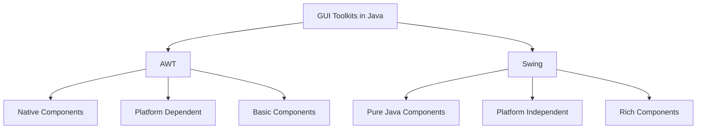

In summary, while AWT is older and platform-dependent, Swing offers more flexibility and a richer set of components. The choice between them depends on specific application requirements, with Swing being more commonly used in modern Java desktop applications.

### પ્રશ્ન 2(અ): જાવામાં AWT અને સ્વિંગની તુલના કરો અને તફાવત સ્પષ્ટ કરો. (3 ગુણ)

**જવાબ 2(અ):**

AWT (Abstract Window Toolkit) અને Swing બંને જાવામાં ડેસ્કટોપ એપ્લિકેશન્સ બનાવવા માટે ઉપયોગમાં લેવાતા GUI (ગ્રાફિકલ યુઝર ઇન્ટરફેસ) ટૂલકિટ્સ છે. અહીં બંનેની તુલના આપેલી છે:

1. **આર્કિટેક્ચર**:
   - AWT: નેટિવ પ્લેટફોર્મ કમ્પોનન્ટ્સનો ઉપયોગ કરે છે, જે તેને પ્લેટફોર્મ-નિર્ભર બનાવે છે.
   - Swing: સંપૂર્ણપણે જાવામાં બનાવવામાં આવ્યું છે, જે તેને પ્લેટફોર્મ-સ્વતંત્ર બનાવે છે.

2. **કમ્પોનન્ટ સેટ**:
   - AWT: મૂળભૂત કમ્પોનન્ટ્સનો સેટ પ્રદાન કરે છે (દા.ત., Button, TextField).
   - Swing: વધુ સુવિધાઓ સાથે સમૃદ્ધ કમ્પોનન્ટ્સનો સેટ આપે છે (દા.ત., JButton, JTextField).

3. **દેખાવ અને અનુભવ**:
   - AWT: દેખાવ ઓપરેટિંગ સિસ્ટમ દ્વારા નિર્ધારિત થાય છે.
   - Swing: પ્લગેબલ લુક એન્ડ ફીલ પ્રદાન કરે છે, જે કસ્ટમાઇઝેશનની મંજૂરી આપે છે.

4. **કાર્યક્ષમતા**:
   - AWT: નેટિવ કમ્પોનન્ટ્સને કારણે સામાન્ય રીતે ઝડપી હોય છે.
   - Swing: જટિલ ઇન્ટરફેસ માટે ધીમું હોઈ શકે છે.

5. **લાઇટવેઇટ vs. હેવીવેઇટ**:
   - AWT: હેવીવેઇટ કમ્પોનન્ટ્સ (પીઅર કમ્પોનન્ટ્સ) નો ઉપયોગ કરે છે.
   - Swing: લાઇટવેઇટ કમ્પોનન્ટ્સનો ઉપયોગ કરે છે (ટોચના-સ્તરના કન્ટેનર્સ સિવાય).

6. **ઇવેન્ટ હેન્ડલિંગ**:
   - AWT: સરળ ઇવેન્ટ મોડેલનો ઉપયોગ કરે છે.
   - Swing: વધુ પરિષ્કૃત ઇવેન્ટ હેન્ડલિંગ મેકેનિઝમ પ્રદાન કરે છે.

7. **લવચીકતા**:
   - AWT: કસ્ટમાઇઝેશનની દ્રષ્ટિએ ઓછું લવચીક.
   - Swing: ઉચ્ચ કસ્ટમાઇઝેબલ અને વિસ્તૃત.

તુલનાત્મક કોષ્ટક:

| પાસું | AWT | Swing |
|-------|-----|-------|
| ઉત્પત્તિ | જૂનું, JDK 1.0 નો ભાગ | નવું, JDK 1.2 માં રજૂ થયું |
| પેકેજ | java.awt | javax.swing |
| કમ્પોનન્ટ્સ | મૂળભૂત (દા.ત., Button) | અદ્યતન (દા.ત., JButton) |
| પ્લેટફોર્મ નિર્ભરતા | નિર્ભર | સ્વતંત્ર |
| મેમરી વપરાશ | ઓછો મેમરી-ઇન્ટેન્સિવ | વધુ મેમરી-ઇન્ટેન્સિવ |
| MVC સપોર્ટ | મર્યાદિત | બિલ્ટ-ઇન MVC આર્કિટેક્ચર |

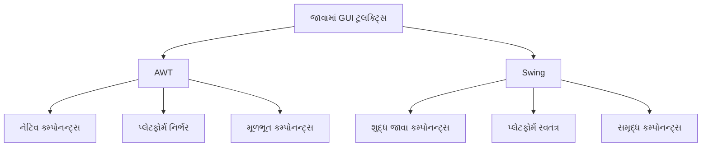

સારાંશમાં, જ્યારે AWT જૂનું અને પ્લેટફોર્મ-નિર્ભર છે, Swing વધુ લવચીકતા અને કમ્પોનન્ટ્સનો સમૃદ્ધ સેટ આપે છે. તેમની વચ્ચેની પસંદગી ચોક્કસ એપ્લિકેશન આવશ્યકતાઓ પર આધાર રાખે છે, જેમાં Swing આધુનિક જાવા ડેસ્કટોપ એપ્લિકેશન્સમાં વધુ સામાન્યપણે ઉપયોગમાં લેવાય છે.

### Question 2(b): Explain the concept of layout managers in Swing with examples. (4 marks)

**Ans 2(b):**

Layout managers in Swing are responsible for arranging components within a container. They determine the size and position of components, adapting to changes in the container's size and ensuring consistent appearance across different platforms.

Key concepts of layout managers:

1. **Automatic Arrangement**: Layout managers automatically position and size components.
2. **Flexibility**: They adapt to different screen sizes and resolutions.
3. **Consistency**: Ensure uniform appearance across platforms.
4. **Simplification**: Reduce the need for manual component positioning.

Common layout managers in Swing:

1. **FlowLayout**:
   - Arranges components in a row, wrapping to the next line if necessary.
   - Default for JPanel.

   Example:

   ```java
   JPanel panel = new JPanel(new FlowLayout());
   panel.add(new JButton("Button 1"));
   panel.add(new JButton("Button 2"));
   ```

2. **BorderLayout**:
   - Divides container into five areas: NORTH, SOUTH, EAST, WEST, and CENTER.
   - Default for JFrame.

   Example:

   ```java
   JFrame frame = new JFrame();
   frame.setLayout(new BorderLayout());
   frame.add(new JButton("North"), BorderLayout.NORTH);
   frame.add(new JButton("Center"), BorderLayout.CENTER);
   ```

3. **GridLayout**:
   - Arranges components in a grid of rows and columns.

   Example:

   ```java
   JPanel panel = new JPanel(new GridLayout(2, 3));
   for (int i = 1; i <= 6; i++) {
       panel.add(new JButton("Button " + i));
   }
   ```

4. **BoxLayout**:
   - Arranges components in a single row or column.

   Example:

   ```java
   JPanel panel = new JPanel();
   panel.setLayout(new BoxLayout(panel, BoxLayout.Y_AXIS));
   panel.add(new JButton("Top"));
   panel.add(new JButton("Bottom"));
   ```

5. **GridBagLayout**:
   - The most flexible but complex layout manager.
   - Allows fine-grained control over component placement.

   Example:

   ```java
   JPanel panel = new JPanel(new GridBagLayout());
   GridBagConstraints gbc = new GridBagConstraints();
   gbc.gridx = 0;
   gbc.gridy = 0;
   panel.add(new JButton("Button"), gbc);
   ```

Visual representation of layout managers:

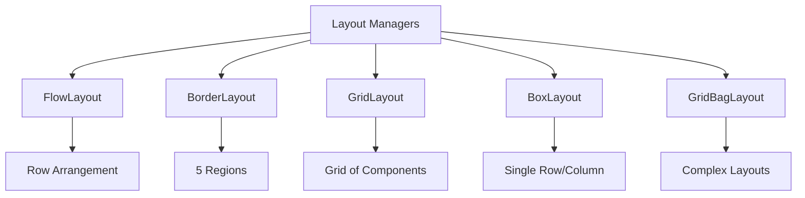

Benefits of using layout managers:

- Simplify UI design and maintenance
- Ensure responsive and adaptive layouts
- Improve cross-platform consistency
- Reduce code complexity for component positioning

By using appropriate layout managers, developers can create flexible and responsive user interfaces in Swing applications, adapting to different screen sizes and resolutions while maintaining a consistent look and feel.

### પ્રશ્ન 2(બ): સ્વિંગમાં લેઆઉટ મેનેજર્સની વિભાવના ઉદાહરણો સાથે સમજાવો. (4 ગુણ)

**જવાબ 2(બ):**

સ્વિંગમાં લેઆઉટ મેનેજર્સ કન્ટેનર અંદર કમ્પોનન્ટ્સની ગોઠવણી માટે જવાબદાર છે. તેઓ કમ્પોનન્ટ્સનું કદ અને સ્થાન નક્કી કરે છે, કન્ટેનરના કદમાં ફેરફારોને અનુકૂળ થાય છે અને વિવિધ પ્લેટફોર્મ્સ પર સુસંગત દેખાવ સુનિશ્ચિત કરે છે.

લેઆઉટ મેનેજર્સના મુખ્ય ખ્યાલો:

1. **સ્વચાલિત ગોઠવણી**: લેઆઉટ મેનેજર્સ આપોઆપ કમ્પોનન્ટ્સને સ્થાન આપે છે અને કદ નક્કી કરે છે.
2. **લવચીકતા**: તેઓ વિવિધ સ્ક્રીન કદ અને રેઝોલ્યુશન સાથે અનુકૂળ થાય છે.
3. **સુસંગતતા**: પ્લેટફોર્મ્સ વચ્ચે એકસરખો દેખાવ સુનિશ્ચિત કરે છે.
4. **સરળીકરણ**: મેન્યુઅલ કમ્પોનન્ટ સ્થાનની જરૂરિયાત ઘટાડે છે.

સ્વિંગમાં સામાન્ય લેઆઉટ મેનેજર્સ:

1. **FlowLayout**:
   - કમ્પોનન્ટ્સને એક પંક્તિમાં ગોઠવે છે, જરૂર પડે તો આગળની લાઈનમાં લપેટે છે.
   - JPanel માટે ડિફોલ્ટ છે.

   ઉદાહરણ:

   ```java
   JPanel panel = new JPanel(new FlowLayout());
   panel.add(new JButton("બટન 1"));
   panel.add(new JButton("બટન 2"));
   ```

2. **BorderLayout**:
   - કન્ટેનરને પાંચ વિસ્તારોમાં વિભાજિત કરે છે: NORTH, SOUTH, EAST, WEST, અને CENTER.
   - JFrame માટે ડિફોલ્ટ છે.

   ઉદાહરણ:

   ```java
   JFrame frame = new JFrame();
   frame.setLayout(new BorderLayout());
   frame.add(new JButton("ઉત્તર"), BorderLayout.NORTH);
   frame.add(new JButton("મધ્ય"), BorderLayout.CENTER);
   ```

3. **GridLayout**:
   - કમ્પોનન્ટ્સને પંક્તિઓ અને કૉલમ્સની ગ્રિડમાં ગોઠવે છે.

   ઉદાહરણ:

   ```java
   JPanel panel = new JPanel(new GridLayout(2, 3));
   for (int i = 1; i <= 6; i++) {
       panel.add(new JButton("બટન " + i));
   }
   ```

4. **BoxLayout**:
   - કમ્પોનન્ટ્સને એક પંક્તિ અથવા કૉલમમાં ગોઠવે છે.

   ઉદાહરણ:

   ```java
   JPanel panel = new JPanel();
   panel.setLayout(new BoxLayout(panel, BoxLayout.Y_AXIS));
   panel.add(new JButton("ઉપર"));
   panel.add(new JButton("નીચે"));
   ```

5. **GridBagLayout**:
   - સૌથી લવચીક પરંતુ જટિલ લેઆઉટ મેનેજર.
   - કમ્પોનન્ટ સ્થાન પર ઝીણવટભર્યું નિયંત્રણ આપે છે.

   ઉદાહરણ:

   ```java
   JPanel panel = new JPanel(new GridBagLayout());
   GridBagConstraints gbc = new GridBagConstraints();
   gbc.gridx = 0;
   gbc.gridy = 0;
   panel.add(new JButton("બટન"), gbc);
   ```

લેઆઉટ મેનેજર્સનું દૃશ્યમાન રજૂઆત:

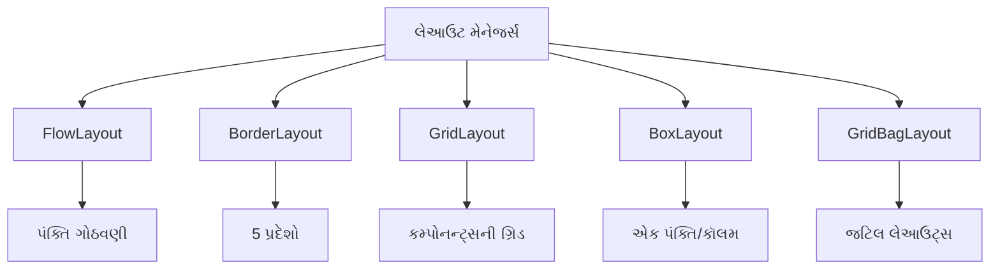

લેઆઉટ મેનેજર્સના ઉપયોગના ફાયદા:

- UI ડિઝાઇન અને જાળવણીને સરળ બનાવે છે
- પ્રતિસાદાત્મક અને અનુકૂલનશીલ લેઆઉટ્સ સુનિશ્ચિત કરે છે
- ક્રોસ-પ્લેટફોર્મ સુસંગતતા સુધારે છે
- કમ્પોનન્ટ સ્થાન માટે કોડ જટિલતા ઘટાડે છે

યોગ્ય લેઆઉટ મેનેજર્સનો ઉપયોગ કરીને, ડેવલપર્સ સ્વિંગ એપ્લિકેશન્સમાં લવચીક અને પ્રતિસાદાત્મક યુઝર ઇન્ટરફેસ બનાવી શકે છે, જે વિવિધ સ્ક્રીન કદ અને રેઝોલ્યુશન સાથે અનુકૂળ થાય છે અને સાથે સુસંગત દેખાવ અને અનુભવ જાળવે છે.

### Question 2(c): Describe the JavaFX architecture and explain how FXML is used for creating user interfaces. (7 marks)

**Ans 2(c):**

JavaFX is a software platform for creating and delivering desktop applications, as well as rich internet applications (RIAs) that can run across various devices. The JavaFX architecture consists of several key components that work together to provide a powerful and flexible framework for building modern user interfaces.

**JavaFX Architecture:**

1. **Scene Graph**:
   - Core of JavaFX rendering
   - Hierarchical tree of nodes representing the visual elements
   - Efficiently manages rendering and event handling

2. **JavaFX API**:
   - High-level APIs for UI controls, graphics, media, and web content
   - Includes layout panes, charts, and CSS styling support

3. **Graphics Engine**:
   - Prism: Hardware-accelerated graphics pipeline
   - Quantum: Toolkit that interfaces with the native operating system

4. **Media Engine**:
   - Supports playback of web multimedia content

5. **Web Engine**:
   - WebKit-based engine for rendering HTML content

6. **CSS**:
   - Styling and theming of JavaFX applications

7. **FXML**:
   - XML-based language for defining user interfaces

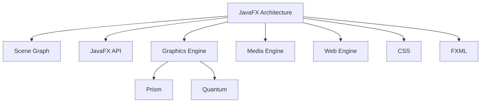

**FXML for Creating User Interfaces:**

FXML is an XML-based markup language used to define user interfaces in JavaFX applications. It provides a declarative approach to UI design, separating the UI structure from the application logic.

Key aspects of FXML:

1. **Declarative UI Definition**:
   - Describes the structure and layout of the UI in XML format
   - Example:

     ```xml
     <?xml version="1.0" encoding="UTF-8"?>
     <?import javafx.scene.layout.VBox?>
     <?import javafx.scene.control.Button?>
     <VBox xmlns:fx="http://javafx.com/fxml">
         <Button text="Click Me"/>
     </VBox>
     ```

2. **Separation of Concerns**:
   - Separates UI design from application logic
   - Facilitates collaboration between designers and developers

3. **Integration with Scene Builder**:
   - Visual tool for designing FXML layouts
   - Generates FXML code automatically

4. **Controller Integration**:
   - Links FXML elements to Java controller classes
   - Example:

     ```xml
     <VBox fx:controller="com.example.MyController">
         <Button text="Click Me" onAction="#handleButtonClick"/>
     </VBox>
     ```

5. **Resource Binding**:
   - Allows binding of UI elements to resources (e.g., internationalization)
   - Example:

     ```xml
     <Label text="%welcomeMessage"/>
     ```

6. **Event Handling**:
   - Defines event handlers directly in FXML
   - Links to methods in the controller class

7. **Nested Structures**:
   - Supports complex layouts through nesting of elements
   - Example:

     ```xml
     <BorderPane>
         <top><MenuBar>...</MenuBar></top>
         <center><TableView>...</TableView></center>
     </BorderPane>
     ```

Using FXML in a JavaFX application:

1. Create an FXML file defining the UI layout.
2. Load the FXML file in the Java code:

   ```java
   Parent root = FXMLLoader.load(getClass().getResource("layout.fxml"));
   Scene scene = new Scene(root);
   ```

3. Set the scene to the stage and display:

   ```java
   stage.setScene(scene);
   stage.show();
   ```

Benefits of using FXML:

- Clear separation of UI design and logic
- Easier maintenance and updates of UI
- Supports rapid prototyping and iteration
- Facilitates collaboration in development teams

FXML, combined with the JavaFX architecture, provides a powerful and flexible way to create rich, interactive user interfaces for modern Java applications. It allows for a clean separation of concerns, making development more efficient and maintainable.

### પ્રશ્ન 2(ક): JavaFX આર્કિટેક્ચરનું વર્ણન કરો અને યુઝર ઇન્ટરફેસ બનાવવા માટે FXML નો ઉપયોગ કેવી રીતે થાય છે તે સમજાવો. (7 ગુણ)

**જવાબ 2(ક):**

JavaFX એ ડેસ્કટોપ એપ્લિકેશન્સ બનાવવા અને વિતરિત કરવા માટેનું સોફ્ટવેર પ્લેટફોર્મ છે, તેમજ રિચ ઈન્ટરનેટ એપ્લિકેશન્સ (RIAs) માટે પણ છે જે વિવિધ ઉપકરણો પર ચાલી શકે છે. JavaFX આર્કિટેક્ચરમાં ઘણા મુખ્ય ઘટકો છે જે આધુનિક યુઝર ઇન્ટરફેસ બનાવવા માટે શક્તિશાળી અને લવચીક ફ્રેમવર્ક પ્રદાન કરવા માટે એકસાથે કામ કરે છે.

**JavaFX આર્કિટેક્ચર:**

1. **સીન ગ્રાફ**:
   - JavaFX રેન્ડરિંગનો મુખ્ય ભાગ
   - દૃશ્ય તત્વોનું પ્રતિનિધિત્વ કરતા નોડ્સનું હાયરાર્કિકલ ટ્રી
   - કાર્યક્ષમ રીતે રેન્ડરિંગ અને ઇવેન્ટ હેન્ડલિંગનું સંચાલન કરે છે

2. **JavaFX API**:
   - UI કંટ્રોલ્સ, ગ્રાફિક્સ, મીડિયા અને વેબ સામગ્રી માટે ઉચ્ચ-સ્તરીય APIs
   - લેઆઉટ પેન્સ, ચાર્ટ્સ અને CSS સ્ટાઇલિંગ સપોર્ટ સામેલ છે

3. **ગ્રાફિક્સ એન્જિન**:
   - Prism: હાર્ડવેર-એક્સેલરેટેડ ગ્રાફિક્સ પાઇપલાઇન
   - Quantum: નેટિવ ઓપરેટિંગ સિસ્ટમ સાથે ઇન્ટરફેસ કરતું ટૂલકિટ

4. **મીડિયા એન્જિન**:
   - વેબ મલ્ટિમીડિયા સામગ્રીના પ્લેબેકને સપોર્ટ કરે છે

5. **વેબ એન્જિન**:
   - HTML સામગ્રી રેન્ડર કરવા માટે WebKit-આધારિત એન્જિન

6. **CSS**:
   - JavaFX એપ્લિકેશન્સની સ્ટાઇલિંગ અને થીમિંગ

7. **FXML**:
   - યુઝર ઇન્ટરફેસ વ્યાખ્યાયિત કરવા માટે XML-આધારિત ભાષા

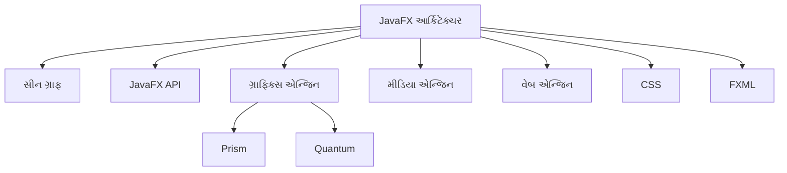

**યુઝર ઇન્ટરફેસ બનાવવા માટે FXML નો ઉપયોગ:**

FXML એ XML-આધારિત માર્કઅપ ભાષા છે જેનો ઉપયોગ JavaFX એપ્લિકેશન્સમાં યુઝર ઇન્ટરફેસ વ્યાખ્યાયિત કરવા માટે થાય છે. તે UI ડિઝાઇન માટે ડિક્લેરેટિવ અભિગમ પ્રદાન કરે છે, જે UI સ્ટ્રક્ચરને એપ્લિકેશન લોજિકથી અલગ કરે છે.

FXML ના મુખ્ય પાસાઓ:

1. **ડિક્લેરેટિવ UI વ્યાખ્યા**:
   - UI ની રચના અને લેઆઉટનું XML ફોર્મેટમાં વર્ણન કરે છે
   - ઉદાહરણ:

     ```xml
     <?xml version="1.0" encoding="UTF-8"?>
     <?import javafx.scene.layout.VBox?>
     <?import javafx.scene.control.Button?>
     <VBox xmlns:fx="http://javafx.com/fxml">
         <Button text="મને ક્લિક કરો"/>
     </VBox>
     ```

2. **કન્સર્ન્સનું વિભાજન**:
   - UI ડિઝાઇનને એપ્લિકેશન લોજિકથી અલગ કરે છે
   - ડિઝાઇનર્સ અને ડેવલપર્સ વચ્ચે સહયોગને સરળ બનાવે છે

3. **સીન બિલ્ડર સાથે એકીકરણ**:
   - FXML લેઆઉટ્સ ડિઝાઇન કરવા માટે વિઝ્યુઅલ ટૂલ
   - આપોઆપ FXML કોડ જનરેટ કરે છે

4. **કંટ્રોલર એકીકરણ**:
   - FXML તત્વોને Java કંટ્રોલર ક્લાસ સાથે જોડે છે
   - ઉદાહરણ:

     ```xml
     <VBox fx:controller="com.example.MyController">
         <Button text="મને ક્લિક કરો" onAction="#handleButtonClick"/>
     </VBox>
     ```

5. **રિસોર્સ બાઇન્ડિંગ**:
   - UI તત્વોને સંસાધનો સાથે બાઇન્ડ કરવાની મંજૂરી આપે છે (દા.ત., આંતરરાષ્ટ્રીયકરણ)
   - ઉદાહરણ:

     ```xml
     <Label text="%welcomeMessage"/>
     ```

6. **ઇવેન્ટ હેન્ડલિંગ**:
   - FXML માં સીધા ઇવેન્ટ હેન્ડલર્સ વ્યાખ્યાયિત કરે છે
   - કંટ્રોલર ક્લાસમાં પદ્ધતિઓ સાથે જોડે છે

7. **નેસ્ટેડ સ્ટ્રક્ચર્સ**:
   - તત્વોના નેસ્ટિંગ દ્વારા જટિલ લેઆઉટ્સને સપોર્ટ કરે છે
   - ઉદાહરણ:

     ```xml
     <BorderPane>
         <top><MenuBar>...</MenuBar></top>
         <center><TableView>...</TableView></center>
     </BorderPane>
     ```

JavaFX એપ્લિકેશનમાં FXML નો ઉપયોગ:

1. UI લેઆઉટ વ્યાખ્યાયિત કરતી FXML ફાઇલ બનાવો.
2. Java કોડમાં FXML ફાઇલ લોડ કરો:

   ```java
   Parent root = FXMLLoader.load(getClass().getResource("layout.fxml"));
   Scene scene = new Scene(root);
   ```

3. સ્ટેજ પર સીન સેટ કરો અને પ્રદર્શિત કરો:

   ```java
   stage.setScene(scene);
   stage.show();
   ```

FXML નો ઉપયોગ કરવાના ફાયદા:

- UI ડિઝાઇન અને લોજિકનું સ્પષ્ટ વિભાજન
- UI ની સરળ જાળવણી અને અપડેટ્સ
- ઝડપી પ્રોટોટાઇપિંગ અને પુનરાવર્તનને સમર્થન આપે છે
- વિકાસ ટીમોમાં સહયોગને સરળ બનાવે છે

FXML, JavaFX આર્કિટેક્ચર સાથે સંયોજિત, આધુનિક Java એપ્લિકેશન્સ માટે સમૃદ્ધ, ઇન્ટરેક્ટિવ યુઝર ઇન્ટરફેસ બનાવવા માટે શક્તિશાળી અને લવચીક રીત પ્રદાન કરે છે. તે કન્સર્ન્સના સ્પષ્ટ વિભાજનની મંજૂરી આપે છે, જે વિકાસને વધુ કાર્ક્ષમ અને જાળવણી યોગ્ય બનાવે છે.

FXML અને JavaFX આર્કિટેક્ચરનું સંયોજન ડેવલપર્સને જટિલ અને આકર્ષક યુઝર ઇન્ટરફેસ બનાવવાની ક્ષમતા આપે છે, જે સાથે સાથે કોડની સ્પષ્ટતા અને સંગઠનને પણ જાળવે છે. આ અભિગમ માત્ર વિઝ્યુઅલ ડિઝાઇન અને પ્રોગ્રામિંગ લોજિકને અલગ કરતો નથી, પરંતુ ટીમ સહયોગ, પુન:ઉપયોગી કોડ, અને ઝડપી પ્રોટોટાઇપિંગને પણ પ્રોત્સાહન આપે છે. પરિણામે, JavaFX અને FXML નો ઉપયોગ કરીને વિકસિત એપ્લિકેશન્સ વધુ સ્કેલેબલ, ટકાઉ, અને સરળતાથી વિકસાવી શકાય છે, જે આધુનિક સોફ્ટવેર વિકાસના આવશ્યક પાસાઓ છે.

### Question 2(a): Explain the concept of event-driven programming in Java. (3 marks)

**Ans 2(a):**

Event-driven programming is a programming paradigm in which the flow of the program is determined by events such as user actions, sensor outputs, or messages from other programs or threads. In Java, this concept is fundamental to creating interactive applications, especially in graphical user interfaces (GUIs).

Key aspects of event-driven programming in Java:

1. **Events**:
   - Occurrences or incidents that happen during the execution of a program.
   - Examples: button clicks, mouse movements, key presses.

2. **Event Sources**:
   - Objects that generate events.
   - In Java, these are typically GUI components like buttons, text fields, etc.

3. **Event Listeners**:
   - Objects that wait for specific events to occur.
   - Implement specific interfaces to handle events.

4. **Event Handlers**:
   - Methods that are called when a specific event occurs.
   - Contain the code to be executed in response to the event.

5. **Event Queue**:
   - Events are typically processed in a queue, ensuring orderly handling.

Example of event-driven programming in Java:

```java
import javax.swing.*;
import java.awt.event.*;

public class EventExample extends JFrame {
    public EventExample() {
        JButton button = new JButton("Click me");
        button.addActionListener(new ActionListener() {
            public void actionPerformed(ActionEvent e) {
                System.out.println("Button clicked!");
            }
        });
        add(button);
        setSize(200, 100);
        setVisible(true);
    }

    public static void main(String[] args) {
        new EventExample();
    }
}
```

In this example:

- The `JButton` is the event source.
- The `ActionListener` is the event listener.
- The `actionPerformed` method is the event handler.

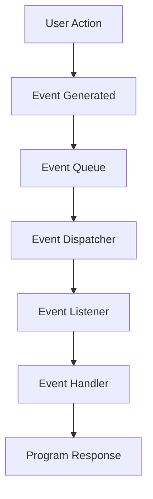

Event-driven programming allows for responsive and interactive applications, making it crucial for developing modern user interfaces and reactive systems in Java.

### પ્રશ્ન 2(અ): જાવામાં ઇવેન્ટ-ડ્રિવન પ્રોગ્રામિંગની વિભાવના સમજાવો. (3 ગુણ)

**જવાબ 2(અ):**

ઇવેન્ટ-ડ્રિવન પ્રોગ્રામિંગ એ એક પ્રોગ્રામિંગ પેરાડાઇમ છે જેમાં પ્રોગ્રામનો પ્રવાહ યુઝર ક્રિયાઓ, સેન્સર આઉટપુટ, અથવા અન્ય પ્રોગ્રામ્સ કે થ્રેડ્સમાંથી આવતા સંદેશાઓ જેવી ઘટનાઓ દ્વારા નક્કી થાય છે. જાવામાં, આ વિભાવના ઇન્ટરેક્ટિવ એપ્લિકેશન્સ બનાવવા માટે મૂળભૂત છે, ખાસ કરીને ગ્રાફિકલ યુઝર ઇન્ટરફેસ (GUIs) માં.

જાવામાં ઇવેન્ટ-ડ્રિવન પ્રોગ્રામિંગના મુખ્ય પાસાઓ:

1. **ઇવેન્ટ્સ**:
   - પ્રોગ્રામના અમલીકરણ દરમિયાન થતી ઘટનાઓ અથવા બનાવો.
   - ઉદાહરણો: બટન ક્લિક્સ, માઉસ હલનચલન, કી દબાવવી.

2. **ઇવેન્ટ સ્રોતો**:
   - ઇવેન્ટ્સ ઉત્પન્ન કરતા ઑબ્જેક્ટ્સ.
   - જાવામાં, આ સામાન્ય રીતે બટન્સ, ટેક્સ્ટ ફીલ્ડ્સ વગેરે જેવા GUI કમ્પોનન્ટ્સ હોય છે.

3. **ઇવેન્ટ લિસનર્સ**:
   - ચોક્કસ ઇવેન્ટ્સ થવાની રાહ જોતા ઑબ્જેક્ટ્સ.
   - ઇવેન્ટ્સ હેન્ડલ કરવા માટે ચોક્કસ ઇન્ટરફેસ અમલ કરે છે.

4. **ઇવેન્ટ હેન્ડલર્સ**:
   - ચોક્કસ ઇવેન્ટ થાય ત્યારે કૉલ થતી પદ્ધતિઓ.
   - ઇવેન્ટના પ્રતિસાદમાં અમલ કરવાનો કોડ ધરાવે છે.

5. **ઇવેન્ટ ક્યૂ**:
   - ઇવેન્ટ્સ સામાન્ય રીતે ક્યૂમાં પ્રોસેસ થાય છે, જે વ્યવસ્થિત હેન્ડલિંગ સુનિશ્ચિત કરે છે.

જાવામાં ઇવેન્ટ-ડ્રિવન પ્રોગ્રામિંગનું ઉદાહરણ:

```java
import javax.swing.*;
import java.awt.event.*;

public class EventExample extends JFrame {
    public EventExample() {
        JButton button = new JButton("મને ક્લિક કરો");
        button.addActionListener(new ActionListener() {
            public void actionPerformed(ActionEvent e) {
                System.out.println("બટન ક્લિક થયું!");
            }
        });
        add(button);
        setSize(200, 100);
        setVisible(true);
    }

    public static void main(String[] args) {
        new EventExample();
    }
}
```

આ ઉદાહરણમાં:

- `JButton` ઇવેન્ટ સ્રોત છે.
- `ActionListener` ઇવેન્ટ લિસનર છે.
- `actionPerformed` પદ્ધતિ ઇવેન્ટ હેન્ડલર છે.

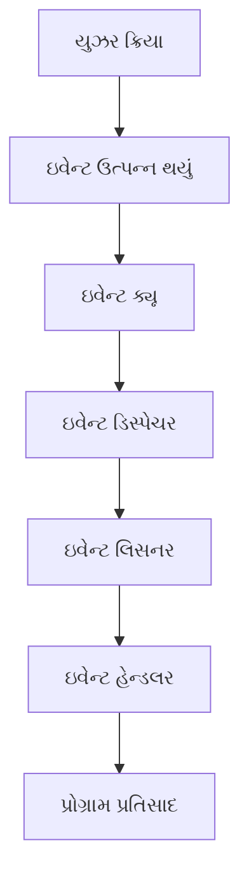

ઇવેન્ટ-ડ્રિવન પ્રોગ્રામિંગ પ્રતિસાદાત્મક અને ઇન્ટરેક્ટિવ એપ્લિકેશન્સની મંજૂરી આપે છે, જે જાવામાં આધુનિક યુઝર ઇન્ટરફેસ અને પ્રતિક્રિયાશીલ સિસ્ટમ્સ વિકસાવવા માટે મહત્વપૂર્ણ છે.

### Question 2(b): Describe the MVC design pattern and its implementation in JavaFX. (4 marks)

**Ans 2(b):**

The Model-View-Controller (MVC) is an architectural pattern commonly used for developing user interfaces. It divides an application into three interconnected components:

1. **Model**: Represents the data and business logic of the application.
2. **View**: Displays the data to the user (the user interface).
3. **Controller**: Handles user input and updates the Model and View accordingly.

Key characteristics of MVC:

- Separation of concerns
- Improved code organization and maintainability
- Facilitates parallel development
- Enhances code reusability

Implementation in JavaFX:

In JavaFX, the MVC pattern is often implemented with FXML, where:

- Model: Java classes representing data and logic
- View: FXML files defining the UI layout
- Controller: Java classes handling user interactions and updating Model/View

Example implementation:

1. Model (Person.java):

   ```java
   public class Person {
      private String name;
      public String getName() { return name; }
      public void setName(String name) { this.name = name; }
   }
   ```

2. View (PersonView.fxml):

   ```xml
   <?xml version="1.0" encoding="UTF-8"?>
   <?import javafx.scene.control.*?>
   <?import javafx.scene.layout.*?>
   <VBox xmlns:fx="http://javafx.com/fxml" fx:controller="PersonController">
      <TextField fx:id="nameField"/>
      <Button text="Save" onAction="#savePerson"/>
      <Label fx:id="resultLabel"/>
   </VBox>
   ```

3. Controller (PersonController.java):

   ```java
   public class PersonController {
      @FXML private TextField nameField;
      @FXML private Label resultLabel;
      private Person person = new Person();

      @FXML
      private void savePerson() {
         person.setName(nameField.getText());
         resultLabel.setText("Saved: " + person.getName());
      }
   }
   ```

4. Main Application:

   ```java
   public class MVCApp extends Application {
      @Override
      public void start(Stage stage) throws IOException {
         FXMLLoader loader = new FXMLLoader(getClass().getResource("PersonView.fxml"));
         Parent root = loader.load();
         Scene scene = new Scene(root);
         stage.setScene(scene);
         stage.show();
      }
   }
   ```

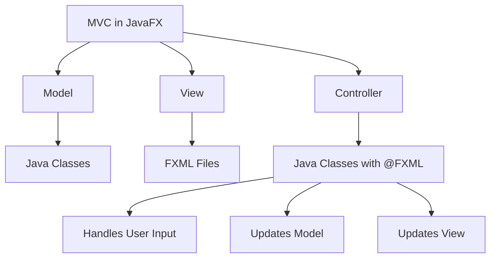

This implementation demonstrates how JavaFX leverages the MVC pattern to create a clear separation between data (Model), presentation (View), and application logic (Controller), resulting in a more modular and maintainable application structure.

### પ્રશ્ન 2(બ): MVC ડિઝાઇન પેટર્ન અને JavaFX માં તેના અમલીકરણનું વર્ણન કરો. (4 ગુણ)

**જવાબ 2(બ):**

Model-View-Controller (MVC) એ યુઝર ઇન્ટરફેસ વિકસાવવા માટે સામાન્યપણે ઉપયોગમાં લેવાતું આર્કિટેક્ચરલ પેટર્ન છે. તે એપ્લિકેશનને ત્રણ પરસ્પર જોડાયેલા ઘટકોમાં વિભાજિત કરે છે:

1. **મોડેલ**: એપ્લિકેશનનો ડેટા અને વ્યવસાય તર્કનું પ્રતિનિધિત્વ કરે છે.
2. **વ્યૂ**: યુઝરને ડેટા પ્રદર્શિત કરે છે (યુઝર ઇન્ટરફેસ).
3. **કંટ્રોલર**: યુઝર ઇનપુટ સંભાળે છે અને તદનુસાર મોડેલ અને વ્યૂને અપડેટ કરે છે.

MVC ની મુખ્ય લાક્ષણિકતાઓ:

- કન્સર્ન્સનું વિભાજન
- સુધારેલ કોડ સંગઠન અને જાળવણી
- સમાંતર વિકાસને સુગમ બનાવે છે
- કોડ પુનઃઉપયોગિતા વધારે છે

JavaFX માં અમલીકરણ:

JavaFX માં, MVC પેટર્ન ઘણીવાર FXML સાથે અમલમાં મૂકવામાં આવે છે, જ્યાં:

- મોડેલ: ડેટા અને લોજિકનું પ્રતિનિધિત્વ કરતા Java ક્લાસ
- વ્યૂ: UI લેઆઉટ વ્યાખ્યાયિત કરતી FXML ફાઇલો
- કંટ્રોલર: યુઝર ઇન્ટરેક્શન્સ સંભાળતા અને મોડેલ/વ્યૂ અપડેટ કરતા Java ક્લાસ

અમલીકરણનું ઉદાહરણ:

1. મોડેલ (Person.java):

   ```java
   public class Person {
      private String name;
      public String getName() { return name; }
      public void setName(String name) { this.name = name; }
   }
   ```

2. વ્યૂ (PersonView.fxml):

   ```xml
   <?xml version="1.0" encoding="UTF-8"?>
   <?import javafx.scene.control.*?>
   <?import javafx.scene.layout.*?>
   <VBox xmlns:fx="http://javafx.com/fxml" fx:controller="PersonController">
      <TextField fx:id="nameField"/>
      <Button text="સેવ કરો" onAction="#savePerson"/>
      <Label fx:id="resultLabel"/>
   </VBox>
   ```

3. કંટ્રોલર (PersonController.java):

   ```java
   public class PersonController {
      @FXML private TextField nameField;
      @FXML private Label resultLabel;
      private Person person = new Person();

      @FXML
      private void savePerson() {
         person.setName(nameField.getText());
         resultLabel.setText("સેવ થયું: " + person.getName());
      }
   }
   ```

4. મુખ્ય એપ્લિકેશન:

   ```java
   public class MVCApp extends Application {
      @Override
      public void start(Stage stage) throws IOException {
         FXMLLoader loader = new FXMLLoader(getClass().getResource("PersonView.fxml"));
         Parent root = loader.load();
         Scene scene = new Scene(root);
         stage.setScene(scene);
         stage.show();
      }
   }
   ```

```mermaid
graph TD
    A[JavaFX માં MVC] --> B[મોડેલ]
    A --> C[વ્યૂ]
    A --> D[કંટ્રોલર]
    B --> E[Java ક્લાસ]
    C --> F[FXML ફાઇલો]
    D --> G[@FXML સાથે Java ક્લાસ]
    G --> H[યુઝર ઇનપુટ સંભાળે છે]
    G --> I[મોડેલ અપડેટ કરે છે]
    G --> J[વ્યૂ અપડેટ કરે છે]
```

આ અમલીકરણ દર્શાવે છે કે કેવી રીતે JavaFX MVC પેટર્નનો લાભ લે છે જેથી ડેટા (મોડેલ), પ્રસ્તુતિ (વ્યૂ), અને એપ્લિકેશન લોજિક (કંટ્રોલર) વચ્ચે સ્પષ્ટ વિભાજન બનાવી શકાય, જેના પરિણામે વધુ મોડ્યુલર અને જાળવણી યોગ્ય એપ્લિકેશન સ્ટ્રક્ચર મળે છે.

### Question 2(c): Explain the process of creating and handling custom events in Swing. (7 marks)

**Ans 2(c):**

Creating and handling custom events in Swing allows developers to define their own event types and event handling mechanisms. This process involves several steps:

1. **Define the Custom Event Class**:
   - Create a class that extends `java.util.EventObject`.
   - Include any additional data relevant to the event.

2. **Create the Event Listener Interface**:
   - Define an interface that extends `java.util.EventListener`.
   - Declare method(s) to handle the custom event.

3. **Implement the Event Source**:
   - Create a class that will generate the custom events.
   - Include methods to add and remove event listeners.
   - Implement a method to fire the custom event.

4. **Implement the Event Listener**:
   - Create a class that implements the custom event listener interface.
   - Define the event handling logic in the listener method.

5. **Use the Custom Event System**:
   - Instantiate the event source and listener.
   - Register the listener with the source.
   - Trigger the event when appropriate.

Let's implement this process with an example:

1. Custom Event Class:

   ```java
   public class ColorChangeEvent extends EventObject {
      private Color newColor;

      public ColorChangeEvent(Object source, Color newColor) {
         super(source);
         this.newColor = newColor;
      }

      public Color getNewColor() {
         return newColor;
      }
   }
   ```

2. Event Listener Interface:

   ```java
   public interface ColorChangeListener extends EventListener {
      void colorChanged(ColorChangeEvent event);
   }
   ```

3. Event Source:

   ```java
   public class ColorChanger {
      private List<ColorChangeListener> listeners = new ArrayList<>();
      private Color currentColor = Color.BLACK;

      public void addColorChangeListener(ColorChangeListener listener) {
         listeners.add(listener);
      }

      public void removeColorChangeListener(ColorChangeListener listener) {
         listeners.remove(listener);
      }

      protected void fireColorChangeEvent(Color newColor) {
         ColorChangeEvent event = new ColorChangeEvent(this, newColor);
         for (ColorChangeListener listener : listeners) {
               listener.colorChanged(event);
         }
      }

      public void changeColor(Color newColor) {
         if (!currentColor.equals(newColor)) {
               currentColor = newColor;
               fireColorChangeEvent(newColor);
         }
      }
   }
   ```

4. Event Listener Implementation:

   ```java
   public class ColorPanel extends JPanel implements ColorChangeListener {
      public ColorPanel() {
         setPreferredSize(new Dimension(200, 200));
      }

      @Override
      public void colorChanged(ColorChangeEvent event) {
         setBackground(event.getNewColor());
         repaint();
      }
   }
   ```

5. Using the Custom Event System:

   ```java
   public class CustomEventDemo extends JFrame {
      public CustomEventDemo() {
         ColorChanger colorChanger = new ColorChanger();
         ColorPanel colorPanel = new ColorPanel();
         
         colorChanger.addColorChangeListener(colorPanel);
         
         JButton redButton = new JButton("Red");
         redButton.addActionListener(e -> colorChanger.changeColor(Color.RED));
         
         JButton blueButton = new JButton("Blue");
         blueButton.addActionListener(e -> colorChanger.changeColor(Color.BLUE));
         
         setLayout(new FlowLayout());
         add(colorPanel);
         add(redButton);
         add(blueButton);
         
         pack();
         setDefaultCloseOperation(JFrame.EXIT_ON_CLOSE);
      }

      public static void main(String[] args) {
         SwingUtilities.invokeLater(() -> new CustomEventDemo().setVisible(true));
      }
   }
   ```

This example demonstrates a custom color change event system:

- `ColorChangeEvent` carries information about the new color.
- `ColorChangeListener` defines the interface for objects interested in color changes.
- `ColorChanger` manages listeners and fires events when the color changes.
- `ColorPanel` listens for color changes and updates its background accordingly.
- `CustomEventDemo` ties everything together in a Swing application.

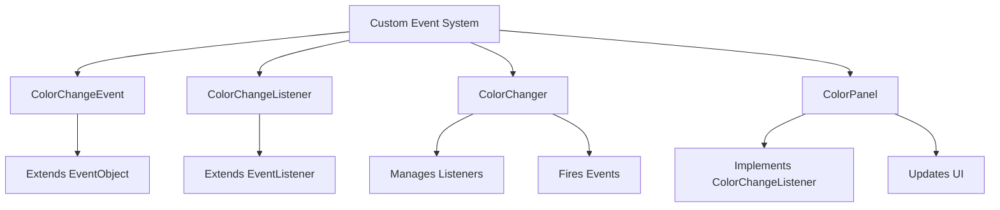

By creating custom events, developers can design more flexible and modular Swing applications, allowing components to communicate and react to application-specific events in a decoupled manner.

### પ્રશ્ન 2(ક): સ્વિંગમાં કસ્ટમ ઇવેન્ટ્સ બનાવવાની અને હેન્ડલ કરવાની પ્રક્રિયા સમજાવો. (7 ગુણ)

**જવાબ 2(ક):**

સ્વિંગમાં કસ્ટમ ઇવેન્ટ્સ બનાવવા અને હેન્ડલ કરવાની પ્રક્રિયા ડેવલપર્સને તેમના પોતાના ઇવેન્ટ પ્રકારો અને ઇવેન્ટ હેન્ડલિંગ મેકેનિઝમ્સ વ્યાખ્યાયિત કરવાની મંજૂરી આપે છે. આ પ્રક્રિયામાં કેટલાક પગલાં સામેલ છે:

1. **કસ્ટમ ઇવેન્ટ ક્લાસ વ્યાખ્યાયિત કરો**:
   - `java.util.EventObject` ને વિસ્તૃત કરતો એક ક્લાસ બનાવો.
   - ઇવેન્ટ સાથે સંબંધિત કોઈપણ વધારાનો ડેટા સામેલ કરો.

2. **ઇવેન્ટ લિસનર ઇન્ટરફેસ બનાવો**:
   - `java.util.EventListener` ને વિસ્તૃત કરતું ઇન્ટરફેસ વ્યાખ્યાયિત કરો.
   - કસ્ટમ ઇવેન્ટ હેન્ડલ કરવા માટે પદ્ધતિ(ઓ) ઘોષિત કરો.

3. **ઇવેન્ટ સ્રોત અમલ કરો**:
   - કસ્ટમ ઇવેન્ટ્સ ઉત્પન્ન કરશે તે ક્લાસ બનાવો.
   - ઇવેન્ટ લિસનર્સ ઉમેરવા અને દૂર કરવા માટેની પદ્ધતિઓ સામેલ કરો.
   - કસ્ટમ ઇવેન્ટ ફાયર કરવા માટેની પદ્ધતિ અમલ કરો.

4. **ઇવેન્ટ લિસનર અમલ કરો**:
   - કસ્ટમ ઇવેન્ટ લિસનર ઇન્ટરફેસને અમલ કરતો ક્લાસ બનાવો.
   - લિસનર પદ્ધતિમાં ઇવેન્ટ હેન્ડલિંગ લોજિક વ્યાખ્યાયિત કરો.

5. **કસ્ટમ ઇવેન્ટ સિસ્ટમનો ઉપયોગ કરો**:
   - ઇવેન્ટ સ્રોત અને લિસનરને ઇન્સ્ટન્શિએટ કરો.
   - સ્રોત સાથે લિસનર નોંધણી કરો.
   - યોગ્ય સમયે ઇવેન્ટ ટ્રિગર કરો.

ચાલો આ પ્રક્રિયાને એક ઉદાહરણ સાથે અમલમાં મૂકીએ:

1. કસ્ટમ ઇવેન્ટ ક્લાસ:

   ```java
   public class ColorChangeEvent extends EventObject {
      private Color newColor;

      public ColorChangeEvent(Object source, Color newColor) {
         super(source);
         this.newColor = newColor;
      }

      public Color getNewColor() {
         return newColor;
      }
   }
   ```

2. ઇવેન્ટ લિસનર ઇન્ટરફેસ:

   ```java
   public interface ColorChangeListener extends EventListener {
      void colorChanged(ColorChangeEvent event);
   }
   ```

3. ઇવેન્ટ સ્રોત:

   ```java
   public class ColorChanger {
      private List<ColorChangeListener> listeners = new ArrayList<>();
      private Color currentColor = Color.BLACK;

      public void addColorChangeListener(ColorChangeListener listener) {
         listeners.add(listener);
      }

      public void removeColorChangeListener(ColorChangeListener listener) {
         listeners.remove(listener);
      }

      protected void fireColorChangeEvent(Color newColor) {
         ColorChangeEvent event = new ColorChangeEvent(this, newColor);
         for (ColorChangeListener listener : listeners) {
               listener.colorChanged(event);
         }
      }

      public void changeColor(Color newColor) {
         if (!currentColor.equals(newColor)) {
               currentColor = newColor;
               fireColorChangeEvent(newColor);
         }
      }
   }
   ```

4. ઇવેન્ટ લિસનર અમલીકરણ:

   ```java
   public class ColorPanel extends JPanel implements ColorChangeListener {
      public ColorPanel() {
         setPreferredSize(new Dimension(200, 200));
      }

      @Override
      public void colorChanged(ColorChangeEvent event) {
         setBackground(event.getNewColor());
         repaint();
      }
   }
   ```

5. કસ્ટમ ઇવેન્ટ સિસ્ટમનો ઉપયોગ:

   ```java
   public class CustomEventDemo extends JFrame {
      public CustomEventDemo() {
         ColorChanger colorChanger = new ColorChanger();
         ColorPanel colorPanel = new ColorPanel();
         
         colorChanger.addColorChangeListener(colorPanel);
         
         JButton redButton = new JButton("લાલ");
         redButton.addActionListener(e -> colorChanger.changeColor(Color.RED));
         
         JButton blueButton = new JButton("વાદળી");
         blueButton.addActionListener(e -> colorChanger.changeColor(Color.BLUE));
         
         setLayout(new FlowLayout());
         add(colorPanel);
         add(redButton);
         add(blueButton);
         
         pack();
         setDefaultCloseOperation(JFrame.EXIT_ON_CLOSE);
      }

      public static void main(String[] args) {
         SwingUtilities.invokeLater(() -> new CustomEventDemo().setVisible(true));
      }
   }
   ```

આ ઉદાહરણ કસ્ટમ રંગ બદલાવ ઇવેન્ટ સિસ્ટમનું પ્રદર્શન કરે છે:

- `ColorChangeEvent` નવા રંગ વિશેની માહિતી વહન કરે છે.
- `ColorChangeListener` રંગ બદલાવમાં રસ ધરાવતા ઑબ્જેક્ટ્સ માટે ઇન્ટરફેસ વ્યાખ્યાયિત કરે છે.
- `ColorChanger` લિસનર્સનું સંચાલન કરે છે અને રંગ બદલાય ત્યારે ઇવેન્ટ્સ ફાયર કરે છે.
- `ColorPanel` રંગ બદલાવ માટે સાંભળે છે અને તદનુસાર તેની પૃષ્ઠભૂમિ અપડેટ કરે છે.
- `CustomEventDemo` સ્વિંગ એપ્લિકેશનમાં બધું એકસાથે જોડે છે.

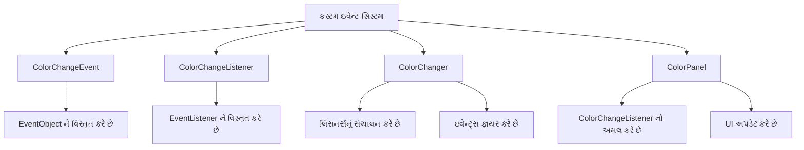

કસ્ટમ ઇવેન્ટ્સ બનાવીને, ડેવલપર્સ વધુ લવચીક અને મોડ્યુલર સ્વિંગ એપ્લિકેશન્સ ડિઝાઇન કરી શકે છે, જે ઘટકોને એપ્લિકેશન-વિશિષ્ટ ઇવેન્ટ્સ પર ડિકપલ્ડ રીતે વાતચીત કરવા અને પ્રતિક્રિયા આપવાની મંજૂરી આપે છે.

### Question 3(a): Explain the concept of connection pooling in JDBC. (3 marks)

**Ans 3(a):**

Connection pooling is an important technique used in JDBC (Java Database Connectivity) to improve the performance and efficiency of database operations. Key aspects of connection pooling include:

1. **Definition:**
   - Connection pooling is a method of creating and managing a pool of reusable database connections.
   - Instead of opening a new connection for each database operation, connections are reused from the pool.

2. **How it works:**
   - A set of database connections is created and maintained in a pool.
   - When an application needs a connection, it borrows one from the pool.
   - After use, the connection is returned to the pool instead of being closed.

3. **Advantages:**
   - Reduces overhead of creating new connections repeatedly.
   - Improves application performance and response time.
   - Manages database resources more efficiently.

4. **Implementation:**
   - JDBC drivers often provide built-in support for connection pooling.
   - Can be implemented using frameworks like Apache Commons DBCP or C3P0.

5. **Key features:**
   - Connection validation to ensure pooled connections are still valid.
   - Configurable pool sizes (minimum, maximum connections).
   - Idle connection timeout to free up unused resources.

```mermaid
graph TD
    A[Application] -->|Request Connection| B[Connection Pool]
    B -->|Provide Connection| A
    B -->|Manage| C[Active Connections]
    B -->|Manage| D[Idle Connections]
    E[Database] <-->|Connect| C
    E <-->|Connect| D
```

### પ્રશ્ન 3(અ): JDBC માં કનેક્શન પૂલિંગની વિભાવના સમજાવો. (3 ગુણ)

**જવાબ 3(અ):**

કનેક્શન પૂલિંગ એ JDBC (Java Database Connectivity) માં ડેટાબેસ ઓપરેશન્સની કાર્યક્ષમતા અને દક્ષતા સુધારવા માટે વપરાતી એક મહત્વપૂર્ણ તકનીક છે. કનેક્શન પૂલિંગના મુખ્ય પાસાંઓમાં સામેલ છે:

1. **વ્યાખ્યા:**
   - કનેક્શન પૂલિંગ એ ફરીથી વાપરી શકાય તેવા ડેટાબેસ કનેક્શન્સનું પૂલ બનાવવા અને સંચાલિત કરવાની પદ્ધતિ છે.
   - દરેક ડેટાબેસ ઓપરેશન માટે નવું કનેક્શન ખોલવાને બદલે, પૂલમાંથી કનેક્શન્સનો પુન:ઉપયોગ કરવામાં આવે છે.

2. **કેવી રીતે કામ કરે છે:**
   - ડેટાબેસ કનેક્શન્સનો એક સેટ પૂલમાં બનાવવામાં અને જાળવવામાં આવે છે.
   - જ્યારે એપ્લિકેશનને કનેક્શનની જરૂર પડે છે, ત્યારે તે પૂલમાંથી એક ઉધાર લે છે.
   - ઉપયોગ પછી, કનેક્શનને બંધ કરવાને બદલે પૂલમાં પરત કરવામાં આવે છે.

3. **ફાયદાઓ:**
   - વારંવાર નવા કનેક્શન્સ બનાવવાનો ઓવરહેડ ઘટાડે છે.
   - એપ્લિકેશનની કાર્યક્ષમતા અને પ્રતિસાદ સમય સુધારે છે.
   - ડેટાબેસ સંસાધનોનું વધુ કાર્યક્ષમ રીતે સંચાલન કરે છે.

4. **અમલીકરણ:**
   - JDBC drivers ઘણી વખત કનેક્શન પૂલિંગ માટે built-in સપોર્ટ પ્રદાન કરે છે.
   - Apache Commons DBCP અથવા C3P0 જેવા frameworks નો ઉપયોગ કરીને અમલમાં મૂકી શકાય છે.

5. **મુખ્ય લક્ષણો:**
   - પૂલ કરેલા કનેક્શન્સ હજી પણ માન્ય છે તેની ખાતરી કરવા માટે કનેક્શન માન્યતા.
   - કોન્ફિગર કરી શકાય તેવા પૂલ કદ (ન્યૂનતમ, મહત્તમ કનેક્શન્સ).
   - વણવપરાયેલા સંસાધનોને મુક્ત કરવા માટે નિષ્ક્રિય કનેક્શન સમયસમાપ્તિ.

```mermaid
graph TD
    A[એપ્લિકેશન] -->|કનેક્શન વિનંતી| B[કનેક્શન પૂલ]
    B -->|કનેક્શન પ્રદાન કરો| A
    B -->|સંચાલન| C[સક્રિય કનેક્શન્સ]
    B -->|સંચાલન| D[નિષ્ક્રિય કનેક્શન્સ]
    E[ડેટાબેસ] <-->|કનેક્ટ| C
    E <-->|કનેક્ટ| D
```

### Question 3(b): Describe the entity lifecycle in JPA. (4 marks)

**Ans 3(b):**

The entity lifecycle in Java Persistence API (JPA) refers to the different states an entity goes through from its creation to its removal. Understanding this lifecycle is crucial for effective management of persistent objects. The entity lifecycle in JPA consists of four main states:

1. **New (Transient) State:**
   - An entity is in this state when it's just created using the `new` keyword.
   - It's not associated with any persistence context and has no persistent identity.
   - The entity is not yet tracked by JPA and has no representation in the database.

2. **Managed (Persistent) State:**
   - An entity enters this state when it's associated with a persistence context.
   - This occurs through operations like `persist()`, `merge()`, or when an entity is retrieved from the database.
   - Changes to the entity are tracked and automatically synchronized with the database during the next flush or commit.

3. **Detached State:**
   - An entity becomes detached when it's no longer associated with a persistence context.
   - This can happen when the persistence context is closed or the entity is evicted.
   - The entity still has a persistent identity but changes are not automatically tracked.

4. **Removed State:**
   - An entity enters this state when it's scheduled for removal from the database.
   - This occurs when the `remove()` method is called on a managed entity.
   - The entity is still in the persistence context until the next flush or commit.

Key transitions between states:

- `persist()`: New → Managed
- `merge()`: Detached → Managed
- `remove()`: Managed → Removed
- `detach()`: Managed → Detached
- `refresh()`: Synchronizes the state of the managed entity with the database

```mermaid
stateDiagram-v2
    [*] --> New : Create
    New --> Managed : persist()
    Managed --> Detached : detach()
    Detached --> Managed : merge()
    Managed --> Removed : remove()
    Removed --> [*] : commit
    Managed --> [*] : commit
```

Understanding these states and transitions is essential for proper entity management and avoiding common pitfalls in JPA applications.

### પ્રશ્ન 3(બ): JPA માં એન્ટિટી લાઇફસાયકલનું વર્ણન કરો. (4 ગુણ)

**જવાબ 3(બ):**

Java Persistence API (JPA) માં એન્ટિટી લાઇફસાયકલ એ એન્ટિટી તેની રચનાથી લઈને તેના નિકાલ સુધી જુદી જુદી અવસ્થાઓમાંથી પસાર થાય છે તેને સંદર્ભિત કરે છે. આ લાઇફસાયકલને સમજવી એ persistent objects ના અસરકારક સંચાલન માટે મહત્વપૂર્ણ છે. JPA માં એન્ટિટી લાઇફસાયકલમાં ચાર મુખ્ય અવસ્થાઓ છે:

1. **નવી (Transient) અવસ્થા:**
   - જ્યારે એન્ટિટી ફક્ત `new` કીવર્ડનો ઉપયોગ કરીને બનાવવામાં આવે છે ત્યારે તે આ અવસ્થામાં હોય છે.
   - તે કોઈપણ persistence context સાથે સંકળાયેલ નથી અને તેની કોઈ persistent ઓળખ નથી.
   - એન્ટિટી હજુ JPA દ્વારા ટ્રૅક કરવામાં આવતી નથી અને ડેટાબેસમાં તેનું કોઈ પ્રતિનિધિત્વ નથી.

2. **મેનેજ્ડ (Persistent) અવસ્થા:**
   - જ્યારે એન્ટિટી persistence context સાથે સંકળાયેલી હોય ત્યારે તે આ અવસ્થામાં પ્રવેશે છે.
   - આ `persist()`, `merge()` જેવા ઓપરેશન્સ દ્વારા અથવા જ્યારે ડેટાબેસમાંથી એન્ટિટી પુનઃપ્રાપ્ત કરવામાં આવે ત્યારે થાય છે.
   - એન્ટિટીમાં થતા ફેરફારો ટ્રૅક કરવામાં આવે છે અને આગામી flush અથવા commit દરમિયાન આપોઆપ ડેટાબેસ સાથે સિંક્રનાઇઝ થાય છે.

3. **ડિટેચ્ડ અવસ્થા:**
   - જ્યારે એન્ટિટી હવે persistence context સાથે સંકળાયેલી ન હોય ત્યારે તે ડિટેચ્ડ બને છે.
   - આ ત્યારે થઈ શકે છે જ્યારે persistence context બંધ થાય છે અથવા એન્ટિટીને કાઢી નાખવામાં આવે છે.
   - એન્ટિટી હજુ પણ persistent ઓળખ ધરાવે છે પરંતુ ફેરફારો આપમેળે ટ્રૅક કરવામાં આવતા નથી.

4. **રિમૂવ્ડ અવસ્થા:**
   - જ્યારે એન્ટિટી ડેટાબેસમાંથી દૂર કરવા માટે શેડ્યૂલ કરવામાં આવે ત્યારે તે આ અવસ્થામાં પ્રવેશે છે.
   - આ ત્યારે થાય છે જ્યારે મેનેજ્ડ એન્ટિટી પર `remove()` મેથડ કૉલ કરવામાં આવે છે.
   - આગામી flush અથવા commit સુધી એન્ટિટી હજુ પણ persistence context માં રહે છે.

અવસ્થાઓ વચ્ચેના મુખ્ય ટ્રાન્ઝિશન્સ:

- `persist()`: નવી → મેનેજ્ડ
- `merge()`: ડિટેચ્ડ → મેનેજ્ડ
- `remove()`: મેનેજ્ડ → રિમૂવ્ડ
- `detach()`: મેનેજ્ડ → ડિટેચ્ડ
- `refresh()`: મેનેજ્ડ એન્ટિટીની સ્થિતિને ડેટાબેસ સાથે સિંક્રનાઇઝ કરે છે

```mermaid
stateDiagram-v2
    [*] --> New : બનાવવું
    New --> Managed : persist()
    Managed --> Detached : detach()
    Detached --> Managed : merge()
    Managed --> Removed : remove()
    Removed --> [*] : commit
    Managed --> [*] : commit
```

JPA એપ્લિકેશન્સમાં યોગ્ય એન્ટિટી મેનેજમેન્ટ અને સામાન્ય સમસ્યાઓને ટાળવા માટે આ અવસ્થાઓ અને ટ્રાન્ઝિશન્સને સમજવી અત્યંત આવશ્યક છે.

### Question 3(c): Explain the process of mapping entities and relationships using Hibernate. (7 marks)

**Ans 3(c):**

Hibernate is a popular Object-Relational Mapping (ORM) framework that simplifies the process of mapping Java objects to database tables. The process of mapping entities and relationships using Hibernate involves several steps and concepts:

1. **Entity Mapping:**
   - Entities are Java classes that represent database tables.
   - Use the `@Entity` annotation to mark a class as an entity.
   - The `@Table` annotation specifies the database table name if it differs from the class name.

   Example:

   ```java
   @Entity
   @Table(name = "employees")
   public class Employee {
       // Class members
   }
   ```

2. **Primary Key Mapping:**
   - Use `@Id` to mark the primary key field.
   - `@GeneratedValue` specifies the strategy for generating primary key values.

   Example:

   ```java
   @Id
   @GeneratedValue(strategy = GenerationType.IDENTITY)
   private Long id;
   ```

3. **Column Mapping:**
   - By default, Hibernate maps all fields to table columns.
   - Use `@Column` to customize column properties (name, nullable, length, etc.).

   Example:

   ```java
   @Column(name = "first_name", nullable = false, length = 50)
   private String firstName;
   ```

4. **Relationship Mapping:**
   Hibernate supports various types of relationships:

   a) One-to-One:

      ```java
      @OneToOne
      @JoinColumn(name = "address_id")
      private Address address;
      ```

   b) One-to-Many:

      ```java
      @OneToMany(mappedBy = "department")
      private List<Employee> employees;
      ```

   c) Many-to-One:

      ```java
      @ManyToOne
      @JoinColumn(name = "department_id")
      private Department department;
      ```

   d) Many-to-Many:

      ```java
      @ManyToMany
      @JoinTable(
          name = "employee_project",
          joinColumns = @JoinColumn(name = "employee_id"),
          inverseJoinColumns = @JoinColumn(name = "project_id")
      )
      private Set<Project> projects;
      ```

5. **Cascade Operations:**
   - Use `cascade` attribute to specify how operations should propagate to associated entities.

   ```java
   @OneToMany(mappedBy = "department", cascade = CascadeType.ALL)
   private List<Employee> employees;
   ```

6. **Fetch Types:**
   - Specify when related entities should be loaded:
     - EAGER: Load immediately
     - LAZY: Load on demand (default for collections)

   ```java
   @ManyToOne(fetch = FetchType.LAZY)
   private Department department;
   ```

7. **Inheritance Mapping:**
   Hibernate supports different inheritance strategies:
   - Single Table: `@Inheritance(strategy = InheritanceType.SINGLE_TABLE)`
   - Joined Table: `@Inheritance(strategy = InheritanceType.JOINED)`
   - Table Per Class: `@Inheritance(strategy = InheritanceType.TABLE_PER_CLASS)`

8. **Composite Keys:**
   - Use `@EmbeddedId` for composite primary keys.

   ```java
   @Embeddable
   public class EmployeeId implements Serializable {
       private String companyId;
       private Long employeeNumber;
   }
   
   @Entity
   public class Employee {
       @EmbeddedId
       private EmployeeId id;
   }
   ```

9. **Mapping Enumerations:**

   ```java
   @Enumerated(EnumType.STRING)
   private EmployeeStatus status;
   ```

10. **Hibernate Configuration:**
    - Configure Hibernate using `hibernate.cfg.xml` or programmatically.
    - Specify database connection details, dialect, and mapping resources.

```mermaid
graph TD
    A[Java Class] -->|@Entity| B[Hibernate]
    B -->|Mapping| C[Database Table]
    D[Relationships] -->|@OneToMany, @ManyToOne, etc.| B
    E[Properties] -->|@Column, @Id, etc.| B
    F[Inheritance] -->|@Inheritance| B
    G[Configuration] --> B
```

By following these mapping techniques, Hibernate can effectively bridge the gap between object-oriented Java code and relational database structures, allowing for seamless persistence and retrieval of complex object graphs.

### પ્રશ્ન 3(ક): Hibernate નો ઉપયોગ કરીને એન્ટિટીઝ અને સંબંધોને મેપ કરવાની પ્રક્રિયા સમજાવો. (7 ગુણ)

**જવાબ 3(ક):**

Hibernate એ એક લોકપ્રિય Object-Relational Mapping (ORM) ફ્રેમવર્ક છે જે Java objects ને ડેટાબેસ ટેબલ્સ સાથે મેપ કરવાની પ્રક્રિયાને સરળ બનાવે છે. Hibernate નો ઉપયોગ કરીને એન્ટિટીઝ અને સંબંધોને મેપ કરવાની પ્રક્રિયામાં ઘણા પગલાં અને વિભાવનાઓ શામેલ છે:

1. **એન્ટિટી મેપિંગ:**
   - એન્ટિટીઝ એ Java ક્લાસ છે જે ડેટાબેસ ટેબલ્સનું પ્રતિનિધિત્વ કરે છે.
   - ક્લાસને એન્ટિટી તરીકે ચિહ્નિત કરવા માટે `@Entity` એનોટેશનનો ઉપયોગ કરો.
   - જો ડેટાબેસ ટેબલનું નામ ક્લાસના નામથી અલગ હોય તો `@Table` એનોટેશન તેને સ્પષ્ટ કરે છે.

   ઉદાહરણ:

   ```java
   @Entity
   @Table(name = "employees")
   public class Employee {
       // ક્લાસના સભ્યો
   }
   ```

2. **પ્રાથમિક કી મેપિંગ:**
   - પ્રાથમિક કી ફીલ્ડને ચિહ્નિત કરવા માટે `@Id` નો ઉપયોગ કરો.
   - `@GeneratedValue` પ્રાથમિક કી મૂલ્યો જનરેટ કરવાની વ્યૂહરચના સ્પષ્ટ કરે છે.

   ઉદાહરણ:

   ```java
   @Id
   @GeneratedValue(strategy = GenerationType.IDENTITY)
   private Long id;
   ```

3. **કૉલમ મેપિંગ:**
   - મૂળભૂત રીતે, Hibernate બધા ફીલ્ડ્સને ટેબલ કૉલમ્સ સાથે મેપ કરે છે.
   - કૉલમ ગુણધર્મોને કસ્ટમાઇઝ કરવા માટે `@Column` નો ઉપયોગ કરો (નામ, nullable, લંબાઈ, વગેરે).

   ઉદાહરણ:

   ```java
   @Column(name = "first_name", nullable = false, length = 50)
   private String firstName;
   ```

4. **સંબંધ મેપિંગ:**
   Hibernate વિવિધ પ્રકારના સંબંધોને સપોર્ટ કરે છે:

   a) વન-ટુ-વન:

      ```java
      @OneToOne
      @JoinColumn(name = "address_id")
      private Address address;
      ```

   b) વન-ટુ-મેની:

      ```java
      @OneToMany(mappedBy = "department")
      private List<Employee> employees;
      ```

   c) મેની-ટુ-વન:

      ```java
      @ManyToOne
      @JoinColumn(name = "department_id")
      private Department department;
      ```

   d) મેની-ટુ-મેની:

      ```java
      @ManyToMany
      @JoinTable(
          name = "employee_project",
          joinColumns = @JoinColumn(name = "employee_id"),
          inverseJoinColumns = @JoinColumn(name = "project_id")
      )
      private Set<Project> projects;
      ```

5. **કેસ્કેડ ઓપરેશન્સ:**
   - સંબંધિત એન્ટિટીઝ પર ઓપરેશન્સ કેવી રીતે પ્રસાર થવા જોઈએ તે સ્પષ્ટ કરવા માટે `cascade` એટ્રિબ્યુટનો ઉપયોગ કરો.

   ```java
   @OneToMany(mappedBy = "department", cascade = CascadeType.ALL)
   private List<Employee> employees;
   ```

6. **ફેચ ટાઇપ્સ:**
   - સંબંધિત એન્ટિટીઝ ક્યારે લોડ થવી જોઈએ તે સ્પષ્ટ કરો:
     - EAGER: તરત જ લોડ કરો
     - LAZY: માંગ પર લોડ કરો (કલેક્શન્સ માટે ડિફૉલ્ટ)

   ```java
   @ManyToOne(fetch = FetchType.LAZY)
   private Department department;
   ```

7. **વારસો મેપિંગ:**
   Hibernate વિવિધ વારસો વ્યૂહરચનાઓને સપોર્ટ કરે છે:
   - સિંગલ ટેબલ: `@Inheritance(strategy = InheritanceType.SINGLE_TABLE)`
   - જોડાયેલ ટેબલ: `@Inheritance(strategy = InheritanceType.JOINED)`
   - ક્લાસ દીઠ ટેબલ: `@Inheritance(strategy = InheritanceType.TABLE_PER_CLASS)`

8. **કમ્પોઝિટ કીઝ:**
   - કમ્પોઝિટ પ્રાથમિક કી માટે `@EmbeddedId` નો ઉપયોગ કરો.

   ```java
   @Embeddable
   public class EmployeeId implements Serializable {
       private String companyId;
       private Long employeeNumber;
   }
   
   @Entity
   public class Employee {
       @EmbeddedId
       private EmployeeId id;
   }
   ```

9. **એન્યુમરેશન મેપિંગ:**

   ```java
   @Enumerated(EnumType.STRING)
   private EmployeeStatus status;
   ```

10. **Hibernate કોન્ફિગરેશન:**
    - `hibernate.cfg.xml` અથવા પ્રોગ્રામેટિક રીતે Hibernate ને કોન્ફિગર કરો.
    - ડેટાબેસ કનેક્શન વિગતો, ડાયલેક્ટ અને મેપિંગ સંસાધનો સ્પષ્ટ કરો.

```mermaid
graph TD
    A[Java ક્લાસ] -->|@Entity| B[Hibernate]
    B -->|મેપિંગ| C[ડેટાબેસ ટેબલ]
    D[સંબંધો] -->|@OneToMany, @ManyToOne, વગેરે| B
    E[ગુણધર્મો] -->|@Column, @Id, વગેરે| B
    F[વારસો] -->|@Inheritance| B
    G[કોન્ફિગરેશન] --> B
```

આ મેપિંગ તકનીકોનું પાલન કરીને, Hibernate object-oriented Java કોડ અને relational ડેટાબેસ સ્ટ્રક્ચર્સ વચ્ચેના અંતરને અસરકારક રીતે દૂર કરી શકે છે, જેનાથી જટિલ object graphs નું સરળ persistence અને પુનઃપ્રાપ્તિ શક્ય બને છે.

### Question 3(a): Explain the difference between HQL and JPQL. (3 marks)

**Ans 3(a):**

HQL (Hibernate Query Language) and JPQL (Java Persistence Query Language) are both object-oriented query languages used in Java applications for database operations. While they share many similarities, there are some key differences:

1. **Origin and Specification:**
   - HQL: Specific to Hibernate, developed by the Hibernate team.
   - JPQL: Part of the Java Persistence API (JPA) specification, standardized across JPA providers.

2. **Portability:**
   - HQL: Less portable, tied specifically to Hibernate.
   - JPQL: More portable, can be used with any JPA-compliant ORM tool.

3. **Syntax Extensions:**
   - HQL: Offers some Hibernate-specific features and extensions.
   - JPQL: Strictly adheres to the JPA specification, more limited but standardized.

4. **Query Execution:**
   - HQL: Executed through Hibernate's Session interface.
   - JPQL: Executed through JPA's EntityManager interface.

5. **Support for Native Database Features:**
   - HQL: May provide more direct access to native database features.
   - JPQL: Generally more limited to ensure cross-database compatibility.

```mermaid
graph TD
    A[Query Language] --> B[HQL]
    A --> C[JPQL]
    B --> D[Hibernate Specific]
    C --> E[JPA Standard]
    B --> F[Extended Features]
    C --> G[Standardized Features]
    B --> H[Session Interface]
    C --> I[EntityManager Interface]
```

In practice, HQL offers more flexibility and Hibernate-specific optimizations, while JPQL provides better portability across different JPA implementations.

### પ્રશ્ન 3(અ): HQL અને JPQL વચ્ચેનો તફાવત સમજાવો. (3 ગુણ)

**જવાબ 3(અ):**

HQL (Hibernate Query Language) અને JPQL (Java Persistence Query Language) બંને Java એપ્લિકેશન્સમાં ડેટાબેસ ઓપરેશન્સ માટે વપરાતી object-oriented ક્વેરી ભાષાઓ છે. તેઓ ઘણી સમાનતાઓ ધરાવે છે, પરંતુ કેટલાક મહત્વપૂર્ણ તફાવતો છે:

1. **મૂળ અને સ્પેસિફિકેશન:**
   - HQL: Hibernate માટે વિશિષ્ટ, Hibernate ટીમ દ્વારા વિકસિત.
   - JPQL: Java Persistence API (JPA) સ્પેસિફિકેશનનો ભાગ, JPA પ્રદાતાઓ વચ્ચે પ્રમાણિત.

2. **પોર્ટેબિલિટી:**
   - HQL: ઓછું પોર્ટેબલ, વિશેષ રૂપે Hibernate સાથે જોડાયેલ.
   - JPQL: વધુ પોર્ટેબલ, કોઈપણ JPA-સુસંગત ORM ટૂલ સાથે વાપરી શકાય છે.

3. **સિન્ટેક્સ એક્સ્ટેન્શન્સ:**
   - HQL: કેટલીક Hibernate-વિશિષ્ટ સુવિધાઓ અને એક્સ્ટેન્શન્સ ઓફર કરે છે.
   - JPQL: JPA સ્પેસિફિકેશનનું કડક પાલન કરે છે, વધુ મર્યાદિત પરંતુ પ્રમાણિત.

4. **ક્વેરી એક્ઝિક્યુશન:**
   - HQL: Hibernate ની Session ઇન્ટરફેસ દ્વારા એક્ઝિક્યુટ થાય છે.
   - JPQL: JPA ની EntityManager ઇન્ટરફેસ દ્વારા એક્ઝિક્યુટ થાય છે.

5. **નેટિવ ડેટાબેસ ફીચર્સ માટે સપોર્ટ:**
   - HQL: નેટિવ ડેટાબેસ ફીચર્સનો વધુ સીધો ઍક્સેસ પ્રદાન કરી શકે છે.
   - JPQL: ક્રોસ-ડેટાબેસ સુસંગતતા સુનિશ્ચિત કરવા માટે સામાન્ય રીતે વધુ મર્યાદિત.

```mermaid
graph TD
    A[ક્વેરી ભાષા] --> B[HQL]
    A --> C[JPQL]
    B --> D[Hibernate વિશિષ્ટ]
    C --> E[JPA પ્રમાણભૂત]
    B --> F[વિસ્તૃત સુવિધાઓ]
    C --> G[પ્રમાણિત સુવિધાઓ]
    B --> H[Session ઇન્ટરફેસ]
    C --> I[EntityManager ઇન્ટરફેસ]
```

વ્યવહારમાં, HQL વધુ લવચીકતા અને Hibernate-વિશિષ્ટ ઓપ્ટિમાઇઝેશન્સ ઓફર કરે છે, જ્યારે JPQL વિવિધ JPA અમલીકરણો વચ્ચે વધુ સારી પોર્ટેબિલિટી પ્રદાન કરે છે.

### Question 3(b): Describe the concept of caching in Hibernate and its types. (4 marks)

**Ans 3(b):**

Caching in Hibernate is a mechanism to improve application performance by reducing the number of database queries. It stores frequently accessed data in memory, allowing faster retrieval in subsequent requests. Hibernate provides a multi-level caching system:

1. **First-level Cache (Session Cache):**
   - Mandatory and enabled by default
   - Scope: Associated with a single Hibernate Session
   - Lifetime: Lasts for the duration of the Session
   - Stores entity objects
   - Cannot be shared across sessions

2. **Second-level Cache:**
   - Optional and must be explicitly configured
   - Scope: SessionFactory-level, shared across sessions
   - Lifetime: Lives as long as the SessionFactory
   - Can store entity, collection, and query results
   - Supports various cache providers (e.g., EHCache, Infinispan)

3. **Query Cache:**
   - Caches the results of Hibernate queries
   - Must be explicitly enabled
   - Works in conjunction with the second-level cache
   - Stores query results along with the parameters used

4. **Collection Cache:**
   - Caches collections associated with entities
   - Part of the second-level cache
   - Must be explicitly enabled for each collection

These caching mechanisms work together to optimize performance:

```mermaid
graph TD
    A[Hibernate Application] --> B[First-level Cache]
    A --> C[Second-level Cache]
    C --> D[Entity Cache]
    C --> E[Collection Cache]
    C --> F[Query Cache]
    B --> G[Database]
    C --> G
```

Key points about Hibernate caching:

- First-level cache is always consulted before hitting the database
- Second-level cache reduces database load in multi-user scenarios
- Caching strategies (read-only, read-write, nonstrict-read-write, transactional) can be configured
- Proper cache configuration is crucial for optimal performance

By effectively utilizing these caching levels, Hibernate can significantly reduce database access and improve application responsiveness.

### પ્રશ્ન 3(બ): Hibernate માં કેશિંગની વિભાવના અને તેના પ્રકારોનું વર્ણન કરો. (4 ગુણ)

**જવાબ 3(બ):**

Hibernate માં કેશિંગ એ ડેટાબેસ ક્વેરીઓની સંખ્યા ઘટાડીને એપ્લિકેશન પરફોર્મન્સ સુધારવાની એક પદ્ધતિ છે. તે વારંવાર ઍક્સેસ થતા ડેટાને મેમરીમાં સ્ટોર કરે છે, જેનાથી પછીની વિનંતીઓમાં ઝડપી પુનઃપ્રાપ્તિ શક્ય બને છે. Hibernate મલ્ટી-લેવલ કેશિંગ સિસ્ટમ પ્રદાન કરે છે:

1. **પ્રથમ-સ્તરીય કેશ (Session કેશ):**
   - ફરજિયાત અને મૂળભૂત રીતે સક્ષમ
   - સ્કોપ: એક Hibernate Session સાથે સંકળાયેલ
   - આયુષ્ય: Session ની અવધિ સુધી ટકે છે
   - એન્ટિટી ઑબ્જેક્ટ્સ સ્ટોર કરે છે
   - સેશન્સ વચ્ચે શેર કરી શકાતું નથી

2. **દ્વિતીય-સ્તરીય કેશ:**
   - વૈકલ્પિક અને સ્પષ્ટપણે કૉન્ફિગર કરવું જરૂરી
   - સ્કોપ: SessionFactory-સ્તરે, સેશન્સ વચ્ચે શેર કરી શકાય છે
   - આયુષ્ય: SessionFactory જેટલું લાંબુ જીવે છે
   - એન્ટિટી, કલેક્શન અને ક્વેરી પરિણામો સ્ટોર કરી શકે છે
   - વિવિધ કેશ પ્રદાતાઓને સપોર્ટ કરે છે (દા.ત., EHCache, Infinispan)

3. **ક્વેરી કેશ:**
   - Hibernate ક્વેરીઓના પરિણામોને કેશ કરે છે
   - સ્પષ્ટપણે સક્ષમ કરવું જરૂરી છે
   - દ્વિતીય-સ્તરીય કેશ સાથે સંયોજનમાં કામ કરે છે
   - વપરાયેલા પરિમાણો સાથે ક્વેરી પરિણામો સંગ્રહ કરે છે

4. **કલેક્શન કેશ:**
   - એન્ટિટીઓ સાથે સંકળાયેલ કલેક્શન્સને કેશ કરે છે
   - દ્વિતીય-સ્તરીય કેશનો ભાગ છે
   - દરેક કલેક્શન માટે સ્પષ્ટપણે સક્ષમ કરવું જરૂરી છે

આ કેશિંગ પદ્ધતિઓ પરફોર્મન્સ ઑપ્ટિમાઇઝ કરવા માટે એકસાથે કામ કરે છે:

```mermaid
graph TD
    A[Hibernate એપ્લિકેશન] --> B[પ્રથમ-સ્તરીય કેશ]
    A --> C[દ્વિતીય-સ્તરીય કેશ]
    C --> D[એન્ટિટી કેશ]
    C --> E[કલેક્શન કેશ]
    C --> F[ક્વેરી કેશ]
    B --> G[ડેટાબેસ]
    C --> G
```

Hibernate કેશિંગ વિશે મુખ્ય મુદ્દાઓ:

- ડેટાબેસને હિટ કરતા પહેલા હંમેશા પ્રથમ-સ્તરીય કેશની સલાહ લેવામાં આવે છે
- દ્વિતીય-સ્તરીય કેશ મલ્ટી-યુઝર પરિસ્થિતિઓમાં ડેટાબેસ લોડ ઘટાડે છે
- કેશિંગ વ્યૂહરચનાઓ (read-only, read-write, nonstrict-read-write, transactional) કૉન્ફિગર કરી શકાય છે
- શ્રેષ્ઠ પરફોર્મન્સ માટે યોગ્ય કેશ કૉન્ફિગરેશન મહત્વપૂર્ણ છે

આ કેશિંગ સ્તરોનો અસરકારક ઉપયોગ કરીને, Hibernate ડેટાબેસ ઍક્સેસને નોંધપાત્ર રીતે ઘટાડી શકે છે અને એપ્લિકેશન પ્રતિસાદકતા સુધારી શકે છે.

### Question 3(c): Explain query optimization techniques for JDBC, Hibernate, and JPA. (7 marks)

**Ans 3(c):**

Query optimization is crucial for improving database performance in Java applications. Here are key optimization techniques for JDBC, Hibernate, and JPA:

1. **JDBC Query Optimization:**

   a) Prepared Statements:
   - Use PreparedStatement instead of Statement to prevent SQL injection and improve performance.
   - Allows database to compile and optimize the query once and reuse it.

   ```java
   PreparedStatement pstmt = conn.prepareStatement("SELECT * FROM users WHERE id = ?");
   pstmt.setInt(1, userId);
   ResultSet rs = pstmt.executeQuery();
   ```

   b) Batch Processing:
   - Use addBatch() and executeBatch() for multiple similar queries.
   - Reduces network roundtrips and improves performance for bulk operations.

   ```java
   PreparedStatement pstmt = conn.prepareStatement("INSERT INTO users (name, email) VALUES (?, ?)");
   for (User user : users) {
       pstmt.setString(1, user.getName());
       pstmt.setString(2, user.getEmail());
       pstmt.addBatch();
   }
   pstmt.executeBatch();
   ```

   c) Connection Pooling:
   - Implement connection pooling to reuse database connections.
   - Reduces the overhead of creating new connections for each query.

   d) Proper Indexing:
   - Create appropriate indexes on frequently queried columns.
   - Speeds up data retrieval but may slow down inserts and updates.

2. **Hibernate Query Optimization:**

   a) Use of Criteria API:
   - Provides a type-safe way to construct queries.
   - Allows dynamic query building and is less error-prone than string-based queries.

   ```java
   Criteria criteria = session.createCriteria(User.class);
   criteria.add(Restrictions.eq("name", "John"));
   List<User> users = criteria.list();
   ```

   b) Fetch Strategies:
   - Use appropriate fetch strategies (lazy, eager) to avoid N+1 select problem.
   - Configure fetch joins for related entities when needed.

   ```java
   Criteria criteria = session.createCriteria(User.class);
   criteria.setFetchMode("orders", FetchMode.JOIN);
   ```

   c) Caching:
   - Utilize Hibernate's first and second-level caching.
   - Configure query cache for frequently executed queries.

   ```java
   Query query = session.createQuery("from User u where u.name = :name");
   query.setCacheable(true);
   query.setParameter("name", "John");
   ```

   d) Pagination:
   - Use setFirstResult() and setMaxResults() for large result sets.
   - Improves memory usage and response time.

   ```java
   Query query = session.createQuery("from User");
   query.setFirstResult(0);
   query.setMaxResults(10);
   ```

3. **JPA Query Optimization:**

   a) Use of JPQL:
   - Utilize Java Persistence Query Language for object-oriented queries.
   - Provides portability across different JPA implementations.

   ```java
   TypedQuery<User> query = em.createQuery("SELECT u FROM User u WHERE u.name = :name", User.class);
   query.setParameter("name", "John");
   List<User> users = query.getResultList();
   ```

   b) Named Queries:
   - Define frequently used queries as named queries.
   - Allows for better caching and optimization by the JPA provider.

   ```java
   @NamedQuery(name = "User.findByName", query = "SELECT u FROM User u WHERE u.name = :name")
   public class User { ... }
   
   TypedQuery<User> query = em.createNamedQuery("User.findByName", User.class);
   ```

   c) EntityGraph:
   - Use EntityGraph to specify which related entities to fetch eagerly.
   - Helps in avoiding N+1 select issues.

   ```java
   EntityGraph<User> graph = em.createEntityGraph(User.class);
   graph.addSubgraph("orders");
   Map<String, Object> hints = new HashMap<>();
   hints.put("javax.persistence.fetchgraph", graph);
   User user = em.find(User.class, userId, hints);
   ```

   d) Native Queries:
   - Use native SQL queries for complex operations not supported by JPQL.
   - Allows leveraging database-specific optimizations.

   ```java
   Query query = em.createNativeQuery("SELECT * FROM users u JOIN orders o ON u.id = o.user_id", User.class);
   ```

```mermaid
graph TD
    A[Query Optimization] --> B[JDBC]
    A --> C[Hibernate]
    A --> D[JPA]
    B --> B1[Prepared Statements]
    B --> B2[Batch Processing]
    B --> B3[Connection Pooling]
    B --> B4[Proper Indexing]
    C --> C1[Criteria API]
    C --> C2[Fetch Strategies]
    C --> C3[Caching]
    C --> C4[Pagination]
    D --> D1[JPQL]
    D --> D2[Named Queries]
    D --> D3[EntityGraph]
    D --> D4[Native Queries]
```

By applying these optimization techniques, developers can significantly improve the performance of database operations in Java applications using JDBC, Hibernate, or JPA.

### પ્રશ્ન 3(ક): JDBC, Hibernate, અને JPA માટે ક્વેરી ઓપ્ટિમાઇઝેશન તકનીકો સમજાવો. (7 ગુણ)

**જવાબ 3(ક):**

Java એપ્લિકેશન્સમાં ડેટાબેસ પરફોર્મન્સ સુધારવા માટે ક્વેરી ઓપ્ટિમાઇઝેશન મહત્વપૂર્ણ છે. અહીં JDBC, Hibernate, અને JPA માટે મુખ્ય ઓપ્ટિમાઇઝેશન તકનીકો આપેલી છે:

1. **JDBC ક્વેરી ઓપ્ટિમાઇઝેશન:**

   a) Prepared Statements:
   - SQL ઇન્જેક્શન રોકવા અને પરફોર્મન્સ સુધારવા માટે Statement ને બદલે PreparedStatement નો ઉપયોગ કરો.
   - ડેટાબેસને ક્વેરીને એકવાર કમ્પાઇલ અને ઓપ્ટિમાઇઝ કરવા અને ફરીથી ઉપયોગ કરવાની મંજૂરી આપે છે.

   ```java
   PreparedStatement pstmt = conn.prepareStatement("SELECT * FROM users WHERE id = ?");
   pstmt.setInt(1, userId);
   ResultSet rs = pstmt.executeQuery();
   ```

   b) Batch Processing:
   - અનેક સમાન ક્વેરીઓ માટે addBatch() અને executeBatch() નો ઉપયોગ કરો.
   - નેટવર્ક રાઉન્ડટ્રિપ્સ ઘટાડે છે અને બલ્ક ઓપરેશન્સ માટે પરફોર્મન્સ સુધારે છે.

   ```java
   PreparedStatement pstmt = conn.prepareStatement("INSERT INTO users (name, email) VALUES (?, ?)");
   for (User user : users) {
       pstmt.setString(1, user.getName());
       pstmt.setString(2, user.getEmail());
       pstmt.addBatch();
   }
   pstmt.executeBatch();
   ```

   c) Connection Pooling:
   - ડેટાબેસ કનેક્શન્સનો પુન:ઉપયોગ કરવા માટે કનેક્શન પૂલિંગ લાગુ કરો.
   - દરેક ક્વેરી માટે નવા કનેક્શન્સ બનાવવાનો ઓવરહેડ ઘટાડે છે.

   d) યોગ્ય Indexing:
   - વારંવાર ક્વેરી કરાયેલા કૉલમ્સ પર યોગ્ય ઇન્ડેક્સ બનાવો.
   - ડેટા પુનઃપ્રાપ્તિને ઝડપી બનાવે છે પરંતુ ઇન્સર્ટ અને અપડેટ્સને ધીમા કરી શકે છે.

2. **Hibernate ક્વેરી ઓપ્ટિમાઇઝેશન:**

   a) Criteria API નો ઉપયોગ:
   - ક્વેરી બનાવવા માટે ટાઇપ-સેફ રીત પ્રદાન કરે છે.
   - ડાયનેમિક ક્વેરી બિલ્ડિંગની મંજૂરી આપે છે અને સ્ટ્રિંગ-આધારિત ક્વેરીઓ કરતાં ઓછી ભૂલ-પ્રવણ છે.

   ```java
   Criteria criteria = session.createCriteria(User.class);
   criteria.add(Restrictions.eq("name", "John"));
   List<User> users = criteria.list();
   ```

   b) Fetch Strategies:
   - N+1 select સમસ્યા ટાળવા માટે યોગ્ય fetch strategies (lazy, eager) નો ઉપયોગ કરો.
   - જરૂર પડે ત્યારે સંબંધિત એન્ટિટીઓ માટે fetch joins કૉન્ફિગર કરો.

   ```java
   Criteria criteria = session.createCriteria(User.class);
   criteria.setFetchMode("orders", FetchMode.JOIN);
   ```

   c) Caching:
   - Hibernate ના પ્રથમ અને દ્વિતીય-સ્તરીય કેશિંગનો ઉપયોગ કરો.
   - વારંવાર એક્ઝિક્યુટ થતી ક્વેરીઓ માટે ક્વેરી કેશ કૉન્ફિગર કરો.

   ```java
   Query query = session.createQuery("from User u where u.name = :name");
   query.setCacheable(true);
   query.setParameter("name", "John");
   ```

   d) Pagination:
   - મોટા પરિણામ સેટ્સ માટે setFirstResult() અને setMaxResults() નો ઉપયોગ કરો.
   - મેમરી વપરાશ અને પ્રતિસાદ સમય સુધારે છે.

   ```java
   Query query = session.createQuery("from User");
   query.setFirstResult(0);
   query.setMaxResults(10);
   ```

3. **JPA ક્વેરી ઓપ્ટિમાઇઝેશન:**

   a) JPQL નો ઉપયોગ:
   - ઑબ્જેક્ટ-ઓરિએન્ટેડ ક્વેરીઓ માટે Java Persistence Query Language નો ઉપયોગ કરો.
   - વિવિધ JPA અમલીકરણો વચ્ચે પોર્ટેબિલિટી પ્રદાન કરે છે.

   ```java
   TypedQuery<User> query = em.createQuery("SELECT u FROM User u WHERE u.name = :name", User.class);
   query.setParameter("name", "John");
   List<User> users = query.getResultList();
   ```

   b) Named Queries:
   - વારંવાર વપરાતી ક્વેરીઓને named queries તરીકે વ્યાખ્યાયિત કરો.
   - JPA પ્રદાતા દ્વારા વધુ સારા કેશિંગ અને ઓપ્ટિમાઇઝેશનની મંજૂરી આપે છે.

   ```java
   @NamedQuery(name = "User.findByName", query = "SELECT u FROM User u WHERE u.name = :name")
   public class User { ... }
   
   TypedQuery<User> query = em.createNamedQuery("User.findByName", User.class);
   ```

   c) EntityGraph:
   - કઈ સંબંધિત એન્ટિટીઓને eagerly fetch કરવી તે સ્પષ્ટ કરવા માટે EntityGraph નો ઉપયોગ કરો.
   - N+1 select સમસ્યાઓ ટાળવામાં મદદ કરે છે.

   ```java
   EntityGraph<User> graph = em.createEntityGraph(User.class);
   graph.addSubgraph("orders");
   Map<String, Object> hints = new HashMap<>();
   hints.put("javax.persistence.fetchgraph", graph);
   User user = em.find(User.class, userId, hints);
   ```

   d) Native Queries:
   - JPQL દ્વારા સપોર્ટેડ ન હોય તેવા જટિલ ઓપરેશન્સ માટે native SQL ક્વેરીઓનો ઉપયોગ કરો.
   - ડેટાબેસ-વિશિષ્ટ ઓપ્ટિમાઇઝેશન્સનો લાભ લેવાની મંજૂરી આપે છે.

   ```java
   Query query = em.createNativeQuery("SELECT * FROM users u JOIN orders o ON u.id = o.user_id", User.class);
   ```

```mermaid
graph TD
    A[ક્વેરી ઓપ્ટિમાઇઝેશન] --> B[JDBC]
    A --> C[Hibernate]
    A --> D[JPA]
    B --> B1[Prepared Statements]
    B --> B2[Batch Processing]
    B --> B3[Connection Pooling]
    B --> B4[યોગ્ય Indexing]
    C --> C1[Criteria API]
    C --> C2[Fetch Strategies]
    C --> C3[Caching]
    C --> C4[Pagination]
    D --> D1[JPQL]
    D --> D2[Named Queries]
```

આ ઓપ્ટિમાઇઝેશન તકનીકોનો ઉપયોગ કરીને, ડેવલપર્સ JDBC, Hibernate, અથવા JPA નો ઉપયોગ કરતી Java એપ્લિકેશન્સમાં ડેટાબેસ ઓપરેશન્સની કાર્યક્ષમતામાં નોંધપાત્ર સુધારો કરી શકે છે.

મુખ્ય લાભો:

1. **પ્રદર્શન સુધારણા:**
   - ક્વેરી એક્ઝિક્યુશન સમય ઘટાડવો
   - મેમરી વપરાશ ઓછો કરવો
   - ડેટાબેસ સર્વર પરનો લોડ ઘટાડવો

2. **સ્કેલેબિલિટી:**
   - મોટા ડેટાસેટ્સ સાથે કાર્યક્ષમ રીતે કામ કરવાની ક્ષમતા
   - વધુ concurrent યુઝર્સને સપોર્ટ કરવા

3. **કોડ ગુણવત્તા:**
   - વધુ મેન્ટેનેબલ અને રીડેબલ કોડ
   - ભૂલો ઘટાડવી અને ડિબગિંગમાં સરળતા

4. **રિસોર્સ ઉપયોગિતા:**
   - ડેટાબેસ કનેક્શન્સનો કાર્યક્ષમ ઉપયોગ
   - નેટવર્ક ટ્રાફિક ઘટાડવો

5. **એપ્લિકેશન પ્રતિસાદકતા:**
   - એન્ડ-યુઝર માટે ઝડપી પ્રતિસાદ સમય
   - બેટર યુઝર એક્સપીરિયન્સ

ધ્યાનમાં રાખવાની બાબતો:

- ઓપ્ટિમાઇઝેશન તકનીકોની પસંદગી એપ્લિકેશનની જરૂરિયાતો અને ડેટા પેટર્ન પર આધારિત હોવી જોઈએ.
- ઓવર-ઓપ્ટિમાઇઝેશનથી બચો, કારણ કે તે જટિલતા વધારી શકે છે અને કેટલાક કેસોમાં પરફોર્મન્સને નુકસાન પહોંચાડી શકે છે.
- નિયમિતપણે પરફોર્મન્સનું પરીક્ષણ કરો અને પ્રોફાઇલ કરો જેથી ઓપ્ટિમાઇઝેશન પ્રયાસોની અસરકારકતા માપી શકાય.
- ડેટાબેસ-સ્પેસિફિક ફીચર્સ અને ઓપ્ટિમાઇઝેશન તકનીકોથી પરિચિત રહો, કારણ કે તેઓ ચોક્કસ પરિસ્થિતિઓમાં મહત્વપૂર્ણ પરફોર્મન્સ લાભો પ્રદાન કરી શકે છે.

આ ઓપ્ટિમાઇઝેશન તકનીકોનો યોગ્ય ઉપયોગ Java એપ્લિકેશન્સમાં ડેટાબેસ ઓપરેશન્સની કાર્યક્ષમતા અને સ્કેલેબિલિટીમાં નોંધપાત્ર સુધારો લાવી શકે છે, જે વધુ પ્રતિસાદક અને કાર્યક્ષમ સોફ્ટવેર સિસ્ટમ્સમાં પરિણમે છે.

### Question 4(a): Explain the lifecycle of a Servlet. (3 marks)

**Ans 4(a):**

The lifecycle of a Servlet consists of several phases from its loading to its destruction. Understanding this lifecycle is crucial for effective Servlet programming. The main phases are:

1. **Loading and Instantiation:**
   - The web container loads the Servlet class and creates an instance of it.
   - This happens only once when the Servlet is first requested or at server startup.

2. **Initialization:**
   - The `init()` method is called once after instantiation.
   - Used for one-time initialization of resources.
   - The container passes a `ServletConfig` object to `init()`.

3. **Request Handling:**
   - For each client request, the container calls the `service()` method.
   - `service()` determines the type of request (GET, POST, etc.) and calls the appropriate method.
   - Multiple threads can execute this phase concurrently.

4. **Destruction:**
   - When the Servlet is taken out of service, the `destroy()` method is called.
   - Used for cleanup activities like closing database connections.
   - Called only once at the end of the Servlet's life.

```mermaid
graph TD
    A[Loading] --> B[Instantiation]
    B --> C["Initialization init()"]
    C --> D["Request Handling service()"]
    D --> E["Destruction destroy()"]
    D --> D
```

This lifecycle ensures efficient resource management and request handling in web applications.

### પ્રશ્ન 4(અ): સર્વલેટના લાઇફસાયકલને સમજાવો. (3 ગુણ)

**જવાબ 4(અ):**

સર્વલેટનો લાઇફસાયકલ તેના લોડિંગથી લઈને તેના વિનાશ સુધીના વિવિધ તબક્કાઓમાંથી પસાર થાય છે. આ લાઇફસાયકલને સમજવું અસરકારક સર્વલેટ પ્રોગ્રામિંગ માટે મહત્વપૂર્ણ છે. મુખ્ય તબક્કાઓ આ છે:

1. **લોડિંગ અને ઇન્સ્ટન્સીએશન:**
   - વેબ કન્ટેનર સર્વલેટ ક્લાસને લોડ કરે છે અને તેનું ઇન્સ્ટન્સ બનાવે છે.
   - આ માત્ર એક વખત થાય છે જ્યારે સર્વલેટની પ્રથમ વખત વિનંતી કરવામાં આવે છે અથવા સર્વર સ્ટાર્ટઅપ પર.

2. **પ્રારંભીકરણ:**
   - ઇન્સ્ટન્સીએશન પછી `init()` મેથડ એક વખત કૉલ થાય છે.
   - સંસાધનોના એક-વખતના પ્રારંભીકરણ માટે વપરાય છે.
   - કન્ટેનર `init()` ને `ServletConfig` ઑબ્જેક્ટ પાસ કરે છે.

3. **રિક્વેસ્ટ હેન્ડલિંગ:**
   - દરેક ક્લાયન્ટ રિક્વેસ્ટ માટે, કન્ટેનર `service()` મેથડને કૉલ કરે છે.
   - `service()` રિક્વેસ્ટનો પ્રકાર (GET, POST, વગેરે) નક્કી કરે છે અને યોગ્ય મેથડને કૉલ કરે છે.
   - મલ્ટીપલ થ્રેડ્સ આ તબક્કાને એકસાથે એક્ઝિક્યુટ કરી શકે છે.

4. **વિનાશ:**
   - જ્યારે સર્વલેટને સેવામાંથી બહાર કાઢવામાં આવે છે, ત્યારે `destroy()` મેથડ કૉલ થાય છે.
   - ડેટાબેસ કનેક્શન્સ બંધ કરવા જેવી ક્લીનઅપ પ્રવૃત્તિઓ માટે વપરાય છે.
   - સર્વલેટના જીવનના અંતે માત્ર એક વખત કૉલ થાય છે.

```mermaid
graph TD
    A[લોડિંગ] --> B[ઇન્સ્ટન્સીએશન]
    B --> C["પ્રારંભીકરણ init()"]
    C --> D["રિક્વેસ્ટ હેન્ડલિંગ service()"]
    D --> E["વિનાશ destroy()"]
    D --> D
```

આ લાઇફસાયકલ વેબ એપ્લિકેશન્સમાં કાર્યક્ષમ સંસાધન વ્યવસ્થાપન અને રિક્વેસ્ટ હેન્ડલિંગ સુનિશ્ચિત કરે છે.

### Question 4(b): Describe the use of Expression Language (EL) in JSP. (4 marks)

**Ans 4(b):**

Expression Language (EL) in JavaServer Pages (JSP) is a powerful feature that simplifies the process of accessing and manipulating data within JSP pages. It provides a concise and readable way to embed expressions in JSP pages. Key aspects of EL in JSP include:

1. **Syntax:**
   - EL expressions are enclosed in `${}` or `#{}` (for deferred evaluation).
   - Example: `${user.name}` or `#{user.age}`

2. **Data Access:**
   - Easily access JavaBeans properties, embedded objects, and collections.
   - Automatic type conversion between EL and Java types.

   ```jsp
   <p>Welcome, ${user.firstName} ${user.lastName}!</p>
   ```

3. **Implicit Objects:**
   - Provides access to various implicit objects like `param`, `header`, `cookie`, etc.
   - Example: `${param.id}` to access request parameters.

4. **Operators:**
   - Supports arithmetic, logical, and comparison operators.
   - Example: `${price * quantity}` or `${age > 18}`

5. **Functions:**
   - Can use custom functions or JSTL functions.
   - Example: `${fn:length(myList)}`

6. **Conditional Expressions:**
   - Supports ternary operators for conditional logic.
   - Example: `${empty user ? 'Guest' : user.name}`

7. **Collection Access:**
   - Easy access to list and map elements.
   - Example: `${myList[0]}` or `${myMap['key']}`

8. **Deferred Evaluation:**
   - Using `#{}` for expressions that should be evaluated later (e.g., in JSF).

```mermaid
graph TD
    A[Expression Language in JSP] --> B["Syntax ${} or #{}"]
    A --> C[Data Access]
    A --> D[Implicit Objects]
    A --> E[Operators]
    A --> F[Functions]
    A --> G[Conditional Expressions]
    A --> H[Collection Access]
    A --> I[Deferred Evaluation]
```

EL significantly reduces the need for scriptlet code in JSP pages, leading to cleaner, more maintainable, and more secure web applications.

### પ્રશ્ન 4(બ): JSP માં એક્સપ્રેશન લેંગ્વેજ (EL) ના ઉપયોગનું વર્ણન કરો. (4 ગુણ)

**જવાબ 4(બ):**

JavaServer Pages (JSP) માં એક્સપ્રેશન લેંગ્વેજ (EL) એ એક શક્તિશાળી ફીચર છે જે JSP પેજમાં ડેટાને ઍક્સેસ કરવાની અને મેનિપ્યુલેટ કરવાની પ્રક્રિયાને સરળ બનાવે છે. તે JSP પેજમાં એક્સપ્રેશન્સને એમ્બેડ કરવા માટે સંક્ષિપ્ત અને વાંચી શકાય તેવી રીત પ્રદાન કરે છે. JSP માં EL ના મુખ્ય પાસાઓમાં સામેલ છે:

1. **સિન્ટેક્સ:**
   - EL એક્સપ્રેશન્સ `${}` અથવા `#{}` (વિલંબિત મૂલ્યાંકન માટે) માં એન્ક્લોઝ કરવામાં આવે છે.
   - ઉદાહરણ: `${user.name}` અથવા `#{user.age}`

2. **ડેટા ઍક્સેસ:**
   - JavaBeans પ્રોપર્ટીઝ, એમ્બેડેડ ઑબ્જેક્ટ્સ, અને કલેક્શન્સને સહેલાઈથી ઍક્સેસ કરી શકાય છે.
   - EL અને Java પ્રકારો વચ્ચે ઓટોમેટિક પ્રકાર રૂપાંતરણ.

   ```jsp
   <p>સ્વાગત છે, ${user.firstName} ${user.lastName}!</p>
   ```

3. **ઇમ્પ્લિસિટ ઑબ્જેક્ટ્સ:**
   - `param`, `header`, `cookie` વગેરે જેવા વિવિધ ઇમ્પ્લિસિટ ઑબ્જેક્ટ્સની ઍક્સેસ પ્રદાન કરે છે.
   - ઉદાહરણ: રિક્વેસ્ટ પેરામીટર્સને ઍક્સેસ કરવા માટે `${param.id}`.

4. **ઓપરેટર્સ:**
   - ગાણિતિક, તાર્કિક, અને તુલનાત્મક ઓપરેટર્સને સપોર્ટ કરે છે.
   - ઉદાહરણ: `${price * quantity}` અથવા `${age > 18}`

5. **ફંક્શન્સ:**
   - કસ્ટમ ફંક્શન્સ અથવા JSTL ફંક્શન્સનો ઉપયોગ કરી શકાય છે.
   - ઉદાહરણ: `${fn:length(myList)}`

6. **શરતી એક્સપ્રેશન્સ:**
   - શરતી તર્ક માટે ટર્નરી ઓપરેટર્સને સપોર્ટ કરે છે.
   - ઉદાહરણ: `${empty user ? 'મહેમાન' : user.name}`

7. **કલેક્શન ઍક્સેસ:**
   - લિસ્ટ અને મેપ એલિમેન્ટ્સની સરળ ઍક્સેસ.
   - ઉદાહરણ: `${myList[0]}` અથવા `${myMap['key']}`

8. **વિલંબિત મૂલ્યાંકન:**
   - પછીથી મૂલ્યાંકન કરવાના એક્સપ્રેશન્સ માટે `#{}` નો ઉપયોગ (દા.ત., JSF માં).

```mermaid
graph TD
    A[JSP માં એક્સપ્રેશન લેંગ્વેજ] --> B["સિન્ટેક્સ ${} અથવા #{}"]
    A --> C[ડેટા ઍક્સેસ]
    A --> D[ઇમ્પ્લિસિટ ઑબ્જેક્ટ્સ]
    A --> E[ઓપરેટર્સ]
    A --> F[ફંક્શન્સ]
    A --> G[શરતી એક્સપ્રેશન્સ]
    A --> H[કલેક્શન ઍક્સેસ]
    A --> I[વિલંબિત મૂલ્યાંકન]
```

EL JSP પેજમાં સ્ક્રિપ્ટલેટ કોડની જરૂરિયાતને નોંધપાત્ર રીતે ઘટાડે છે, જે વધુ સ્વચ્છ, વધુ જાળવી શકાય તેવી, અને વધુ સુરક્ષિત વેબ એપ્લિકેશન્સ તરફ દોરી જાય છે.

### Question 4(c): Explain the process of implementing RESTful web services using JAX-RS. (7 marks)

**Ans 4(c):**

JAX-RS (Java API for RESTful Web Services) is a powerful Java API that simplifies the development of RESTful web services. The process of implementing RESTful web services using JAX-RS involves several steps:

1. **Set up the project:**
   - Create a Java web project.
   - Include JAX-RS implementation (e.g., Jersey) in your project dependencies.

2. **Configure the application:**
   - Create a class that extends `javax.ws.rs.core.Application` or use `web.xml` to configure the JAX-RS servlet.

   ```java
   @ApplicationPath("/api")
   public class MyApplication extends Application {
   }
   ```

3. **Create resource classes:**
   - Define classes that represent your RESTful resources.
   - Use JAX-RS annotations to map HTTP methods to Java methods.

   ```java
   @Path("/users")
   public class UserResource {
       @GET
       @Produces(MediaType.APPLICATION_JSON)
       public List<User> getUsers() {
           // Implementation to fetch users
       }
   
       @POST
       @Consumes(MediaType.APPLICATION_JSON)
       public Response createUser(User user) {
           // Implementation to create a user
       }
   }
   ```

4. **Implement CRUD operations:**
   - Use appropriate HTTP methods for CRUD operations:
     - GET for retrieving resources
     - POST for creating new resources
     - PUT for updating existing resources
     - DELETE for removing resources

   ```java
   @GET
   @Path("/{id}")
   public User getUser(@PathParam("id") int id) {
       // Fetch user by id
   }
   
   @PUT
   @Path("/{id}")
   public Response updateUser(@PathParam("id") int id, User user) {
       // Update user
   }
   
   @DELETE
   @Path("/{id}")
   public Response deleteUser(@PathParam("id") int id) {
       // Delete user
   }
   ```

5. **Handle request and response formats:**
   - Use `@Consumes` and `@Produces` annotations to specify media types.
   - Implement serialization/deserialization for complex objects.

6. **Implement exception handling:**
   - Create custom exception mappers to handle specific exceptions.

   ```java
   @Provider
   public class MyExceptionMapper implements ExceptionMapper<MyException> {
       @Override
       public Response toResponse(MyException ex) {
           return Response.status(Response.Status.BAD_REQUEST)
                          .entity(ex.getMessage())
                          .type(MediaType.TEXT_PLAIN)
                          .build();
       }
   }
   ```

7. **Add support for content negotiation:**
   - Implement support for different representations (JSON, XML, etc.).

8. **Secure the web service:**
   - Implement authentication and authorization using JAX-RS filters or interceptors.

   ```java
   @Provider
   public class AuthenticationFilter implements ContainerRequestFilter {
       @Override
       public void filter(ContainerRequestContext requestContext) throws IOException {
           // Implement authentication logic
       }
   }
   ```

9. **Test the web service:**
   - Use tools like Postman or write client applications to test your RESTful API.

10. **Document the API:**
    - Use tools like Swagger to generate API documentation.

```mermaid
graph TD
    A[Set up project] --> B[Configure application]
    B --> C[Create resource classes]
    C --> D[Implement CRUD operations]
    D --> E[Handle request/response formats]
    E --> F[Implement exception handling]
    F --> G[Add content negotiation]
    G --> H[Secure web service]
    H --> I[Test web service]
    I --> J[Document API]
```

By following these steps, you can create a robust, scalable, and well-structured RESTful web service using JAX-RS. This approach leverages Java's strong typing and JAX-RS's powerful annotations to create clean, maintainable code that adheres to REST principles.

### પ્રશ્ન 4(ક): JAX-RS નો ઉપયોગ કરીને RESTful વેબ સર્વિસીસ અમલમાં મૂકવાની પ્રક્રિયા સમજાવો. (7 ગુણ)

**જવાબ 4(ક):**

JAX-RS (Java API for RESTful Web Services) એ એક શક્તિશાળી Java API છે જે RESTful વેબ સર્વિસીસના વિકાસને સરળ બનાવે છે. JAX-RS નો ઉપયોગ કરીને RESTful વેબ સર્વિસીસ અમલમાં મૂકવાની પ્રક્રિયામાં કેટલાક પગલાં સામેલ છે:

1. **પ્રોજેક્ટ સેટ અપ કરવો:**
   - Java વેબ પ્રોજેક્ટ બનાવો.
   - તમારા પ્રોજેક્ટ ડિપેન્ડન્સીઝમાં JAX-RS અમલીકરણ (દા.ત., Jersey) સામેલ કરો.

2. **એપ્લિકેશન કૉન્ફિગર કરવી:**
   - `javax.ws.rs.core.Application` એક્સ્ટેન્ડ કરતી ક્લાસ બનાવો અથવા JAX-RS સર્વલેટ કૉન્ફિગર કરવા માટે `web.xml` નો ઉપયોગ કરો.

   ```java
   @ApplicationPath("/api")
   public class MyApplication extends Application {
   }
   ```

3. **રિસોર્સ ક્લાસીસ બનાવવી:**
   - તમારા RESTful રિસોર્સીસનું પ્રતિનિધિત્વ કરતી ક્લાસીસ વ્યાખ્યાયિત કરો.
   - HTTP મેથડ્સને Java મેથડ્સ સાથે મેપ કરવા માટે JAX-RS એનોટેશન્સનો ઉપયોગ કરો.

   ```java
   @Path("/users")
   public class UserResource {
       @GET
       @Produces(MediaType.APPLICATION_JSON)
       public List<User> getUsers() {
           // વપરાશકર્તાઓ મેળવવા માટેનું અમલીકરણ
       }
   
       @POST
       @Consumes(MediaType.APPLICATION_JSON)
       public Response createUser(User user) {
           // વપરાશકર્તા બનાવવા માટેનું અમલીકરણ
       }
   }
   ```

4. **CRUD ઓપરેશન્સ અમલમાં મૂકવા:**
   - CRUD ઓપરેશન્સ માટે યોગ્ય HTTP મેથડ્સનો ઉપયોગ કરો:
     - GET રિસોર્સીસ મેળવવા માટે
     - POST નવા રિસોર્સીસ બનાવવા માટે
     - PUT હાલના રિસોર્સીસ અપડેટ કરવા માટે
     - DELETE રિસોર્સીસ દૂર કરવા માટે

   ```java
   @GET
   @Path("/{id}")
   public User getUser(@PathParam("id") int id) {
       // id દ્વારા વપરાશકર્તા મેળવો
   }
   
   @PUT
   @Path("/{id}")
   public Response updateUser(@PathParam("id") int id, User user) {
       // વપરાશકર્તા અપડેટ કરો
   }
   
   @DELETE
   @Path("/{id}")
   public Response deleteUser(@PathParam("id") int id) {
       // વપરાશકર્તા કાઢી નાખો
   }
   ```

5. **રિક્વેસ્ટ અને રિસ્પોન્સ ફોર્મેટ્સ હેન્ડલ કરવા:**
   - મીડિયા પ્રકારો સ્પષ્ટ કરવા માટે `@Consumes` અને `@Produces` એનોટેશન્સનો ઉપયોગ કરો.
   - જટિલ ઑબ્જેક્ટ્સ માટે સીરિયલાઇઝેશન/ડિસીરિયલાઇઝેશન અમલમાં મૂકો.

6. **એક્સેપ્શન હેન્ડલિંગ અમલમાં મૂકવું:**
   - ચોક્કસ એક્સેપ્શન્સ હેન્ડલ કરવા માટે કસ્ટમ એક્સેપ્શન મેપર્સ બનાવો.

   ```java
   @Provider
   public class MyExceptionMapper implements ExceptionMapper<MyException> {
       @Override
       public Response toResponse(MyException ex) {
           return Response.status(Response.Status.BAD_REQUEST)
                          .entity(ex.getMessage())
                          .type(MediaType.TEXT_PLAIN)
                          .build();
       }
   }
   ```

7. **કન્ટેન્ટ નેગોશિએશન માટે સપોર્ટ ઉમેરવો:**
   - વિવિધ રજૂઆતો (JSON, XML, વગેરે) માટે સપોર્ટ અમલમાં મૂકો.

8. **વેબ સર્વિસને સુરક્ષિત કરવી:**
   - JAX-RS ફિલ્ટર્સ અથવા ઇન્ટરસેપ્ટર્સનો ઉપયોગ કરીને ઓથેન્ટિકેશન અને ઓથોરાઇઝેશન અમલમાં મૂકો.

   ```java
   @Provider
   public class AuthenticationFilter implements ContainerRequestFilter {
       @Override
       public void filter(ContainerRequestContext requestContext) throws IOException {
           // ઓથેન્ટિકેશન લોજિક અમલમાં મૂકો
       }
   }
   ```

9. **વેબ સર્વિસનું પરીક્ષણ કરવું:**
   - તમારી RESTful API નું પરીક્ષણ કરવા માટે Postman જેવા ટૂલ્સનો ઉપયોગ કરો અથવા ક્લાયન્ટ એપ્લિકેશન્સ લખો.

10. **API ડોક્યુમેન્ટ કરવી:**
    - API ડોક્યુમેન્ટેશન જનરેટ કરવા માટે Swagger જેવા ટૂલ્સનો ઉપયોગ કરો.

```mermaid
graph TD
    A[પ્રોજેક્ટ સેટ અપ] --> B[એપ્લિકેશન કૉન્ફિગર]
    B --> C[રિસોર્સ ક્લાસીસ બનાવવી]
    C --> D[CRUD ઓપરેશન્સ અમલમાં મૂકવા]
    D --> E[રિક્વેસ્ટ/રિસ્પોન્સ ફોર્મેટ્સ હેન્ડલ]
    E --> F[એક્સેપ્શન હેન્ડલિંગ અમલમાં મૂકવું]
    F --> G[કન્ટેન્ટ નેગોશિએશન ઉમેરવું]
    G --> H[વેબ સર્વિસ સુરક્ષિત કરવી]
    H --> I[વેબ સર્વિસનું પરીક્ષણ]
    I --> J[API ડોક્યુમેન્ટ કરવી]
```

આ પગલાંઓને અનુસરીને, તમે JAX-RS નો ઉપયોગ કરીને મજબૂત, સ્કેલેબલ, અને સારી રીતે માળખાગત RESTful વેબ સર્વિસ બનાવી શકો છો. આ અભિગમ Java ની મજબૂત ટાइપિંગ અને JAX-RS ના શક્તિશાળી એનોટેશન્સનો લાભ લે છે જેથી સ્વચ્છ, જાળવી શકાય તેવો કોડ બનાવી શકાય જે REST સિદ્ધાંતોને અનુસરે છે.

### Question 4(a): Explain the concept of filters in Servlets. (3 marks)

**Ans 4(a):**

Filters in Servlets are Java components that allow preprocessing and postprocessing of requests and responses. They provide a powerful mechanism to intercept and modify the HTTP request-response cycle. Key aspects of Servlet filters include:

1. **Functionality:**
   - Intercept requests before they reach the servlet
   - Modify the request or response
   - Perform actions before or after servlet execution

2. **Chaining:**
   - Multiple filters can be applied in a specific order
   - Forms a filter chain, where each filter passes control to the next

3. **Implementation:**
   - Implement the `javax.servlet.Filter` interface
   - Define `doFilter()` method to contain filter logic

4. **Configuration:**
   - Configured in web.xml or using annotations
   - Specify URL patterns to which the filter applies

5. **Common Uses:**
   - Authentication and authorization
   - Logging and auditing
   - Data compression
   - Request/response transformation

```mermaid
graph LR
    A[Client Request] --> B[Filter 1]
    B --> C[Filter 2]
    C --> D[Servlet]
    D --> E[Filter 2]
    E --> F[Filter 1]
    F --> G[Client Response]
```

Filters enhance modularity and reusability in web applications by separating cross-cutting concerns from core servlet logic.

### પ્રશ્ન 4(અ): સર્વલેટ્સમાં ફિલ્ટર્સની વિભાવના સમજાવો. (3 ગુણ)

**જવાબ 4(અ):**

સર્વલેટ્સમાં ફિલ્ટર્સ એ Java કમ્પોનન્ટ્સ છે જે રિક્વેસ્ટ્સ અને રિસ્પોન્સેસનું પ્રિપ્રોસેસિંગ અને પોસ્ટપ્રોસેસિંગ કરવાની મંજૂરી આપે છે. તેઓ HTTP રિક્વેસ્ટ-રિસ્પોન્સ સાયકલને અવરોધવા અને સંશોધિત કરવા માટે એક શક્તિશાળી પદ્ધતિ પ્રદાન કરે છે. સર્વલેટ ફિલ્ટર્સના મુખ્ય પાસાંઓમાં સામેલ છે:

1. **કાર્યક્ષમતા:**
   - રિક્વેસ્ટ્સને સર્વલેટ સુધી પહોંચતા પહેલા અવરોધવી
   - રિક્વેસ્ટ અથવા રિસ્પોન્સને સંશોધિત કરવા
   - સર્વલેટ એક્ઝિક્યુશન પહેલાં અથવા પછી ક્રિયાઓ કરવી

2. **શૃંખલાબદ્ધતા:**
   - ચોક્કસ ક્રમમાં એકાધિક ફિલ્ટર્સ લાગુ કરી શકાય છે
   - ફિલ્ટર ચેઇન બનાવે છે, જ્યાં દરેક ફિલ્ટર આગળના ફિલ્ટરને નિયંત્રણ પસાર કરે છે

3. **અમલીકરણ:**
   - `javax.servlet.Filter` ઇન્ટરફેસ અમલ કરવો
   - ફિલ્ટર લોજિક ધરાવવા માટે `doFilter()` મેથડ વ્યાખ્યાયિત કરવી

4. **કૉન્ફિગરેશન:**
   - web.xml માં અથવા એનોટેશન્સનો ઉપયોગ કરીને કૉન્ફિગર કરવામાં આવે છે
   - ફિલ્ટર લાગુ થતા URL પેટર્ન્સ સ્પષ્ટ કરવા

5. **સામાન્ય ઉપયોગો:**
   - ઓથેન્ટિકેશન અને ઓથોરાઇઝેશન
   - લોગિંગ અને ઓડિટિંગ
   - ડેટા કમ્પ્રેશન
   - રિક્વેસ્ટ/રિસ્પોન્સ ટ્રાન્સફોર્મેશન

```mermaid
graph LR
    A[ક્લાયન્ટ રિક્વેસ્ટ] --> B[ફિલ્ટર 1]
    B --> C[ફિલ્ટર 2]
    C --> D[સર્વલેટ]
    D --> E[ફિલ્ટર 2]
    E --> F[ફિલ્ટર 1]
    F --> G[ક્લાયન્ટ રિસ્પોન્સ]
```

ફિલ્ટર્સ ક્રોસ-કટિંગ કન્સર્ન્સને કોર સર્વલેટ લોજિકથી અલગ કરીને વેબ એપ્લિકેશન્સમાં મોડ્યુલેરિટી અને પુન:ઉપયોગિતાને વધારે છે.

### Question 4(b): Describe the MVC pattern with JSP and Servlets. (4 marks)

**Ans 4(b):**

The Model-View-Controller (MVC) pattern is a widely used architectural pattern in web application development. When implemented with JSP and Servlets, it provides a clear separation of concerns, enhancing maintainability and scalability. Here's how the MVC pattern is typically structured using JSP and Servlets:

1. **Model:**
   - Represents the application's data and business logic
   - Implemented as Java classes
   - Manages data, performs computations, and enforces business rules
   - Example: JavaBeans or other data objects

2. **View:**
   - Responsible for presenting data to the user
   - Implemented using JSP (JavaServer Pages)
   - Displays information and receives user input
   - Should contain minimal processing logic

3. **Controller:**
   - Acts as an intermediary between Model and View
   - Implemented using Servlets
   - Handles user requests, processes inputs
   - Updates the Model and selects the appropriate View

4. **Flow of Control:**
   a. User sends a request to the Controller (Servlet)
   b. Controller processes the request, interacts with the Model
   c. Controller selects and forwards to the appropriate View (JSP)
   d. View renders the response, which is sent back to the user

5. **Benefits:**
   - Separation of concerns
   - Improved maintainability and testability
   - Easier to modify or extend individual components

6. **Implementation Example:**

   ```java
   // Controller (Servlet)
   @WebServlet("/users")
   public class UserController extends HttpServlet {
       protected void doGet(HttpServletRequest request, HttpServletResponse response) {
           UserModel userModel = new UserModel();
           List<User> users = userModel.getAllUsers();
           request.setAttribute("users", users);
           request.getRequestDispatcher("userView.jsp").forward(request, response);
       }
   }
   
   // Model
   public class UserModel {
       public List<User> getAllUsers() {
           // Logic to fetch users from database
       }
   }
   
   // View (JSP)
   <table>
       <c:forEach var="user" items="${users}">
           <tr>
               <td>${user.name}</td>
               <td>${user.email}</td>
           </tr>
       </c:forEach>
   </table>
   ```

```mermaid
graph TD
    A[User] -->|Request| B[Controller Servlet]
    B -->|Update| C[Model JavaBeans]
    C -->|Data| B
    B -->|Forward| D[View JSP]
    D -->|Response| A
```

This pattern ensures a clear separation between data management, business logic, and presentation, making the application more modular and easier to maintain.

### પ્રશ્ન 4(બ): JSP અને સર્વલેટ્સ સાથે MVC પેટર્નનું વર્ણન કરો. (4 ગુણ)

**જવાબ 4(બ):**

Model-View-Controller (MVC) પેટર્ન એ વેબ એપ્લિકેશન ડેવલપમેન્ટમાં વ્યાપકપણે ઉપયોગમાં લેવાતો આર્કિટેક્ચરલ પેટર્ન છે. જ્યારે JSP અને સર્વલેટ્સ સાથે અમલમાં મૂકવામાં આવે છે, ત્યારે તે જવાબદારીઓનું સ્પષ્ટ વિભાજન પ્રદાન કરે છે, જે જાળવણીક્ષમતા અને સ્કેલેબિલિટીને વધારે છે. અહીં JSP અને સર્વલેટ્સનો ઉપયોગ કરીને MVC પેટર્ન સામાન્ય રીતે કેવી રીતે રચાયેલ છે તે આપેલ છે:

1. **મોડેલ:**
   - એપ્લિકેશનનો ડેટા અને બિઝનેસ લોજિકનું પ્રતિનિધિત્વ કરે છે
   - Java ક્લાસીસ તરીકે અમલમાં મૂકવામાં આવે છે
   - ડેટાનું સંચાલન કરે છે, ગણતરીઓ કરે છે, અને બિઝનેસ નિયમો લાગુ કરે છે
   - ઉદાહરણ: JavaBeans અથવા અન્ય ડેટા ઑબ્જેક્ટ્સ

2. **વ્યૂ:**
   - વપરાશકર્તાને ડેટા રજૂ કરવા માટે જવાબદાર
   - JSP (JavaServer Pages) નો ઉપયોગ કરીને અમલમાં મૂકવામાં આવે છે
   - માહિતી પ્રદર્શિત કરે છે અને વપરાશકર્તા ઇનપુટ મેળવે છે
   - લઘુત્તમ પ્રોસેસિંગ લોજિક ધરાવવી જોઈએ

3. **કન્ટ્રોલર:**
   - મોડેલ અને વ્યૂ વચ્ચે મધ્યસ્થી તરીકે કાર્ય કરે છે
   - સર્વલેટ્સનો ઉપયોગ કરીને અમલમાં મૂકવામાં આવે છે
   - વપરાશકર્તા વિનંતીઓ હેન્ડલ કરે છે, ઇનપુટ્સ પ્રોસેસ કરે છે
   - મોડેલને અપડેટ કરે છે અને યોગ્ય વ્યૂ પસંદ કરે છે

4. **નિયંત્રણનો પ્રવાહ:**
   a. વપરાશકર્તા કન્ટ્રોલર (સર્વલેટ)ને વિનંતી મોકલે છે
   b. કન્ટ્રોલર વિનંતીને પ્રોસેસ કરે છે, મોડેલ સાથે ઇન્ટરેક્ટ કરે છે
   c. કન્ટ્રોલર યોગ્ય વ્યૂ (JSP) પસંદ કરે છે અને તેને ફોરવર્ડ કરે છે
   d. વ્યૂ રિસ્પોન્સ રેન્ડર કરે છે, જે વપરાશકર્તાને પાછો મોકલવામાં આવે છે

5. **લાભો:**
   - જવાબદારીઓનું વિભાજન
   - સુધારેલ જાળવણીક્ષમતા અને પરીક્ષણક્ષમતા
   - વ્યક્તિગત ઘટકોને સંશોધિત કરવા અથવા વિસ્તારવા માટે સરળ

6. **અમલીકરણ ઉદાહરણ:**

   ```java
   // કન્ટ્રોલર (સર્વલેટ)
   @WebServlet("/users")
   public class UserController extends HttpServlet {
       protected void doGet(HttpServletRequest request, HttpServletResponse response) {
           UserModel userModel = new UserModel();
           List<User> users = userModel.getAllUsers();
           request.setAttribute("users", users);
           request.getRequestDispatcher("userView.jsp").forward(request, response);
       }
   }
   
   // મોડેલ
   public class UserModel {
       public List<User> getAllUsers() {
           // ડેટાબેસમાંથી વપરાશકર્તાઓ મેળવવાની લોજિક
       }
   }
   
   // વ્યૂ (JSP)
   <table>
       <c:forEach var="user" items="${users}">
           <tr>
               <td>${user.name}</td>
               <td>${user.email}</td>
           </tr>
       </c:forEach>
   </table>
   ```

```mermaid
graph TD
    A[વપરાશકર્તા] -->|વિનંતી| B[કન્ટ્રોલર સર્વલેટ]
    B -->|અપડેટ| C[મોડેલ JavaBeans]
    C -->|ડેટા| B
    B -->|ફોરવર્ડ| D[વ્યૂ JSP]
    D -->|પ્રતિસાદ| A
```

આ પેટર્ન ડેટા મેનેજમેન્ટ, બિઝનેસ લોજિક, અને પ્રેઝન્ટેશન વચ્ચે સ્પષ્ટ વિભાજન સુનિશ્ચિત કરે છે, જે એપ્લિકેશનને વધુ મોડ્યુલર અને જાળવવા માટે સરળ બનાવે છે.

### Question 4(c): Explain the process of designing and implementing RESTful APIs. (7 marks)

**Ans 4(c):**

Designing and implementing RESTful APIs involves a systematic approach to create scalable, maintainable, and efficient web services. The process typically includes the following steps:

1. **Identify Resources:**
   - Determine the key entities or resources in your system.
   - Example: For a blog application, resources might include posts, comments, users.

2. **Define Resource URIs:**
   - Create a logical and consistent URI structure for resources.
   - Use nouns to represent resources.
   - Example:
     - `/api/posts` for blog posts
     - `/api/users` for users

3. **Determine Resource Representations:**
   - Decide on data formats (usually JSON or XML).
   - Define the structure of request and response bodies.
   - Example JSON representation of a post:

     ```json
     {
       "id": 1,
       "title": "REST API Design",
       "content": "This is a blog post about REST API design.",
       "author": "John Doe"
     }
     ```

4. **Assign HTTP Methods:**
   - Map CRUD operations to appropriate HTTP methods:
     - GET: Retrieve a resource
     - POST: Create a new resource
     - PUT: Update an existing resource
     - DELETE: Remove a resource
   - Example:
     - GET `/api/posts`: Retrieve all posts
     - POST `/api/posts`: Create a new post
     - PUT `/api/posts/{id}`: Update a specific post
     - DELETE `/api/posts/{id}`: Delete a specific post

5. **Design Error Handling:**
   - Define a consistent error response format.
   - Use appropriate HTTP status codes.
   - Example error response:

     ```json
     {
       "status": 404,
       "message": "Post not found",
       "details": "The requested post with ID 123 does not exist"
     }
     ```

6. **Implement Versioning:**
   - Plan for API evolution by incorporating versioning.
   - Common approaches: URL versioning, header versioning.
   - Example: `/api/v1/posts` for version 1 of the API

7. **Implement Security:**
   - Decide on authentication and authorization mechanisms.
   - Use HTTPS for all communications.
   - Implement rate limiting to prevent abuse.
   - Example: Using JWT tokens for authentication

8. **Develop the API:**
   - Choose an appropriate framework or library (e.g., Spring Boot, Express.js).
   - Implement the defined endpoints and logic.
   - Example Java Spring Boot controller:

     ```java
     @RestController
     @RequestMapping("/api/posts")
     public class PostController {
         @GetMapping
         public List<Post> getAllPosts() {
             // Implementation
         }
     
         @PostMapping
         public ResponseEntity<Post> createPost(@RequestBody Post post) {
             // Implementation
         }
     }
     ```

9. **Document the API:**
   - Create comprehensive API documentation.
   - Use tools like Swagger or OpenAPI for interactive documentation.
   - Example: Swagger UI for interactive API exploration

10. **Test the API:**
    - Write unit tests for individual components.
    - Perform integration testing for API endpoints.
    - Conduct performance and security testing.
    - Example: Using JUnit for Java or Mocha for Node.js

11. **Implement HATEOAS (optional):**
    - Include links in responses to related resources.
    - Enhances discoverability and self-description of the API.
    - Example response with HATEOAS:

      ```json
      {
        "id": 1,
        "title": "REST API Design",
        "links": [
          {"rel": "self", "href": "/api/posts/1"},
          {"rel": "author", "href": "/api/users/123"}
        ]
      }
      ```

12. **Monitor and Maintain:**
    - Implement logging and monitoring solutions.
    - Gather usage metrics and performance data.
    - Continuously update and improve based on feedback and requirements.

```mermaid
graph TD
    A[Identify Resources] --> B[Define Resource URIs]
    B --> C[Determine Representations]
    C --> D[Assign HTTP Methods]
    D --> E[Design Error Handling]
    E --> F[Implement Versioning]
    F --> G[Implement Security]
    G --> H[Develop API]
    H --> I[Document API]
    I --> J[Test API]
    J --> K[Implement HATEOAS]
    K --> L[Monitor and Maintain]
```

By following these steps, you can create a well-designed, robust, and scalable RESTful API that adheres to best practices and provides a great developer experience for API consumers.

### પ્રશ્ન 4(ક): RESTful APIs ડિઝાઇન કરવાની અને અમલમાં મૂકવાની પ્રક્રિયા સમજાવો. (7 ગુણ)

**જવાબ 4(ક):**

RESTful APIs ડિઝાઇન કરવી અને અમલમાં મૂકવી એ સ્કેલેબલ, જાળવી શકાય તેવી, અને કાર્યક્ષમ વેબ સેવાઓ બનાવવા માટે એક વ્યવસ્થિત અભિગમ સામેલ કરે છે. આ પ્રક્રિયામાં સામાન્ય રીતે નીચેના પગલાં શામેલ છે:

1. **રિસોર્સીસ ઓળખવા:**
   - તમારી સિસ્ટમમાં મુખ્ય એન્ટિટીઓ અથવા રિસોર્સીસ નક્કી કરો.
   - ઉદાહરણ: બ્લોગ એપ્લિકેશન માટે, રિસોર્સીસમાં પોસ્ટ્સ, કોમેન્ટ્સ, વપરાશકર્તાઓ શામેલ હોઈ શકે છે.

2. **રિસોર્સ URIs વ્યાખ્યાયિત કરવી:**
   - રિસોર્સીસ માટે તાર્કિક અને સુસંગત URI માળખું બનાવો.
   - રિસોર્સીસનું પ્રતિનિધિત્વ કરવા માટે નામો વાપરો.
   - ઉદાહરણ:
     - બ્લોગ પોસ્ટ્સ માટે `/api/posts`
     - વપરાશકર્તાઓ માટે `/api/users`

3. **રિસોર્સ રજૂઆતો નક્કી કરવી:**
   - ડેટા ફોર્મેટ્સ નક્કી કરો (સામાન્ય રીતે JSON અથવા XML).
   - રિક્વેસ્ટ અને રિસ્પોન્સ બોડીઓનું માળખું વ્યાખ્યાયિત કરો.
   - પોસ્ટની JSON રજૂઆતનું ઉદાહરણ:

     ```json
     {
       "id": 1,
       "title": "REST API ડિઝાઇન",
       "content": "આ REST API ડિઝાઇન વિશેની બ્લોગ પોસ્ટ છે.",
       "author": "જોન ડો"
     }
     ```

4. **HTTP મેથડ્સ સોંપવી:**
   - CRUD ઓપરેશન્સને યોગ્ય HTTP મેથડ્સ સાથે મેપ કરો:
     - GET: રિસોર્સ મેળવવા
     - POST: નવો રિસોર્સ બનાવવા
     - PUT: હાલના રિસોર્સને અપડેટ કરવા
     - DELETE: રિસોર્સ દૂર કરવા
   - ઉદાહરણ:
     - GET `/api/posts`: બધી પોસ્ટ્સ મેળવવી
     - POST `/api/posts`: નવી પોસ્ટ બનાવવી
     - PUT `/api/posts/{id}`: ચોક્કસ પોસ્ટ અપડેટ કરવી
     - DELETE `/api/posts/{id}`: ચોક્કસ પોસ્ટ કાઢી નાખવી

5. **એરર હેન્ડલિંગ ડિઝાઇન કરવું:**
   - સુસંગત એરર રિસ્પોન્સ ફોર્મેટ વ્યાખ્યાયિત કરો.
   - યોગ્ય HTTP સ્ટેટસ કોડ્સનો ઉપયોગ કરો.
   - એરર રિસ્પોન્સનું ઉદાહરણ:

     ```json
     {
       "status": 404,
       "message": "પોસ્ટ મળી નથી",
       "details": "ID 123 વાળી વિનંતી કરેલી પોસ્ટ અસ્તિત્વમાં નથી"
     }
     ```

6. **વર્ઝનિંગ અમલમાં મૂકવું:**
   - વર્ઝનિંગનો સમાવેશ કરીને API વિકાસ માટે આયોજન કરો.
   - સામાન્ય અભિગમો: URL વર્ઝનિંગ, હેડર વર્ઝનિંગ.
   - ઉદાહરણ: API ની વર્ઝન 1 માટે `/api/v1/posts`

7. **સુરક્ષા અમલમાં મૂકવી:**
   - ઓથેન્ટિકેશન અને ઓથોરાઇઝેશન પદ્ધતિઓ નક્કી કરો.
   - બધા સંચારો માટે HTTPS નો ઉપયોગ કરો.
   - દુરુપયોગ અટકાવવા માટે રેટ લિમિટિંગ અમલમાં મૂકો.
   - ઉદાહરણ: ઓથેન્ટિકેશન માટે JWT ટોકન્સનો ઉપયોગ કરવો

8. **API વિકસાવવી:**
   - યોગ્ય ફ્રેમવર્ક અથવા લાઇબ્રેરી પસંદ કરો (દા.ત., Spring Boot, Express.js).
   - વ્યાખ્યાયિત એન્ડપોઇન્ટ્સ અને લોજિક અમલમાં મૂકો.
   - Java Spring Boot કન્ટ્રોલરનું ઉદાહરણ:

     ```java
     @RestController
     @RequestMapping("/api/posts")
     public class PostController {
         @GetMapping
         public List<Post> getAllPosts() {
             // અમલીકરણ
         }
     
         @PostMapping
         public ResponseEntity<Post> createPost(@RequestBody Post post) {
             // અમલીકરણ
         }
     }
     ```

9. **API ડોક્યુમેન્ટ કરવી:**
   - વ્યાપક API ડોક્યુમેન્ટેશન બનાવો.
   - ઇન્ટરેક્ટિવ ડોક્યુમેન્ટેશન માટે Swagger અથવા OpenAPI જેવા ટૂલ્સનો ઉપયોગ કરો.
   - ઉદાહરણ: ઇન્ટરેક્ટિવ API એક્સપ્લોરેશન માટે Swagger UI

10. **API નું પરીક્ષણ કરવું:**
    - વ્યક્તિગત ઘટકો માટે યુનિટ ટેસ્ટ લખો.
    - API એન્ડપોઇન્ટ્સ માટે ઇન્ટિગ્રેશન ટેસ્ટિંગ કરો.
    - પરફોર્મન્સ અને સુરક્ષા પરીક્ષણ કરો.
    - ઉદાહરણ: Java માટે JUnit અથવા Node.js માટે Mocha નો ઉપયોગ કરવો

11. **HATEOAS અમલમાં મૂકવું (વૈકલ્પિક):**
    - સંબંધિત રિસોર્સીસ માટે રિસ્પોન્સમાં લિંક્સ શામેલ કરો.
    - API ની શોધક્ષમતા અને સ્વ-વર્ણનને વધારે છે.
    - HATEOAS સાથેના રિસ્પોન્સનું ઉદાહરણ:

      ```json
      {
        "id": 1,
        "title": "REST API ડિઝાઇન",
        "links": [
          {"rel": "self", "href": "/api/posts/1"},
          {"rel": "author", "href": "/api/users/123"}
        ]
      }
      ```

12. **મોનિટર અને જાળવણી કરવી:**
    - લોગિંગ અને મોનિટરિંગ સોલ્યુશન્સ અમલમાં મૂકો.
    - ઉપયોગ મેટ્રિક્સ અને પરફોર્મન્સ ડેટા એકત્રિત કરો.
    - પ્રતિસાદ અને જરૂરિયાતોના આધારે સતત અપડેટ અને સુધારો કરો.

```mermaid
graph TD
    A[રિસોર્સીસ ઓળખવા] --> B[રિસોર્સ URIs વ્યાખ્યાયિત કરવી]
    B --> C[રજૂઆતો નક્કી કરવી]
    C --> D[HTTP મેથડ્સ સોંપવી]
    D --> E[એરર હેન્ડલિંગ ડિઝાઇન કરવું]
    E --> F[વર્ઝનિંગ અમલમાં મૂકવું]
    F --> G[સુરક્ષા અમલમાં મૂકવી]
    G --> H[API વિકસાવવી]
    H --> I[API ડોક્યુમેન્ટ કરવી]
    I --> J[API નું પરીક્ષણ કરવું]
    J --> K[HATEOAS અમલમાં મૂકવું]
    K --> L[મોનિટર અને જાળવણી કરવી]
```

આ પગલાંઓને અનુસરીને, તમે એક સારી રીતે ડિઝાઇન કરેલી, મજબૂત, અને સ્કેલેબલ RESTful API બનાવી શકો છો જે શ્રેષ્ઠ પ્રણાલીઓને અનુસરે છે અને API વપરાશકર્તાઓ માટે એક મહાન ડેવલપર અનુભવ પ્રદાન કરે છે.

મુખ્ય લાભો:

1. **સુસંગતતા:** API ડિઝાઇનમાં સુસંગતતા જાળવવાથી વપરાશકર્તાઓ માટે શીખવું અને વાપરવું સરળ બને છે.

2. **સ્કેલેબિલિટી:** યોગ્ય રિસોર્સ ડિઝાઇન અને HTTP મેથડ્સનો ઉપયોગ API ને સરળતાથી સ્કેલ કરવાની મંજૂરી આપે છે.

3. **સુરક્ષા:** શરૂઆતથી જ સુરક્ષા વિચારણાઓને ધ્યાનમાં લેવાથી સુરક્ષિત API સુનિશ્ચિત થાય છે.

4. **જાળવણીક્ષમતા:** સ્પષ્ટ ડોક્યુમેન્ટેશન અને સુસંગત ડિઝાઇન API ને જાળવવા અને અપડેટ કરવાનું સરળ બનાવે છે.

5. **વિકાસક્ષમતા:** વર્ઝનિંગ અને HATEOAS જેવી તકનીકોનો ઉપયોગ કરીને, API સમય સાથે વિકસી શકે છે જ્યારે હાલના ક્લાયન્ટ્સ સાથે સુસંગતતા જાળવી રાખે છે.

6. **કાર્યક્ષમતા:** યોગ્ય રિસોર્સ ડિઝાઇન અને HTTP મેથડ્સનો ઉપયોગ નેટવર્ક ટ્રાફિક ઘટાડે છે અને સિસ્ટમ કાર્યક્ષમતા વધારે છે.

7. **ટેસ્ટેબિલિટી:** સ્પષ્ટ રીતે વ્યાખ્યાયિત એન્ડપોઇન્ટ્સ અને રિસ્પોન્સ ફોર્મેટ્સ API નું વ્યાપક પરીક્ષણ સરળ બનાવે છે.

આ પ્રક્રિયા અનુસરવાથી, તમે એક મજબૂત અને વ્યાવસાયિક-ગ્રેડ RESTful API બનાવી શકો છો જે તમારા એપ્લિકેશનની જરૂરિયાતોને પૂર્ણ કરે છે અને તમારા API વપરાશકર્તાઓને એક સરસ અનુભવ પ્રદાન કરે છે.

I apologize for the oversight. I'll regenerate the answer with proper formatting as per the instructions and the sample solution.

### Question 5(a): Explain the concept of Dependency Injection in Spring Framework. (3 marks)

**Ans 5(a):**

Dependency Injection (DI) is a fundamental concept in the Spring Framework that implements the **Inversion of Control (IoC)** principle. Key aspects of Dependency Injection include:

- **Definition**: DI is a design pattern where objects receive their *dependencies* from external sources rather than creating them internally.

- **Purpose**: It promotes *loose coupling* between classes, making the code more:
  - Modular
  - Testable
  - Maintainable

- **Types of DI in Spring**:
  1. *Constructor Injection*: Dependencies are provided through a class constructor.
  2. *Setter Injection*: Dependencies are set through setter methods.
  3. *Field Injection*: Dependencies are injected directly into fields (less common).

- **Benefits**:
  - Reduced boilerplate code
  - Easier unit testing through mock objects
  - Increased code reusability and modularity

- **Implementation**: The Spring container manages the creation and lifecycle of objects (beans) and injects dependencies as needed.

```mermaid
graph TD
    A[Spring Container] -->|injects| B[Object A]
    A -->|injects| C[Object B]
    B -->|uses| C
```

### પ્રશ્ન 5(અ): સ્પ્રિંગ ફ્રેમવર્કમાં Dependency Injection ની વિભાવના સમજાવો. (3 ગુણ)

**જવાબ 5(અ):**

Dependency Injection (DI) એ Spring Framework માં **Inversion of Control (IoC)** સિદ્ધાંતનો અમલ કરતી એક મૂળભૂત વિભાવના છે. Dependency Injection ના મુખ્ય પાસાંઓમાં સામેલ છે:

- **વ્યાખ્યા**: DI એક ડિઝાઇન પેટર્ન છે જ્યાં ઓબ્જેક્ટ્સ તેમની *dependencies* ને આંતરિક રીતે બનાવવાને બદલે બાહ્ય સ્ત્રોતોમાંથી મેળવે છે.

- **હેતુ**: તે વર્ગો વચ્ચે *loose coupling* ને પ્રોત્સાહન આપે છે, જે કોડને વધુ:
  - Modular
  - Testable
  - Maintainable બનાવે છે

- **Spring માં DI ના પ્રકારો**:
  1. *Constructor Injection*: Dependencies ક્લાસ constructor દ્વારા પ્રદાન કરવામાં આવે છે.
  2. *Setter Injection*: Dependencies setter methods દ્વારા સેટ કરવામાં આવે છે.
  3. *Field Injection*: Dependencies સીધા fields માં inject કરવામાં આવે છે (ઓછું સામાન્ય).

- **લાભો**:
  - ઘટાડેલ boilerplate કોડ
  - mock objects દ્વારા સરળ unit testing
  - વધારેલ કોડ reusability અને modularity

- **અમલીકરણ**: Spring container ઓબ્જેક્ટ્સ (beans) ની રચના અને lifecycle નું સંચાલન કરે છે અને જરૂરિયાત મુજબ dependencies ને inject કરે છે.

```mermaid
graph TD
    A[Spring Container] -->|inject કરે છે| B[Object A]
    A -->|inject કરે છે| C[Object B]
    B -->|ઉપયોગ કરે છે| C
```

### Question 5(b): Describe the features of Spring Boot that facilitate rapid application development. (4 marks)

**Ans 5(b):**

Spring Boot is a powerful framework that simplifies the development of Spring-based applications. It offers several features that facilitate rapid application development:

1. **Auto-configuration**:
   - Spring Boot automatically configures your application based on the dependencies you've added.
   - Reduces the need for manual configuration, saving time and effort.
   - Example: Adding `spring-boot-starter-web` dependency automatically configures a web application.

2. **Embedded Server**:
   - Comes with embedded servers like Tomcat, Jetty, or Undertow.
   - Eliminates the need for external server deployment.
   - Simplifies the development and testing process.

3. **Starter Dependencies**:
   - Pre-configured dependencies that simplify the build configuration.
   - Grouped commonly used dependencies for specific functionalities.
   - Examples: `spring-boot-starter-data-jpa`, `spring-boot-starter-security`

4. **Spring Boot CLI**:
   - Command-line tool for quickly prototyping Spring applications.
   - Allows running Groovy scripts, which can be automatically compiled and run.

5. **Actuator**:
   - Provides production-ready features to help you monitor and manage your application.
   - Offers endpoints for health checks, metrics, and application information.

6. **Externalized Configuration**:
   - Supports easy configuration through properties files, YAML files, environment variables, and command-line arguments.
   - Allows for easy customization without changing the code.

7. **Developer Tools**:
   - Includes features like automatic restart when files change on the classpath.
   - Improves developer productivity by reducing turnaround time.

```mermaid
graph TD
    A[Spring Boot] --> B[Auto-configuration]
    A --> C[Embedded Server]
    A --> D[Starter Dependencies]
    A --> E[Spring Boot CLI]
    A --> F[Actuator]
    A --> G[Externalized Configuration]
    A --> H[Developer Tools]
```

These features collectively contribute to rapid application development by:

- Reducing boilerplate code
- Minimizing configuration efforts
- Providing out-of-the-box functionality
- Enhancing developer productivity
- Facilitating easy deployment and monitoring

### પ્રશ્ન 5(બ): ઝડપી એપ્લિકેશન ડેવલપમેન્ટને સરળ બનાવતી Spring Boot ની વિશેષતાઓનું વર્ણન કરો. (4 ગુણ)

**જવાબ 5(બ):**

Spring Boot એ Spring-આધારિત એપ્લિકેશનોના વિકાસને સરળ બનાવતું એક શક્તિશાળી framework છે. તે ઝડપી એપ્લિકેશન ડેવલપમેન્ટને સરળ બનાવતી ઘણી વિશેષતાઓ ધરાવે છે:

1. **Auto-configuration**:
   - Spring Boot તમે ઉમેરેલી dependencies ના આધારે તમારી એપ્લિકેશનને આપમેળે કોન્ફિગર કરે છે.
   - મેન્યુઅલ કોન્ફિગરેશનની જરૂરિયાત ઘટાડે છે, સમય અને પ્રયાસ બચાવે છે.
   - ઉદાહરણ: `spring-boot-starter-web` dependency ઉમેરવાથી આપમેળે વેબ એપ્લિકેશન કોન્ફિગર થાય છે.

2. **Embedded Server**:
   - Tomcat, Jetty, અથવા Undertow જેવા embedded servers સાથે આવે છે.
   - બાહ્ય સર્વર ડિપ્લોયમેન્ટની જરૂરિયાત દૂર કરે છે.
   - ડેવલપમેન્ટ અને ટેસ્ટિંગ પ્રક્રિયાને સરળ બનાવે છે.

3. **Starter Dependencies**:
   - બિલ્ડ કોન્ફિગરેશનને સરળ બનાવતી પૂર્વ-કોન્ફિગર કરેલી dependencies.
   - ચોક્કસ કાર્યક્ષમતાઓ માટે સામાન્ય રીતે વપરાતી dependencies ને જૂથબદ્ધ કરે છે.
   - ઉદાહરણો: `spring-boot-starter-data-jpa`, `spring-boot-starter-security`

4. **Spring Boot CLI**:
   - Spring એપ્લિકેશનોને ઝડપથી પ્રોટોટાઇપ કરવા માટેનું કમાન્ડ-લાઇન ટૂલ.
   - Groovy સ્ક્રિપ્ટ્સ ચલાવવાની મંજૂરી આપે છે, જે આપમેળે કમ્પાઇલ અને ચલાવી શકાય છે.

5. **Actuator**:
   - તમારી એપ્લિકેશનનું મોનિટરિંગ અને મેનેજમેન્ટ કરવામાં મદદ કરવા માટે production-ready સુવિધાઓ પ્રદાન કરે છે.
   - હેલ્થ ચેક્સ, મેટ્રિક્સ, અને એપ્લિકેશન માહિતી માટે endpoints આપે છે.

6. **Externalized Configuration**:
   - properties ફાઇલો, YAML ફાઇલો, environment variables, અને command-line arguments દ્વારા સરળ કોન્ફિગરેશનને સપોર્ટ કરે છે.
   - કોડ બદલ્યા વગર સરળ કસ્ટમાઇઝેશનની મંજૂરી આપે છે.

7. **Developer Tools**:
   - જ્યારે classpath પર ફાઇલો બદલાય ત્યારે આપમેળે પુનઃપ્રારંભ જેવી સુવિધાઓ સામેલ છે.
   - turnaround સમય ઘટાડીને ડેવલપર ઉત્પાદકતા સુધારે છે.

```mermaid
graph TD
    A[Spring Boot] --> B[Auto-configuration]
    A --> C[Embedded Server]
    A --> D[Starter Dependencies]
    A --> E[Spring Boot CLI]
    A --> F[Actuator]
    A --> G[Externalized Configuration]
    A --> H[Developer Tools]
```

આ વિશેષતાઓ સામૂહિક રીતે ઝડપી એપ્લિકેશન ડેવલપમેન્ટમાં ફાળો આપે છે દ્વારા:

- Boilerplate કોડ ઘટાડવો
- કોન્ફિગરેશન પ્રયાસોને ન્યૂનતમ કરવા
- Out-of-the-box કાર્યક્ષમતા પ્રદાન કરવી
- ડેવલપર ઉત્પાદકતા વધારવી
- સરળ ડિપ્લોયમેન્ટ અને મોનિટરિંગની સુવિધા આપવી

### Question 5(c): Explain the process of developing a Java application for IoT using Raspberry Pi. (7 marks)

**Ans 5(c):**

Developing a Java application for IoT (Internet of Things) using Raspberry Pi involves several steps, combining Java programming with hardware interfacing. Here's a detailed explanation of the process:

1. **Setting up the Raspberry Pi**:
   - Install Raspberry Pi OS (formerly Raspbian) on the SD card.
   - Connect peripherals (keyboard, mouse, monitor) and power up the Pi.
   - Configure basic settings, including Wi-Fi connection.

2. **Installing Java Development Kit (JDK)**:
   - Open terminal and update package list: `sudo apt-get update`
   - Install JDK: `sudo apt-get install default-jdk`
   - Verify installation: `java -version`

3. **Setting up the Development Environment**:
   - Install an Integrated Development Environment (IDE) like NetBeans or Eclipse.
   - Alternatively, use a text editor and compile/run from the command line.

4. **Installing Required Libraries**:
   - Pi4J: For GPIO (General Purpose Input/Output) control

     ```bash
     curl -sSL https://pi4j.com/install | sudo bash
     ```

   - Other libraries as needed (e.g., MQTT for communication)

5. **Designing the IoT Application**:
   - Define the application's purpose (e.g., temperature monitoring, home automation).
   - Plan the hardware components needed (sensors, actuators).
   - Design the software architecture and data flow.

6. **Connecting Hardware**:
   - Wire sensors or actuators to the Raspberry Pi's GPIO pins.
   - Ensure proper connections and power requirements.

7. **Writing the Java Code**:
   - Create a new Java project in your IDE.
   - Import necessary libraries (Pi4J, MQTT, etc.).
   - Implement the main application logic:

     ```java
     import com.pi4j.io.gpio.*;
     
     public class IoTApp {
         public static void main(String[] args) {
             final GpioController gpio = GpioFactory.getInstance();
             final GpioPinDigitalInput sensor = gpio.provisionDigitalInputPin(RaspiPin.GPIO_01, PinPullResistance.PULL_DOWN);
             
             sensor.addListener(new GpioPinListenerDigital() {
                 @Override
                 public void handleGpioPinDigitalStateChangeEvent(GpioPinDigitalStateChangeEvent event) {
                     System.out.println("Sensor state changed: " + event.getState());
                     // Add logic to process sensor data
                 }
             });
             
             // Keep the program running
             while(true) {
                 Thread.sleep(500);
             }
         }
     }
     ```

8. **Testing and Debugging**:
   - Compile and run the application on the Raspberry Pi.
   - Test with connected hardware to ensure proper functionality.
   - Debug any issues that arise during testing.

9. **Implementing IoT Communication**:
   - Add code to send data to cloud services or other devices.
   - Implement protocols like MQTT or HTTP for data transmission.

   ```java
   import org.eclipse.paho.client.mqttv3.*;
   
   MqttClient client = new MqttClient("tcp://broker.hivemq.com:1883", MqttClient.generateClientId());
   client.connect();
   MqttMessage message = new MqttMessage("Hello, IoT!".getBytes());
   client.publish("iot/test", message);
   ```

10. **Optimizing Performance**:
    - Ensure efficient use of resources (CPU, memory, network).
    - Implement error handling and recovery mechanisms.

11. **Deploying the Application**:
    - Create a runnable JAR file of your application.
    - Set up the application to run automatically on Raspberry Pi boot.

12. **Monitoring and Maintenance**:
    - Implement logging for monitoring application health.
    - Plan for regular updates and maintenance.

```mermaid
graph TD
    A[Set up Raspberry Pi] --> B[Install JDK]
    B --> C[Set up Development Environment]
    C --> D[Install Libraries]
    D --> E[Design IoT Application]
    E --> F[Connect Hardware]
    F --> G[Write Java Code]
    G --> H[Test and Debug]
    H --> I[Implement IoT Communication]
    I --> J[Optimize Performance]
    J --> K[Deploy Application]
    K --> L[Monitor and Maintain]
```

This process combines software development skills with hardware knowledge, creating a powerful IoT solution using Java on Raspberry Pi. The flexibility of Java, combined with the capabilities of Raspberry Pi, allows for a wide range of IoT applications, from simple sensor data collection to complex automated systems.

### પ્રશ્ન 5(ક): Raspberry Pi નો ઉપયોગ કરીને IoT માટે Java એપ્લિકેશન વિકસાવવાની પ્રક્રિયા સમજાવો. (7 ગુણ)

**જવાબ 5(ક):**

Raspberry Pi નો ઉપયોગ કરીને IoT (Internet of Things) માટે Java એપ્લિકેશન વિકસાવવાની પ્રક્રિયામાં ઘણા પગલાં સામેલ છે, જે Java પ્રોગ્રામિંગને hardware interfacing સાથે જોડે છે. અહીં પ્રક્રિયાનું વિગતવાર સ્પષ્ટીકરણ છે:

1. **Raspberry Pi સેટ અપ કરવું**:
   - SD કાર્ડ પર Raspberry Pi OS (અગાઉ Raspbian) ઇન્સ્ટોલ કરો.
   - Peripherals (કીબોર્ડ, માઉસ, મોનિટર) કનેક્ટ કરો અને Pi ને પાવર આપો.
   - Wi-Fi કનેક્શન સહિત મૂળભૂત સેટિંગ્સ કોન્ફિગર કરો.

2. **Java Development Kit (JDK) ઇન્સ્ટોલ કરવું**:
   - Terminal ખોલો અને પેકેજ લિસ્ટ અપડેટ કરો: `sudo apt-get update`
   - JDK ઇન્સ્ટોલ કરો: `sudo apt-get install default-jdk`
   - ઇન્સ્ટોલેશન ચકાસો: `java -version`

3. **ડેવલપમેન્ટ એન્વાયરનમેન્ટ સેટ અપ કરવું**:
   - NetBeans અથવા Eclipse જેવું Integrated Development Environment (IDE) ઇન્સ્ટોલ કરો.
   - વૈકલ્પિક રીતે, ટેક્સ્ટ એડિટરનો ઉપયોગ કરો અને કમાન્ડ લાઇનથી કમ્પાઇલ/રન કરો.

4. **જરૂરી લાઇબ્રેરીઓ ઇન્સ્ટોલ કરવી**:
   - Pi4J: GPIO (General Purpose Input/Output) નિયંત્રણ માટે

     ```bash
     curl -sSL https://pi4j.com/install | sudo bash
     ```

   - જરૂર મુજબ અન્ય લાઇબ્રેરીઓ (દા.ત., કમ્યુનિકેશન માટે MQTT)

5. **IoT એપ્લિકેશન ડિઝાઇન કરવી**:
   - એપ્લિકેશનનો હેતુ વ્યાખ્યાયિત કરો (દા.ત., તાપમાન મોનિટરિંગ, હોમ ઓટોમેશન).
   - જરૂરી હાર્ડવેર ઘટકોની યોજના બનાવો (સેન્સર્સ, એક્ચ્યુએટર્સ).
   - સોફ્ટવેર આર્કિટેક્ચર અને ડેટા પ્રવાહની ડિઝાઇન કરો.

6. **હાર્ડવેર કનેક્ટ કરવું**:
   - Raspberry Pi ના GPIO પિન્સ પર સેન્સર્સ અથવા એક્ચ્યુએટર્સ વાયર કરો.
   - યોગ્ય કનેક્શન્સ અને પાવર જરૂરિયાતો સુનિશ્ચિત કરો.

7. **Java કોડ લખવો**:
   - તમારા IDE માં નવું Java પ્રોજેક્ટ બનાવો.
   - જરૂરી લાઇબ્રેરીઓ (Pi4J, MQTT, વગેરે) import કરો.
   - મુખ્ય એપ્લિકેશન લોજિક લાગુ કરો:

     ```java
     import com.pi4j.io.gpio.*;
     
     public class IoTApp {
         public static void main(String[] args) {
             final GpioController gpio = GpioFactory.getInstance();
             final GpioPinDigitalInput sensor = gpio.provisionDigitalInputPin(RaspiPin.GPIO_01, PinPullResistance.PULL_DOWN);
             
             sensor.addListener(new GpioPinListenerDigital() {
                 @Override
                 public void handleGpioPinDigitalStateChangeEvent(GpioPinDigitalStateChangeEvent event) {
                     System.out.println("સેન્સર સ્થિતિ બદલાઈ: " + event.getState());
                     // સેન્સર ડેટા પ્રોસેસ કરવા માટે લોજિક ઉમેરો
                 }
             });
             
             // પ્રોગ્રામ ચાલુ રાખો
             while(true) {
                 Thread.sleep(500);
             }
         }
     }
     ```

8. **ટેસ્ટિંગ અને ડીબગિંગ**:
   - Raspberry Pi પર એપ્લિકેશન કમ્પાઇલ અને રન કરો.
   - યોગ્ય કાર્યક્ષમતા સુનિશ્ચિત કરવા માટે કનેક્ટેડ હાર્ડવેર સાથે ટેસ્ટ કરો.
   - ટેસ્ટિંગ દરમિયાન ઉદ્ભવતી કોઈપણ સમસ્યાઓને ડીબગ કરો.

9. **IoT કમ્યુનિકેશન લાગુ કરવું**:
   - ક્લાઉડ સેવાઓ અથવા અન્ય ઉપકરણોને ડેટા મોકલવા માટે કોડ ઉમેરો.
   - ડેટા ટ્રાન્સમિશન માટે MQTT અથવા HTTP જેવા પ્રોટોકોલ લાગુ કરો.

   ```java
   import org.eclipse.paho.client.mqttv3.*;
   
   MqttClient client = new MqttClient("tcp://broker.hivemq.com:1883", MqttClient.generateClientId());
   client.connect();
   MqttMessage message = new MqttMessage("નમસ્તે, IoT!".getBytes());
   client.publish("iot/test", message);
   ```

10. **પરફોર્મન્સ ઓપ્ટિમાઇઝ કરવું**:
    - સંસાધનોનો કાર્યક્ષમ ઉપયોગ સુનિશ્ચિત કરો (CPU, મેમરી, નેટવર્ક).
    - એરર હેન્ડલિંગ અને રિકવરી મેકેનિઝમ્સ લાગુ કરો.

11. **એપ્લિકેશન ડિપ્લોય કરવું**:
    - તમારી એપ્લિકેશનની runnable JAR ફાઇલ બનાવો.
    - Raspberry Pi બૂટ પર આપમેળે ચાલે તે માટે એપ્લિકેશન સેટ અપ કરો.

12. **મોનિટરિંગ અને જાળવણી**:
    - એપ્લિકેશન હેલ્થ મોનિટરિંગ માટે લોગિંગ લાગુ કરો.
    - નિયમિત અપડેટ્સ અને જાળવણી માટે યોજના બનાવો.

   ```mermaid
   graph TD
      A[Raspberry Pi સેટ અપ કરો] --> B[JDK ઇન્સ્ટોલ કરો]
      B --> C[ડેવલપમેન્ટ એન્વાયરનમેન્ટ સેટ અપ કરો]
      C --> D[લાઇબ્રેરીઓ ઇન્સ્ટોલ કરો]
      D --> E[IoT એપ્લિકેશન ડિઝાઇન કરો]
      E --> F[હાર્ડવેર કનેક્ટ કરો]
      F --> G[Java કોડ લખો]
      G --> H[ટેસ્ટ અને ડીબગ કરો]
      H --> I[IoT કમ્યુનિકેશન લાગુ કરો]
      I --> J[પરફોર્મન્સ ઓપ્ટિમાઇઝ કરો]
      J --> K[એપ્લિકેશન ડિપ્લોય કરો]
      K --> L[મોનિટર અને જાળવણી કરો]
   ```

   આ પ્રક્રિયા સોફ્ટવેર ડેવલપમેન્ટ કૌશલ્યોને હાર્ડવેર જ્ઞાન સાથે જોડે છે, જે Raspberry Pi પર Java નો ઉપયોગ કરીને શક્તિશાળી IoT સોલ્યુશન બનાવે છે. Java ની લવચીકતા, Raspberry Pi ની ક્ષમતાઓ સાથે જોડાઈને, સરળ સેન્સર ડેટા સંગ્રહથી લઈને જટિલ સ્વયંસંચાલિત સિસ્ટમ્સ સુધીની વિશાળ શ્રેણીની IoT એપ્લિકેશન્સની મંજૂરી આપે છે.

### Question 5(a): Explain the concept of Aspect-Oriented Programming (AOP) in Spring. (3 marks)

**Ans 5(a):**

Aspect-Oriented Programming (AOP) is a programming paradigm that aims to increase modularity by allowing the separation of cross-cutting concerns. In Spring Framework, AOP provides a way to add additional behavior to existing code without modifying the code itself.

Key concepts of AOP in Spring:

1. **Aspect**: A modularization of a concern that cuts across multiple classes. Common aspects include logging, security, and transaction management.

2. **Join Point**: A point during the execution of a program, such as method execution or exception handling.

3. **Advice**: The action taken by an aspect at a particular join point. Types include:
   - *Before*: Runs before the join point
   - *After*: Runs after the join point
   - *Around*: Runs before and after the join point

4. **Pointcut**: A predicate that matches join points. Advice is associated with a pointcut expression and runs at any join point matched by the pointcut.

5. **Weaving**: The process of linking aspects with other application types or objects to create an advised object.

Benefits of AOP in Spring:

- Improves code modularity
- Reduces code duplication
- Enhances separation of concerns
- Facilitates centralized handling of cross-cutting concerns

Example of AOP usage in Spring:

```java
@Aspect
@Component
public class LoggingAspect {
    @Before("execution(* com.example.service.*.*(..))")
    public void logBefore(JoinPoint joinPoint) {
        System.out.println("Before method: " + joinPoint.getSignature().getName());
    }
}
```

```mermaid
graph TD
    A[AOP in Spring] --> B[Aspect]
    A --> C[Join Point]
    A --> D[Advice]
    A --> E[Pointcut]
    A --> F[Weaving]
    D --> G[Before]
    D --> H[After]
    D --> I[Around]
```

AOP in Spring allows developers to modularize cross-cutting concerns, leading to cleaner, more maintainable code.

### પ્રશ્ન 5(અ): સ્પ્રિંગમાં Aspect-Oriented Programming (AOP) ની વિભાવના સમજાવો. (3 ગુણ)

**જવાબ 5(અ):**

Aspect-Oriented Programming (AOP) એ એક પ્રોગ્રામિંગ પેરાડાઇમ છે જે cross-cutting concerns ના અલગીકરણની મંજૂરી આપીને મોડ્યુલારિટી વધારવાનો લક્ષ્ય રાખે છે. Spring Framework માં, AOP વર્તમાન કોડને સુધાર્યા વિના તેમાં વધારાનું વર્તન ઉમેરવાની રીત પ્રદાન કરે છે.

Spring માં AOP ની મુખ્ય વિભાવનાઓ:

1. **Aspect**: એક ચિંતાનું મોડ્યુલાઇઝેશન જે અનેક વર્ગોમાં છેદે છે. સામાન્ય aspects માં લોગિંગ, સુરક્ષા અને ટ્રાન્ઝેક્શન મેનેજમેન્ટ શામેલ છે.

2. **Join Point**: પ્રોગ્રામના અમલીકરણ દરમિયાન એક બિંદુ, જેમ કે પદ્ધતિ અમલીકરણ અથવા અપવાદ હેન્ડલિંગ.

3. **Advice**: ચોક્કસ join point પર aspect દ્વારા લેવામાં આવતી ક્રિયા. પ્રકારોમાં શામેલ છે:
   - *Before*: Join point પહેલાં ચાલે છે
   - *After*: Join point પછી ચાલે છે
   - *Around*: Join point પહેલાં અને પછી ચાલે છે

4. **Pointcut**: Join points ને મેળ ખાતું એક પ્રેડિકેટ. Advice એક pointcut અભિવ્યક્તિ સાથે સંકળાયેલ છે અને pointcut દ્વારા મેળ ખાતા કોઈપણ join point પર ચાલે છે.

5. **Weaving**: Advised object બનાવવા માટે aspects ને અન્ય એપ્લિકેશન પ્રકારો અથવા ઓબ્જેક્ટ્સ સાથે જોડવાની પ્રક્રિયા.

Spring માં AOP ના ફાયદાઓ:

- કોડ મોડ્યુલારિટી સુધારે છે
- કોડ ડુપ્લિકેશન ઘટાડે છે
- Concerns ના અલગીકરણમાં વધારો કરે છે
- Cross-cutting concerns ના કેન્દ્રીકૃત હેન્ડલિંગની સુવિધા આપે છે

Spring માં AOP ઉપયોગનું ઉદાહરણ:

```java
@Aspect
@Component
public class LoggingAspect {
    @Before("execution(* com.example.service.*.*(..))")
    public void logBefore(JoinPoint joinPoint) {
        System.out.println("પદ્ધતિ પહેલાં: " + joinPoint.getSignature().getName());
    }
}
```

```mermaid
graph TD
    A[Spring માં AOP] --> B[Aspect]
    A --> C[Join Point]
    A --> D[Advice]
    A --> E[Pointcut]
    A --> F[Weaving]
    D --> G[Before]
    D --> H[After]
    D --> I[Around]
```

Spring માં AOP ડેવલપર્સને cross-cutting concerns ને મોડ્યુલર બનાવવાની મંજૂરી આપે છે, જે વધુ સ્વચ્છ, વધુ જાળવી શકાય તેવા કોડ તરફ દોરી જાય છે.

### Question 5(b): Describe the role of Actuator in Spring Boot applications. (4 marks)

**Ans 5(b):**

Spring Boot Actuator is a powerful feature that provides production-ready features to help monitor and manage Spring Boot applications. It plays a crucial role in enhancing the observability and manageability of applications in production environments.

Key roles and features of Spring Boot Actuator:

1. **Health Checks**:
   - Provides a `/health` endpoint to check the application's health status.
   - Can be customized to include checks for databases, message queues, and other external systems.

   ```java
   @Component
   public class CustomHealthIndicator implements HealthIndicator {
       @Override
       public Health health() {
           // Custom health check logic
           return Health.up().withDetail("custom", "Everything is working").build();
       }
   }
   ```

2. **Metrics Collection**:
   - Offers a `/metrics` endpoint for accessing application metrics.
   - Integrates with monitoring systems like Prometheus and Graphite.
   - Provides insights into JVM memory, garbage collection, HTTP requests, etc.

3. **Environment Information**:
   - Exposes configuration properties through the `/env` endpoint.
   - Helps in verifying the active configuration in different environments.

4. **Application Information**:
   - Provides the `/info` endpoint for displaying application information.
   - Can be customized to show version, build details, and other metadata.

   ```properties
   info.app.name=My Spring Boot Application
   info.app.version=1.0.0
   ```

5. **Logging Configuration**:
   - Allows dynamic modification of logging levels via the `/loggers` endpoint.
   - Useful for debugging issues in production without restarting the application.

6. **Thread Dump**:
   - Offers the `/threaddump` endpoint for capturing thread states.
   - Helpful in diagnosing performance issues and deadlocks.

7. **HTTP Trace**:
   - Provides the `/httptrace` endpoint for recent HTTP request-response exchanges.
   - Useful for debugging and monitoring API usage.

8. **Security Auditing**:
   - When combined with Spring Security, provides audit events for authentication and authorization.

Benefits of using Actuator:

- Enhances application monitoring capabilities
- Facilitates easy integration with external monitoring tools
- Provides out-of-the-box production-ready features
- Improves application maintainability and troubleshooting

Configuration example:

```yaml
management:
  endpoints:
    web:
      exposure:
        include: health,metrics,info
  endpoint:
    health:
      show-details: always
```

```mermaid
graph TD
    A[Spring Boot Actuator] --> B[Health Checks]
    A --> C[Metrics Collection]
    A --> D[Environment Info]
    A --> E[Application Info]
    A --> F[Logging Config]
    A --> G[Thread Dump]
    A --> H[HTTP Trace]
    A --> I[Security Auditing]
```

Spring Boot Actuator serves as a powerful tool for DevOps teams, providing essential insights and management capabilities for Spring Boot applications in production environments.

### પ્રશ્ન 5(બ): સ્પ્રિંગ બૂટ એપ્લિકેશન્સમાં Actuator ની ભૂમિકાનું વર્ણન કરો. (4 ગુણ)

**જવાબ 5(બ):**

Spring Boot Actuator એ એક શક્તિશાળી સુવિધા છે જે Spring Boot એપ્લિકેશન્સનું મોનિટરિંગ અને મેનેજમેન્ટ કરવામાં મદદ કરવા માટે production-ready સુવિધાઓ પ્રદાન કરે છે. તે ઉત્પાદન વાતાવરણમાં એપ્લિકેશન્સની નિરીક્ષણક્ષમતા અને સંચાલનક્ષમતા વધારવામાં મહત્વપૂર્ણ ભૂમિકા ભજવે છે.

Spring Boot Actuator ની મુખ્ય ભૂમિકાઓ અને સુવિધાઓ:

1. **હેલ્થ ચેક્સ**:
   - એપ્લિકેશનની આરોગ્ય સ્થિતિ તપાસવા માટે `/health` endpoint પ્રદાન કરે છે.
   - ડેટાબેસ, મેસેજ ક્યુ અને અન્ય બાહ્ય સિસ્ટમ્સ માટેની તપાસ સામેલ કરવા માટે કસ્ટમાઇઝ કરી શકાય છે.

   ```java
   @Component
   public class CustomHealthIndicator implements HealthIndicator {
       @Override
       public Health health() {
           // કસ્ટમ હેલ્થ ચેક લોજિક
           return Health.up().withDetail("custom", "બધું કામ કરી રહ્યું છે").build();
       }
   }
   ```

2. **મેટ્રિક્સ સંગ્રહ**:
   - એપ્લિકેશન મેટ્રિક્સ ઍક્સેસ કરવા માટે `/metrics` endpoint આપે છે.
   - Prometheus અને Graphite જેવી મોનિટરિંગ સિસ્ટમ્સ સાથે એકીકૃત થાય છે.
   - JVM મેમરી, ગાર્બેજ કલેક્શન, HTTP વિનંતીઓ વગેરે વિશે અંતર્દૃષ્ટિ પ્રદાન કરે છે.

3. **પર્યાવરણ માહિતી**:
   - `/env` endpoint દ્વારા કોન્ફિગરેશન ગુણધર્મો પ્રદર્શિત કરે છે.
   - વિવિધ પર્યાવરણમાં સક્રિય કોન્ફિગરેશનની ચકાસણી કરવામાં મદદ કરે છે.

4. **એપ્લિકેશન માહિતી**:
   - એપ્લિકેશન માહિતી પ્રદર્શિત કરવા માટે `/info` endpoint પ્રદાન કરે છે.
   - આવૃત્તિ, બિલ્ડ વિગતો અને અન્ય મેટાડેટા બતાવવા માટે કસ્ટમાઇઝ કરી શકાય છે.

   ```properties
   info.app.name=મારી Spring Boot એપ્લિકેશન
   info.app.version=1.0.0
   ```

5. **લોગિંગ કોન્ફિગરેશન**:
   - `/loggers` endpoint દ્વારા લોગિંગ સ્તરોનું ગતિશીલ સંશોધન કરવાની મંજૂરી આપે છે.
   - એપ્લિકેશન પુનઃપ્રારંભ કર્યા વિના ઉત્પાદનમાં સમસ્યાઓનું નિવારણ કરવા માટે ઉપયોગી.

6. **થ્રેડ ડમ્પ**:
   - થ્રેડ સ્થિતિઓને કેપ્ચર કરવા માટે `/threaddump` endpoint આપે છે.
   - કાર્યક્ષમતા સમસ્યાઓ અને ડેડલોક્સનું નિદાન કરવામાં મદદરૂપ.

7. **HTTP ટ્રેસ**:
   - તાજેતરની HTTP વિનંતી-પ્રતિસાદ વિનિમયો માટે `/httptrace` endpoint પ્રદાન કરે છે.
   - API ઉપયોગનું ડિબગિંગ અને મોનિટરિંગ માટે ઉપયોગી.

8. **સુરક્ષા ઓડિટિંગ**:
   - Spring Security સાથે જોડાયેલ હોય ત્યારે, પ્રમાણીકરણ અને અધિકૃતતા માટે ઓડિટ ઘટનાઓ પ્રદાન કરે છે.

Actuator નો ઉપયોગ કરવાના ફાયદા:

- એપ્લિકેશન મોનિટરિંગ ક્ષમતાઓ વધારે છે
- બાહ્ય મોનિટરિંગ સાધનો સાથે સરળ એકીકરણની સુવિધા આપે છે
- Out-of-the-box production-ready સુવિધાઓ પ્રદાન કરે છે
- એપ્લિકેશન જાળવણી અને સમસ્યા નિવારણમાં સુધારો કરે છે

કોન્ફિગરેશન ઉદાહરણ:

```yaml
management:
  endpoints:
    web:
      exposure:
        include: health,metrics,info
  endpoint:
    health:
      show-details: always
```

```mermaid
graph TD
    A[Spring Boot Actuator] --> B[હેલ્થ ચેક્સ]
    A --> C[મેટ્રિક્સ સંગ્રહ]
    A --> D[પર્યાવરણ માહિતી]
    A --> E[એપ્લિકેશન માહિતી]
    A --> F[લોગિંગ કોન્ફિગ]
    A --> G[થ્રેડ ડમ્પ]
    A --> H[HTTP ટ્રેસ]
    A --> I[સુરક્ષા ઓડિટિંગ]
```

Spring Boot Actuator DevOps ટીમો માટે એક શક્તિશાળી સાધન તરીકે કામ કરે છે, જે ઉત્પાદન વાતાવરણમાં Spring Boot એપ્લિકેશન્સ માટે આવશ્યક અંતર્દૃષ્ટિ અને સંચાલન ક્ષમતાઓ પ્રદાન કરે છે.

### Question 5(c): Explain the MQTT protocol and its implementation in Java for IoT applications. (7 marks)

**Ans 5(c):**

MQTT (Message Queuing Telemetry Transport) is a lightweight, publish-subscribe network protocol designed for efficient communication in IoT (Internet of Things) and machine-to-machine (M2M) contexts. Its implementation in Java is crucial for developing robust IoT applications.

**Key Features of MQTT:**

1. **Publish-Subscribe Model**:
   - Devices can publish messages to topics or subscribe to topics to receive messages.
   - Decouples message senders (publishers) from receivers (subscribers).

2. **Quality of Service (QoS) Levels**:
   - QoS 0: At most once delivery (fire and forget)
   - QoS 1: At least once delivery (acknowledged delivery)
   - QoS 2: Exactly once delivery (assured delivery)

3. **Small Footprint**:
   - Minimal packet overhead, ideal for constrained devices and low-bandwidth networks.

4. **Last Will and Testament (LWT)**:
   - Allows a message to be sent automatically when a client disconnects unexpectedly.

5. **Retained Messages**:
   - The broker can store the last message for a topic, delivering it to new subscribers.

**Implementing MQTT in Java for IoT:**

1. **Setting Up Dependencies**:
   - Use Eclipse Paho MQTT Client library for Java.
   - Add to Maven `pom.xml`:

     ```xml
     <dependency>
         <groupId>org.eclipse.paho</groupId>
         <artifactId>org.eclipse.paho.client.mqttv3</artifactId>
         <version>1.2.5</version>
     </dependency>
     ```

2. **Connecting to an MQTT Broker**:

   ```java
   import org.eclipse.paho.client.mqttv3.*;
   
   public class MQTTClient {
       private MqttClient client;
   
       public void connect() throws MqttException {
           String broker = "tcp://broker.hivemq.com:1883";
           String clientId = MqttClient.generateClientId();
           client = new MqttClient(broker, clientId);
           MqttConnectOptions options = new MqttConnectOptions();
           options.setCleanSession(true);
           client.connect(options);
       }
   }
   ```

3. **Publishing Messages**:

   ```java
   public void publish(String topic, String message) throws MqttException {
       MqttMessage mqttMessage = new MqttMessage(message.getBytes());
       mqttMessage.setQos(1);
       client.publish(topic, mqttMessage);
   }
   ```

4. **Subscribing to Topics**:

   ```java
   public void subscribe(String topic) throws MqttException {
       client.subscribe(topic, (topic1, message) -> {
           System.out.println("Received message: " + new String(message.getPayload()));
       });
   }
   ```

5. **Handling Connection Loss**:

   ```java
   options.setAutomaticReconnect(true);
   client.setCallback(new MqttCallback() {
       @Override
       public void connectionLost(Throwable cause) {
           System.out.println("Connection lost! " + cause.getMessage());
       }
   
       // Other callback methods...
   });
   ```

6. **Implementing QoS**:

   ```java
   MqttMessage message = new MqttMessage(payload);
   message.setQos(2); // Exactly once delivery
   client.publish("sensor/temperature", message);
   ```

7. **Using Last Will and Testament**:

   ```java
   MqttConnectOptions options = new MqttConnectOptions();
   options.setWill("device/status", "offline".getBytes(), 1, true);
   ```

**Application in IoT Scenarios:**

1. **Sensor Data Collection**:
   - Sensors publish data to specific topics (e.g., "home/livingroom/temperature").
   - Central system subscribes to these topics for data processing.

2. **Device Control**:
   - Control commands published to topics (e.g., "home/livingroom/lights/command").
   - Devices subscribe to relevant command topics.

3. **Real-time Monitoring**:
   - Devices continuously publish status updates.
   - Monitoring applications subscribe to status topics.

4. **Scalable Architecture**:
   - MQTT brokers can handle thousands of simultaneous connections.
   - Ideal for large-scale IoT deployments.

```mermaid
graph TD
    A[MQTT Broker] --> B[Publisher: Sensor]
    A --> C[Subscriber: Data Processor]
    A --> D[Publisher: Control System]
    A --> E[Subscriber: IoT Device]
    B -->|Publishes| F[Topic: sensor/data]
    C -->|Subscribes| F
    D -->|Publishes| G[Topic: device/command]
    E -->|Subscribes| G
```

**Best Practices:**

- Use SSL/TLS for secure communication.
- Implement proper error handling and reconnection logic.
- Use meaningful topic structures for easy management.
- Optimize message payload size for efficiency.

MQTT's lightweight nature, coupled with its robust features, makes it an excellent choice for IoT applications in Java. Its publish-subscribe model allows for flexible, scalable, and efficient communication between devices and systems in IoT ecosystems.

### પ્રશ્ન 5(ક): MQTT પ્રોટોકોલ અને IoT એપ્લિકેશન્સ માટે Java માં તેના અમલીકરણને સમજાવો. (7 ગુણ)

**જવાબ 5(ક):**

MQTT (Message Queuing Telemetry Transport) એ એક હળવું, પ્રકાશિત-સબ્સ્ક્રાઇબ નેટવર્ક પ્રોટોકોલ છે જે IoT (Internet of Things) અને મશીન-ટુ-મશીન (M2M) સંદર્ભોમાં કાર્યક્ષમ સંચાર માટે રચાયેલ છે. Java માં તેનું અમલીકરણ મજબૂત IoT એપ્લિકેશન્સ વિકસાવવા માટે મહત્વપૂર્ણ છે.

**MQTT ની મુખ્ય વિશેષતાઓ:**

1. **પબ્લિશ-સબ્સ્ક્રાઇબ મોડેલ**:
   - ઉપકરણો વિષયો પર સંદેશાઓ પ્રકાશિત કરી શકે છે અથવા સંદેશાઓ પ્રાપ્ત કરવા માટે વિષયોને સબ્સ્ક્રાઇબ કરી શકે છે.
   - સંદેશ મોકલનારાઓ (પ્રકાશકો)ને પ્રાપ્તકર્તાઓ (સબ્સ્ક્રાઇબર્સ)થી અલગ કરે છે.

2. **સેવાની ગુણવત્તા (QoS) સ્તરો**:
   - QoS 0: વધુમાં વધુ એક વખત વિતરણ (ફાયર એન્ડ ફોરગેટ)
   - QoS 1: ઓછામાં ઓછું એક વખત વિતરણ (સ્વીકૃત વિતરણ)
   - QoS 2: ચોક્કસ એક વખત વિતરણ (ખાતરીપૂર્વક વિતરણ)

3. **નાનું ફૂટપ્રિન્ટ**:
   - ન્યૂનતમ પેકેટ ઓવરહેડ, મર્યાદિત ઉપકરણો અને ઓછી બેન્ડવિડ્થ નેટવર્ક્સ માટે આદર્શ.

4. **છેલ્લી ઇચ્છા અને વસીયત (LWT)**:
   - જ્યારે ક્લાયન્ટ અનપેક્ષિત રીતે ડિસ્કનેક્ટ થાય ત્યારે આપમેળે સંદેશ મોકલવાની મંજૂરી આપે છે.

5. **જાળવી રાખેલા સંદેશાઓ**:
   - બ્રોકર કોઈ વિષય માટે છેલ્લો સંદેશ સંગ્રહિત કરી શકે છે, તેને નવા સબ્સ્ક્રાઇબર્સને ડિલિવર કરે છે.

**IoT માટે Java માં MQTT નું અમલીકરણ:**

1. **ડિપેન્ડન્સીઝ સેટ અપ કરવી**:
   - Java માટે Eclipse Paho MQTT Client લાઇબ્રેરીનો ઉપયોગ કરો.
   - Maven `pom.xml` માં ઉમેરો:

     ```xml
     <dependency>
         <groupId>org.eclipse.paho</groupId>
         <artifactId>org.eclipse.paho.client.mqttv3</artifactId>
         <version>1.2.5</version>
     </dependency>
     ```

2. **MQTT બ્રોકર સાથે કનેક્ટ થવું**:

   ```java
   import org.eclipse.paho.client.mqttv3.*;
   
   public class MQTTClient {
       private MqttClient client;
   
       public void connect() throws MqttException {
           String broker = "tcp://broker.hivemq.com:1883";
           String clientId = MqttClient.generateClientId();
           client = new MqttClient(broker, clientId);
           MqttConnectOptions options = new MqttConnectOptions();
           options.setCleanSession(true);
           client.connect(options);
       }
   }
   ```

3. **સંદેશાઓ પ્રકાશિત કરવા**:

   ```java
   public void publish(String topic, String message) throws MqttException {
       MqttMessage mqttMessage = new MqttMessage(message.getBytes());
       mqttMessage.setQos(1);
       client.publish(topic, mqttMessage);
   }
   ```

4. **વિષયોને સબ્સ્ક્રાઇબ કરવા**:

   ```java
   public void subscribe(String topic) throws MqttException {
       client.subscribe(topic, (topic1, message) -> {
           System.out.println("પ્રાપ્ત થયેલ સંદેશ: " + new String(message.getPayload()));
       });
   }
   ```

5. **કનેક્શન લોસ હેન્ડલિંગ**:

   ```java
   options.setAutomaticReconnect(true);
   client.setCallback(new MqttCallback() {
       @Override
       public void connectionLost(Throwable cause) {
           System.out.println("કનેક્શન ગુમાવ્યું! " + cause.getMessage());
       }
   
       // અન્ય કોલબેક પદ્ધતિઓ...
   });
   ```

6. **QoS નો અમલ કરવો**:

   ```java
   MqttMessage message = new MqttMessage(payload);
   message.setQos(2); // ચોક્કસ એક વખત વિતરણ
   client.publish("sensor/temperature", message);
   ```

7. **છેલ્લી ઇચ્છા અને વસીયતનો ઉપયોગ કરવો**:

   ```java
   MqttConnectOptions options = new MqttConnectOptions();
   options.setWill("device/status", "offline".getBytes(), 1, true);
   ```

**IoT પરિદૃશ્યોમાં એપ્લિકેશન:**

1. **સેન્સર ડેટા સંગ્રહ**:
   - સેન્સર્સ ચોક્કસ વિષયો પર ડેટા પ્રકાશિત કરે છે (દા.ત., "home/livingroom/temperature").
   - કેન્દ્રીય સિસ્ટમ ડેટા પ્રોસેસિંગ માટે આ વિષયોને સબ્સ્ક્રાઇબ કરે છે.

2. **ઉપકરણ નિયંત્રણ**:
   - વિષયો પર પ્રકાશિત નિયંત્રણ આદેશો (દા.ત., "home/livingroom/lights/command").
   - ઉપકરણો સંબંધિત આદેશ વિષયોને સબ્સ્ક્રાઇબ કરે છે.

3. **રીયલ-ટાઇમ મોનિટરિંગ**:
   - ઉપકરણો સતત સ્થિતિ અપડેટ્સ પ્રકાશિત કરે છે.
   - મોનિટરિંગ એપ્લિકેશન્સ સ્થિતિ વિષયોને સબ્સ્ક્રાઇબ કરે છે.

4. **સ્કેલેબલ આર્કિટેક્ચર**:
   - MQTT બ્રોકર્સ હજારો સમકાલીન કનેક્શન્સને સંભાળી શકે છે.
   - મોટા પાયે IoT ડેપ્લોયમેન્ટ માટે આદર્શ.

```mermaid
graph TD
    A[MQTT બ્રોકર] --> B[પ્રકાશક: સેન્સર]
    A --> C[સબ્સ્ક્રાઇબર: ડેટા પ્રોસેસર]
    A --> D[પ્રકાશક: નિયંત્રણ સિસ્ટમ]
    A --> E[સબ્સ્ક્રાઇબર: IoT ઉપકરણ]
    B -->|પ્રકાશિત કરે છે| F[વિષય: sensor/data]
    C -->|સબ્સ્ક્રાઇબ કરે છે| F
    D -->|પ્રકાશિત કરે છે| G[વિષય: device/command]
    E -->|સબ્સ્ક્રાઇબ કરે છે| G
```

**શ્રેષ્ઠ પ્રથાઓ:**

- સુરક્ષિત સંચાર માટે SSL/TLS નો ઉપયોગ કરો.
- યોગ્ય ભૂલ હેન્ડલિંગ અને પુનઃજોડાણ લોજિક લાગુ કરો.
- સરળ વ્યવસ્થાપન માટે અર્થપૂર્ણ વિષય માળખાનો ઉપયોગ કરો.
- કાર્યક્ષમતા માટે સંદેશ પેલોડ કદને ઓપ્ટિમાઇઝ કરો.

MQTT ની હલકી પ્રકૃતિ, તેની મજબૂત સુવિધાઓ સાથે જોડાયેલી, તેને Java માં IoT એપ્લિકેશન્સ માટે એક ઉત્તમ પસંદગી બનાવે છે. તેનું પબ્લિશ-સબ્સ્ક્રાઇબ મોડેલ IoT ઇકોસિસ્ટમ્સમાં ઉપકરણો અને સિસ્ટમ્સ વચ્ચે લવચીક, સ્કેલેબલ અને કાર્યક્ષમ સંચારની મંજૂરી આપે છે.

**વધારાના મહત્વપૂર્ણ મુદ્દાઓ:**

1. **સુરક્ષા વિચારણાઓ**:
   - MQTT બ્રોકર પર SSL/TLS સક્ષમ કરો.
   - યુઝરનેમ અને પાસવર્ડ પ્રમાણીકરણનો ઉપયોગ કરો.
   - સંવેદનશીલ ડેટા માટે પેલોડ એન્ક્રિપ્શન લાગુ કરો.

   ```java
   MqttConnectOptions options = new MqttConnectOptions();
   options.setSocketFactory(SSLSocketFactory.getDefault());
   options.setUserName("username");
   options.setPassword("password".toCharArray());
   ```

2. **ડેટા ફોર્મેટિંગ**:
   - JSON અથવા Protocol Buffers જેવા માનક ડેટા ફોર્મેટ્સનો ઉપયોગ કરો.
   - ડેટા સંરચના અને પ્રકારની સુસંગતતા જાળવો.

   ```java
   JSONObject payload = new JSONObject();
   payload.put("temperature", 25.5);
   payload.put("humidity", 60);
   String message = payload.toString();
   mqttClient.publish("sensor/data", message.getBytes(), 1, false);
   ```

3. **પુનઃપ્રયાસ અને પુનઃજોડાણ વ્યૂહરચના**:
   - નેટવર્ક વિક્ષેપો સામે ટકાઉ રહેવા માટે પુનઃપ્રયાસ લોજિક લાગુ કરો.
   - એક્સપોનેન્શિયલ બેકઓફ અલ્ગોરિધમનો ઉપયોગ કરો.

   ```java
   options.setAutomaticReconnect(true);
   options.setMaxReconnectDelay(5000);
   ```

4. **બેચ પ્રોસેસિંગ અને એગ્રિગેશન**:
   - બેટરી સંચાલિત ઉપકરણો માટે, ડેટાને બેચમાં એકત્રિત કરો અને મોકલો.
   - એજ ઉપકરણો પર પ્રાથમિક એગ્રિગેશન કરો.

5. **ટોપિક ફિલ્ટરિંગ અને વાઇલ્ડકાર્ડ્સ**:
   - ટોપિક ફિલ્ટરિંગનો ઉપયોગ કરીને કાર્યક્ષમ સબ્સ્ક્રિપ્શન્સ બનાવો.
   - વાઇલ્ડકાર્ડ્સનો ઉપયોગ કરો: '+' (એક-સ્તરીય) અને '#' (બહુ-સ્તરીય).

   ```java
   client.subscribe("home/+/temperature");
   client.subscribe("sensors/#");
   ```

6. **ઓફલાઇન મેસેજિંગ અને બફરિંગ**:
   - ઓફલાઇન સમય દરમિયાન સંદેશાઓને બફર કરવા માટે ક્લાયન્ટ-સાઇડ લોજિક લાગુ કરો.
   - પુનઃજોડાણ પર બફર કરેલા સંદેશાઓ મોકલો.

7. **મોનિટરિંગ અને લોગિંગ**:
   - MQTT કનેક્શન્સ અને મેસેજ ફ્લો પર નજર રાખવા માટે લોગિંગ મેકેનિઝમ લાગુ કરો.
   - ભૂલો અને અસામાન્ય ઘટનાઓને લોગ કરો.

   ```java
   import org.slf4j.Logger;
   import org.slf4j.LoggerFactory;
   
   private static final Logger logger = LoggerFactory.getLogger(MQTTClient.class);
   
   // લોગિંગનો ઉપયોગ
   logger.info("MQTT કનેક્શન સ્થાપિત");
   logger.error("કનેક્શન નિષ્ફળ", exception);
   ```

8. **રિસોર્સ મેનેજમેન્ટ**:
   - યોગ્ય રીતે MQTT કનેક્શન્સ બંધ કરો.
   - મેમરી લીક્સને ટાळવા માટે સંસાધનોને મુક્ત કરો.

   ```java
   public void disconnect() {
       try {
           client.disconnect();
           client.close();
       } catch (MqttException e) {
           logger.error("ડિસ્કનેક્ટ કરતી વખતે ભૂલ", e);
       }
   }
   ```

```mermaid
graph TD
    A[MQTT IoT એપ્લિકેશન] --> B[સુરક્ષા]
    A --> C[ડેટા ફોર્મેટિંગ]
    A --> D[પુનઃપ્રયાસ વ્યૂહરચના]
    A --> E[બેચ પ્રોસેસિંગ]
    A --> F[ટોપિક ફિલ્ટરિંગ]
    A --> G[ઓફલાઇન મેસેજિંગ]
    A --> H[મોનિટરિંગ અને લોગિંગ]
    A --> I[રિસોર્સ મેનેજમેન્ટ]
```

આ વિસ્તૃત અભિગમ Java માં MQTT નો ઉપયોગ કરીને મજબૂત, સ્કેલેબલ અને કાર્યક્ષમ IoT એપ્લિકેશન્સ બનાવવા માટેની સંપૂર્ણ રૂપરેખા પ્રદાન કરે છે. તે સુરક્ષા, કાર્યક્ષમતા અને વિશ્વસનીયતા સુનિશ્ચિત કરતી વખતે IoT ઇકોસિસ્ટમમાં MQTT નો શ્રેષ્ઠ ઉપયોગ કરવાની પદ્ધતિઓ પર ભાર મૂકે છે. આ માર્ગદર્શિકાને અનુસરીને, ડેવલપર્સ વિવિધ IoT પરિદૃશ્યોમાં અસરકારક રીતે કામ કરી શકે તેવા સોફ્ટવેર સોલ્યુશન્સ બનાવી શકે છે.
