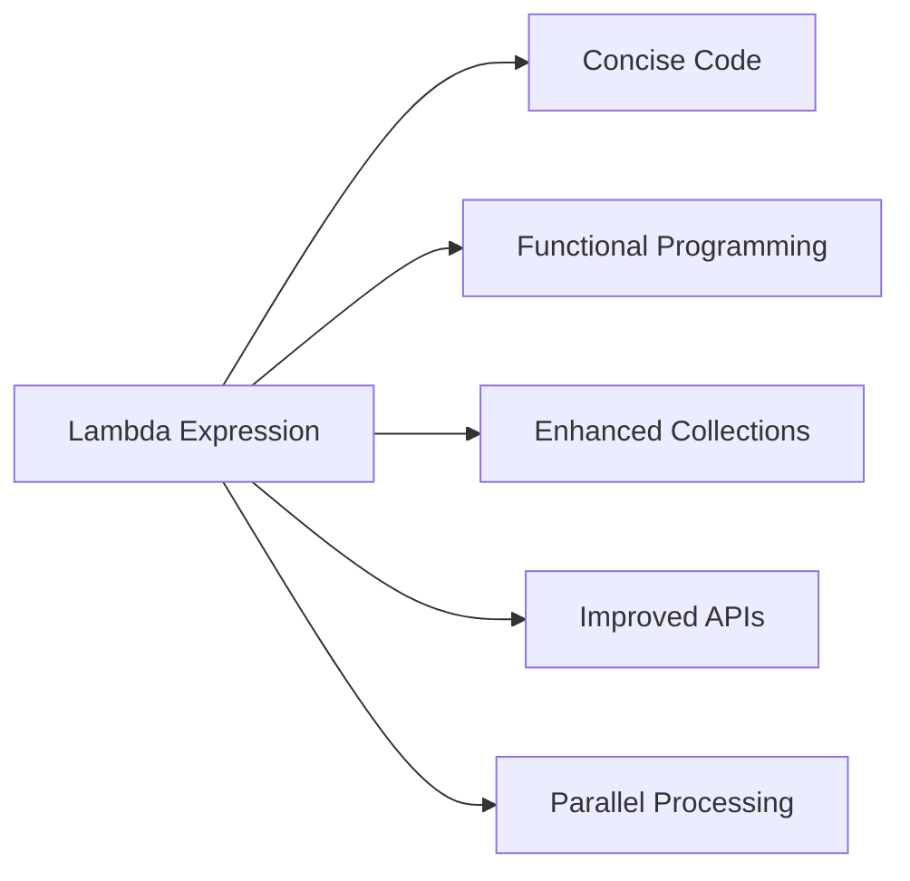
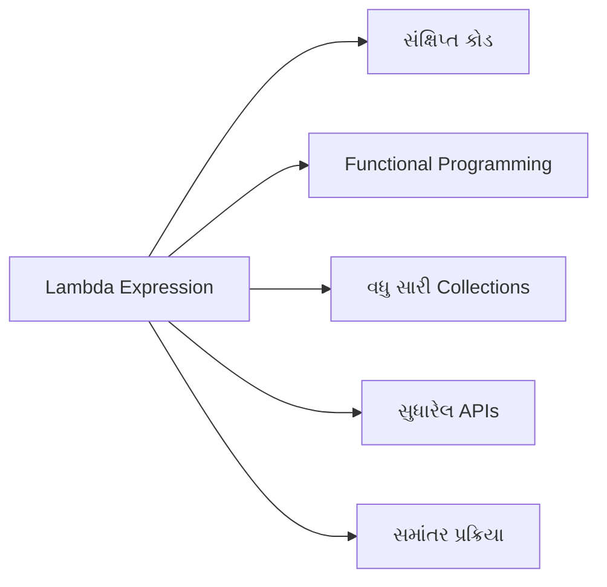
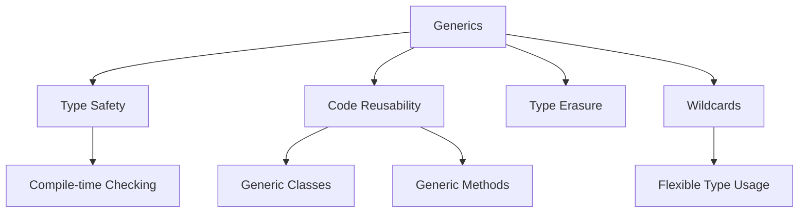
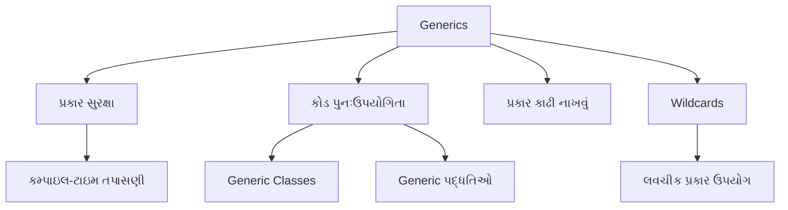
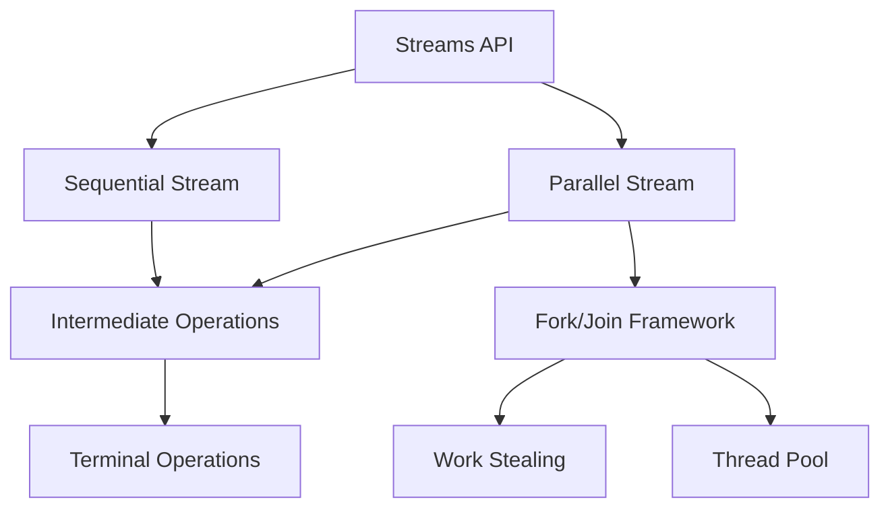
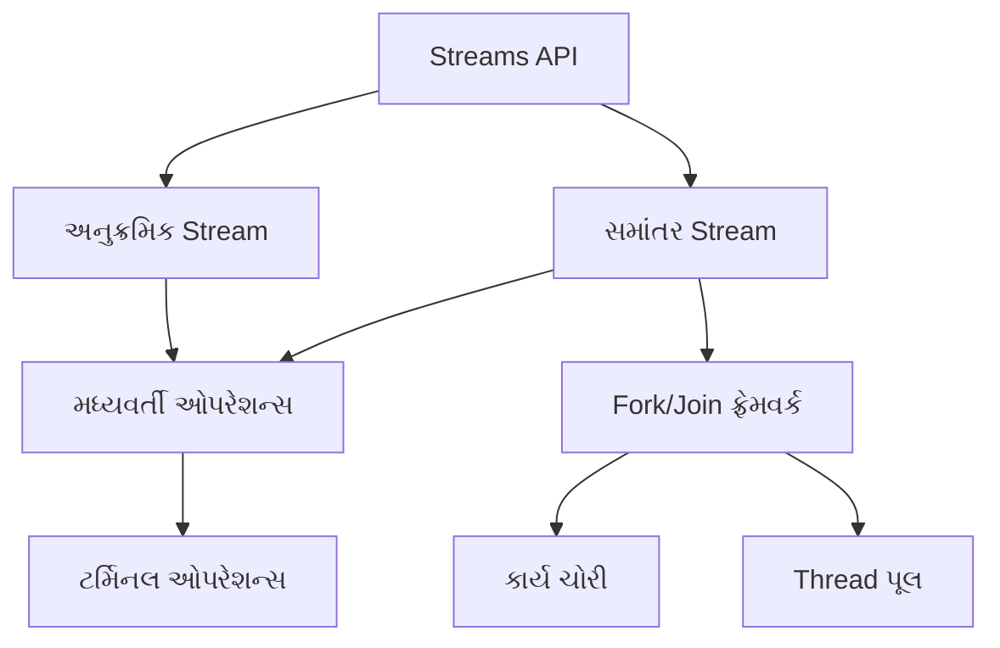

### Question 1(a): Define lambda expressions and explain their significance in Java programming. (3 marks)

**Ans 1(a):**

Lambda expressions in Java are anonymous functions that provide a concise way to express instances of single-method interfaces (functional interfaces). They were introduced in Java 8 to enable functional programming features.

Key points about lambda expressions:

1. **Syntax**: 
   - Basic structure: `(parameters) -> expression` or `(parameters) -> { statements; }`
   - Example: `(int a, int b) -> a + b`

2. **Characteristics**:
   - No name (anonymous)
   - No return type declaration
   - No access modifiers

3. **Significance in Java programming**:

   - **Concise code**: Lambda expressions reduce the verbosity of anonymous inner classes, making code more readable and maintainable.
   
   - **Functional programming support**: They enable functional programming concepts in Java, allowing functions to be treated as first-class citizens.
   
   - **Enhanced collection processing**: Lambda expressions work seamlessly with the Streams API, enabling efficient and expressive data processing.
   
   - **Improved API design**: Libraries can now define more flexible and powerful APIs using functional interfaces.
   
   - **Parallel processing**: Lambda expressions facilitate writing concurrent code, especially when used with parallel streams.

Example demonstrating lambda expression usage:

```java
// Without lambda
Runnable runnable = new Runnable() {
    @Override
    public void run() {
        System.out.println("Hello World!");
    }
};

// With lambda
Runnable lambdaRunnable = () -> System.out.println("Hello World!");
```



Lambda expressions significantly enhance Java's capabilities, making it more expressive and aligned with modern programming paradigms.

### પ્રશ્ન 1(અ): લેમ્બ્ડા એક્સપ્રેશન્સની વ્યાખ્યા આપો અને જાવા પ્રોગ્રામિંગમાં તેમનું મહત્વ સમજાવો. (3 ગુણ)

**જવાબ 1(અ):**

જાવામાં lambda expressions એ anonymous functions છે જે single-method interfaces (functional interfaces) ના instances ને સંક્ષિપ્ત રીતે વ્યક્ત કરવાની રીત પ્રદાન કરે છે. તેઓને Java 8 માં functional programming સુવિધાઓને સક્ષમ કરવા માટે રજૂ કરવામાં આવ્યા હતા.

Lambda expressions વિશે મુખ્ય મુદ્દાઓ:

1. **સિન્ટેક્સ**:
   - મૂળભૂત રચના: `(parameters) -> expression` અથવા `(parameters) -> { statements; }`
   - ઉદાહરણ: `(int a, int b) -> a + b`

2. **લાક્ષણિકતાઓ**:
   - કોઈ નામ નથી (anonymous)
   - કોઈ return type ઘોષણા નથી
   - કોઈ access modifiers નથી

3. **જાવા પ્રોગ્રામિંગમાં મહત્વ**:

   - **સંક્ષિપ્ત કોડ**: Lambda expressions anonymous inner classes ની વર્બોસિટી ઘટાડે છે, જેથી કોડ વધુ વાંચી શકાય અને જાળવી શકાય તેવો બને છે.
   
   - **Functional programming સપોર્ટ**: તેઓ જાવામાં functional programming concepts ને સક્ષમ કરે છે, જેથી functions ને પ્રથમ-વર્ગના નાગરિકો તરીકે ગણવામાં આવે છે.
   
   - **વધુ સારી collection પ્રોસેસિંગ**: Lambda expressions Streams API સાથે સરળતાથી કામ કરે છે, જે કાર્યક્ષમ અને અભિવ્યક્તિપૂર્ણ ડેટા પ્રોસેસિંગને સક્ષમ કરે છે.
   
   - **સુધારેલ API ડિઝાઇન**: લાઇબ્રેરીઓ હવે functional interfaces નો ઉપયોગ કરીને વધુ લવચીક અને શક્તિશાળી APIs વ્યાખ્યાયિત કરી શકે છે.
   
   - **સમાંતર પ્રક્રિયા**: Lambda expressions concurrent કોડ લખવાની સુવિધા આપે છે, ખાસ કરીને parallel streams સાથે વપરાય ત્યારે.

Lambda expression ના ઉપયોગને દર્શાવતું ઉદાહરણ:

```java
// Lambda વગર
Runnable runnable = new Runnable() {
    @Override
    public void run() {
        System.out.println("Hello World!");
    }
};

// Lambda સાથે
Runnable lambdaRunnable = () -> System.out.println("Hello World!");
```



Lambda expressions જાવાની ક્ષમતાઓને નોંધપાત્ર રીતે વધારે છે, તેને વધુ અભિવ્યક્તિપૂર્ણ બનાવે છે અને આધુનિક પ્રોગ્રામિંગ પેરાડાઇમ્સ સાથે સંરેખિત કરે છે.

### Question 1(b): Explain the concept of generics in Java with an example. (4 marks)

**Ans 1(b):**

Generics in Java provide a way to create classes, interfaces, and methods that operate on objects of various types while providing compile-time type safety. They allow you to abstract over types, making code more flexible and reusable.

Key aspects of generics:

1. **Type Safety**: Generics enforce compile-time type checking, reducing runtime errors.

2. **Code Reusability**: A single generic class can work with different types, reducing code duplication.

3. **Type Erasure**: Generic type information is removed at runtime, maintaining backward compatibility.

4. **Wildcards**: Allow for more flexible use of generic types (e.g., `?`, `? extends`, `? super`).

Example of a generic class:

```java
public class Box<T> {
    private T content;

    public void set(T content) {
        this.content = content;
    }

    public T get() {
        return content;
    }
}

// Usage
Box<Integer> intBox = new Box<>();
intBox.set(10);
int value = intBox.get(); // No casting needed

Box<String> stringBox = new Box<>();
stringBox.set("Hello Generics");
String text = stringBox.get();
```

In this example:
- `Box<T>` is a generic class where `T` is a type parameter.
- We can create `Box` objects for different types (e.g., `Integer`, `String`).
- The compiler ensures type safety, preventing type mismatches.

Benefits of using generics:

1. **Type-safe collections**: Eliminates the need for explicit casting.
   ```java
   List<String> list = new ArrayList<>();
   list.add("Java");
   String s = list.get(0); // No cast needed
   ```

2. **Generic methods**: Allow creation of type-safe methods.
   ```java
   public static <E> void printArray(E[] array) {
       for (E element : array) {
           System.out.print(element + " ");
       }
   }
   ```

3. **Bounded type parameters**: Restrict the types that can be used with a generic class or method.
   ```java
   public class NumberBox<T extends Number> {
       // ...
   }
   ```



Generics significantly enhance Java's type system, leading to more robust and flexible code while maintaining strong type safety.

### પ્રશ્ન 1(બ): જાવામાં જેનેરિક્સની વિભાવના ઉદાહરણ સાથે સમજાવો. (4 ગુણ)

**જવાબ 1(બ):**

જાવામાં generics વિવિધ પ્રકારના objects પર કાર્ય કરતા વર્ગો, ઇન્ટરફેસેસ અને પદ્ધતિઓ બનાવવાની રીત પ્રદાન કરે છે, જે કમ્પાઇલ-ટાઇમ પ્રકાર સુરક્ષા પ્રદાન કરે છે. તેઓ પ્રકારો પર અમૂર્ત થવાની મંજૂરી આપે છે, જેથી કોડ વધુ લવચીક અને પુન:ઉપયોગી બને છે.

Generics ના મુખ્ય પાસાઓ:

1. **પ્રકાર સુરક્ષા**: Generics કમ્પાઇલ-ટાઇમ પ્રકાર તપાસણીને લાગુ કરે છે, જે રનટાઇમ ભૂલોને ઘટાડે છે.

2. **કોડ પુનઃઉપયોગિતા**: એક જ generic class વિવિધ પ્રકારો સાથે કામ કરી શકે છે, જે કોડ ડુપ્લિકેશનને ઘટાડે છે.

3. **પ્રકાર કાઢી નાખવું**: Generic પ્રકારની માહિતી રનટાઇમ પર દૂર કરવામાં આવે છે, જે પાછલી સુસંગતતા જાળવે છે.

4. **Wildcards**: Generic પ્રકારોના વધુ લવચીક ઉપયોગની મંજૂરી આપે છે (દા.ત., `?`, `? extends`, `? super`).

Generic class નું ઉદાહરણ:

```java
public class Box<T> {
    private T content;

    public void set(T content) {
        this.content = content;
    }

    public T get() {
        return content;
    }
}

// ઉપયોગ
Box<Integer> intBox = new Box<>();
intBox.set(10);
int value = intBox.get(); // કાસ્ટિંગની જરૂર નથી

Box<String> stringBox = new Box<>();
stringBox.set("Hello Generics");
String text = stringBox.get();
```

આ ઉદાહરણમાં:
- `Box<T>` એ generic class છે જ્યાં `T` એક પ્રકાર પરિમાણ છે.
- આપણે વિવિધ પ્રકારો માટે `Box` objects બનાવી શકીએ છીએ (દા.ત., `Integer`, `String`).
- કમ્પાઇલર પ્રકાર સુરક્ષા સુનિશ્ચિત કરે છે, પ્રકાર બેમેળને રોકે છે.

Generics ના ઉપયોગના ફાયદાઓ:

1. **પ્રકાર-સુરક્ષિત સંગ્રહો**: સ્પષ્ટ casting ની જરૂરિયાતને દૂર કરે છે.
   ```java
   List<String> list = new ArrayList<>();
   list.add("Java");
   String s = list.get(0); // કાસ્ટની જરૂર નથી
   ```

2. **Generic પદ્ધતિઓ**: પ્રકાર-સુરક્ષિત પદ્ધતિઓ બનાવવાની મંજૂરી આપે છે.
   ```java
   public static <E> void printArray(E[] array) {
       for (E element : array) {
           System.out.print(element + " ");
       }
   }
   ```

3. **બાઉન્ડેડ પ્રકાર પરિમાણો**: Generic class અથવા પદ્ધતિ સાથે ઉપયોગ કરી શકાય તેવા પ્રકારોને મર્યાદિત કરે છે.
   ```java
   public class NumberBox<T extends Number> {
       // ...
   }
   ```



Generics જાવાની પ્રકાર પ્રણાલીને નોંધપાત્ર રીતે વધારે છે, જે મજબૂત પ્રકાર સુરક્ષા જાળવી રાખતા વધુ મજબૂત અને લવચીક કોડ તરફ દોરી જાય છે.

### Question 1(c): Describe the Streams API in Java and explain how it facilitates parallel processing. (7 marks)

**Ans 1(c):**

The Streams API, introduced in Java 8, provides a modern approach to process collections of objects. It offers a functional programming model for data manipulation, allowing for more concise and expressive code.

Key features of the Streams API:

1. **Declarative Programming**: Streams allow you to describe what you want to do, rather than how to do it.

2. **Lazy Evaluation**: Stream operations are lazily evaluated, improving performance for large datasets.

3. **Pipeline Processing**: Multiple operations can be chained together to form a processing pipeline.

4. **Functional Interfaces**: Streams work seamlessly with lambda expressions and method references.

5. **Parallel Execution**: Streams can easily switch between sequential and parallel processing.

Basic structure of a Stream operation:
```java
collection.stream()
    .intermediateOperation1()
    .intermediateOperation2()
    .terminalOperation();
```

Common Stream operations:

1. **Intermediate Operations**:
   - `filter()`: Filters elements based on a predicate.
   - `map()`: Transforms elements using a function.
   - `flatMap()`: Flattens nested structures.
   - `sorted()`: Sorts elements.
   - `distinct()`: Removes duplicates.

2. **Terminal Operations**:
   - `forEach()`: Performs an action for each element.
   - `collect()`: Gathers elements into a collection.
   - `reduce()`: Reduces elements to a single value.
   - `count()`: Returns the number of elements.
   - `anyMatch()`, `allMatch()`, `noneMatch()`: Checks elements against a predicate.

Example of Stream usage:
```java
List<String> names = Arrays.asList("Alice", "Bob", "Charlie", "David");
long count = names.stream()
                  .filter(name -> name.length() > 4)
                  .count();
System.out.println("Names longer than 4 characters: " + count);
```

Parallel Processing with Streams:

The Streams API facilitates parallel processing through the use of parallel streams. This allows operations to be executed concurrently on multiple threads, potentially improving performance for large datasets.

How Streams facilitate parallel processing:

1. **Easy Parallelization**: Convert a sequential stream to parallel with `parallelStream()` or `parallel()`.
   ```java
   long count = names.parallelStream()
                     .filter(name -> name.length() > 4)
                     .count();
   ```

2. **Automatic Thread Management**: The API handles thread creation and management, simplifying concurrent programming.

3. **Fork/Join Framework**: Parallel streams utilize the fork/join framework for efficient work distribution.

4. **Stateless Operations**: Many stream operations are stateless, making them suitable for parallel execution.

5. **Reduction Operations**: The API provides efficient parallel reduction operations like `reduce()` and `collect()`.

6. **Configurable Thread Pool**: The common fork/join pool can be configured for optimal performance.

Benefits of parallel streams:

- **Improved Performance**: Can significantly speed up operations on large datasets.
- **Efficient Resource Utilization**: Makes better use of multi-core processors.
- **Simplified Concurrent Programming**: Abstracts away the complexities of thread management.

Considerations for parallel streams:

- **Data Size**: Parallel processing may not be beneficial for small datasets due to overhead.
- **Thread Safety**: Ensure that operations used with parallel streams are thread-safe.
- **Ordering**: Some operations may not preserve the encounter order in parallel streams.



The Streams API, particularly with its support for parallel processing, represents a powerful tool in Java for efficient and expressive data processing, especially when dealing with large datasets or computationally intensive operations.

### પ્રશ્ન 1(ક): જાવામાં સ્ટ્રીમ્સ API નું વર્ણન કરો અને તે સમાંતર પ્રક્રિયાને કેવી રીતે સરળ બનાવે છે તે સમજાવો. (7 ગુણ)

**જવાબ 1(ક):**

Java 8 માં રજૂ કરાયેલ Streams API, objects ના સંગ્રહોને પ્રક્રિયા કરવા માટે એક આધુનિક અભિગમ પ્રદાન કરે છે. તે ડેટા મેનિપ્યુલેશન માટે functional programming મોડેલ આપે છે, જે વધુ સંક્ષિપ્ત અને અભિવ્યક્તિપૂર્ણ કોડની મંજૂરી આપે છે.

Streams API ની મુખ્ય વિશેષતાઓ:

1. **ડિક્લેરેટિવ પ્રોગ્રામિંગ**: Streams તમને શું કરવું છે તે વર્ણવવાની મંજૂરી આપે છે, કેવી રીતે કરવું તેના બદલે.

2. **આળસુ મૂલ્યાંકન**: Stream ઓપરેશન્સ આળસુથી મૂલ્યાંકન કરવામાં આવે છે, જે મોટા ડેટાસેટ્સ માટે કાર્યક્ષમતા સુધારે છે.

3. **પાઇપલાઇન પ્રોસેસિંગ**: પ્રોસેસિંગ પાઇપલાઇન બનાવવા માટે એકાધિક ઓપરેશન્સને સાંકળી શકાય છે.

4. **ફંક્શનલ ઇન્ટરફેસેસ**: Streams lambda expressions અને method references સાથે સરળતાથી કામ કરે છે.

5. **સમાંતર અમલીકરણ**: Streams સરળતાથી અનુક્રમિક અને સમાંતર પ્રક્રિયા વચ્ચે સ્વિચ કરી શકે છે.

Stream ઓપરેશનની મૂળભૂત રચના:
```java
collection.stream()
    .intermediateOperation1()
    .intermediateOperation2()
    .terminalOperation();
```

સામાન્ય Stream ઓપરેશન્સ:

1. **મધ્યવર્તી ઓપરેશન્સ**:
   - `filter()`: પ્રેડિકેટના આધારે તત્વોને ફિલ્ટર કરે છે.
   - `map()`: ફંક્શનનો ઉપયોગ કરીને તત્વોને રૂપાંતરિત કરે છે.
   - `flatMap()`: નેસ્ટેડ સ્ટ્રક્ચર્સને ફ્લેટ કરે છે.
   - `sorted()`: તત્વોને સોર્ટ કરે છે.
   - `distinct()`: ડુપ્લિકેટ્સ દૂર કરે છે.

2. **ટર્મિનલ ઓપરેશન્સ**:
   - `forEach()`: દરેક તત્વ માટે ક્રિયા કરે છે.
   - `collect()`: તત્વોને સંગ્રહમાં એકત્રિત કરે છે.
   - `reduce()`: તત્વોને એક મૂલ્યમાં ઘટાડે છે.
   - `count()`: તત્વોની સંખ્યા પરત કરે છે.
   - `anyMatch()`, `allMatch()`, `noneMatch()`: પ્રેડિકેટ સામે તત્વોની તપાસ કરે છે.

Stream ઉપયોગનું ઉદાહરણ:
```java
List<String> names = Arrays.asList("Alice", "Bob", "Charlie", "David");
long count = names.stream()
                  .filter(name -> name.length() > 4)
                  .count();
System.out.println("4 અક્ષરો કરતાં લાંબા નામો: " + count);
```

Streams સાથે સમાંતર પ્રક્રિયા:

Streams API સમાંતર streams ના ઉપયોગ દ્વારા સમાંતર પ્રક્રિયાને સરળ બનાવે છે. આ ઓપરેશન્સને એક સાથે ઘણા threads પર અમલ કરવાની મંજૂરી આપે છે, જે મોટા ડેટાસેટ્સ માટે કાર્યક્ષમતા સુધારી શકે છે.

Streams સમાંતર પ્રક્રિયાને કેવી રીતે સરળ બનાવે છે:

1. **સરળ સમાંતરીકરણ**: `parallelStream()` અથવા `parallel()` સાથે અનુક્રમિક stream ને સમાંતર માં રૂપાંતરિત કરો.
   ```java
   long count = names.parallelStream()
                     .filter(name -> name.length() > 4)
                     .count();
   ```

2. **સ્વચાલિત Thread મેનેજમેન્ટ**: API thread નિર્માણ અને મેનેજમેન્ટને સંભાળે છે, જે concurrent programming ને સરળ બનાવે છે.

3. **Fork/Join ફ્રેમવર્ક**: સમાંતર streams કાર્યક્ષમ કાર્ય વિતરણ માટે fork/join ફ્રેમવર્કનો ઉપયોગ કરે છે.

4. **સ્ટેટલેસ ઓપરેશન્સ**: ઘણા stream ઓપરેશન્સ સ્ટેટલેસ છે, જે તેમને સમાંતર અમલીકરણ માટે યોગ્ય બનાવે છે.

5. **ઘટાડા ઓપરેશન્સ**: API `reduce()` અને `collect()` જેવા કાર્યક્ષમ સમાંતર ઘટાડા ઓપરેશન્સ પ્રદાન કરે છે.

6. **કોન્ફિગર કરી શકાય તેવું Thread પૂલ**: સામાન્ય fork/join પૂલને શ્રેષ્ઠ કાર્યક્ષમતા માટે કોન્ફિગર કરી શકાય છે.

સમાંતર streams ના ફાયદા:

- **સુધારેલી કાર્યક્ષમતા**: મોટા ડેટાસેટ્સ પર ઓપરેશન્સને નોંધપાત્ર રીતે ઝડપી બનાવી શકે છે.
- **કાર્યક્ષમ સંસાધન ઉપયોગ**: મલ્ટી-કોર પ્રોસેસર્સનો વધુ સારો ઉપયોગ કરે છે.
- **સરળીકૃત Concurrent પ્રોગ્રામિંગ**: Thread મેનેજમેન્ટની જટિલતાઓને દૂર કરે છે.

સમાંતર streams માટે ધ્યાનમાં લેવાની બાબતો:

- **ડેટા કદ**: નાના ડેટાસેટ્સ માટે ઓવરહેડને કારણે સમાંતર પ્રક્રિયા ફાયદાકારક ન હોઈ શકે.
- **Thread સુરક્ષા**: ખાતરી કરો કે સમાંતર streams સાથે ઉપયોગમાં લેવાતા ઓપરેશન્સ thread-safe છે.
- **ક્રમ**: કેટલાક ઓપરેશન્સ સમાંતર streams માં એન્કાઉન્ટર ઓર્ડરને જાળવી ન શકે.



Streams API, ખાસ કરીને તેના સમાંતર પ્રક્રિયા માટેના સમર્થન સાથે, મોટા ડેટાસેટ્સ અથવા કમ્પ્યુટેશનલી સઘન ઓપરેશન્સ સાથે કામ કરતી વખતે કાર્યક્ષમ અને અભિવ્યક્તિપૂર્ણ ડેટા પ્રોસેસિંગ માટે Java માં એક શક્તિશાળી સાધન રજૂ કરે છે.